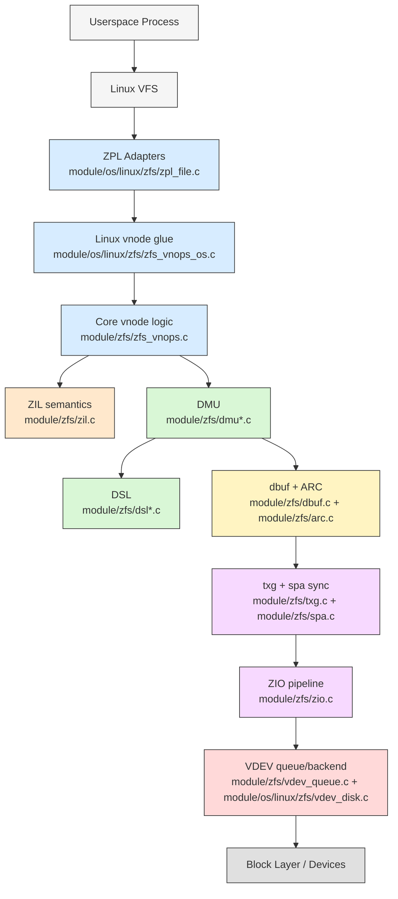
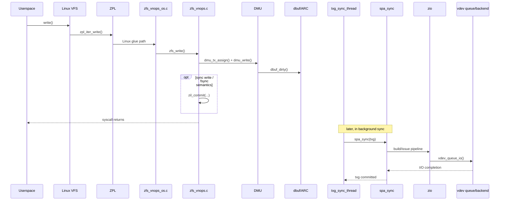
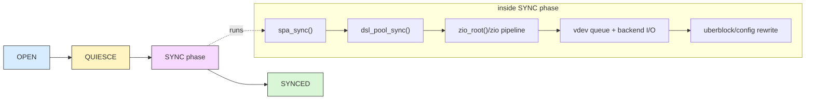

# Part 1 - Architecture Overview

> If you are new to the OpenZFS codebase, here is the mental model I would build first.

## Introduction

This chapter is intentionally code-first. The goal is to help you answer:

- Where does a syscall enter ZFS?
- Which layer owns object semantics versus storage semantics?
- What happens immediately, and what is deferred to txg sync?

If you keep one model in your head, use this:

- Foreground path accepts and records intent (`zpl_*`, `zfs_*`, `dmu_*`, `dbuf_*`).
- Sync path persists and commits intent (`txg_*`, `spa_sync`, `dsl_pool_sync`, `zio`, `vdev`).

That split explains a lot of ZFS behavior that otherwise feels non-linear.

Companion on-disk format reference:

- https://github.com/mminkus/zfs-ondiskformat/

---

## Diagram 1 - Big Picture Stack

```
Userspace process
    |
    v
Linux VFS
    |
    v
ZPL adapters
  module/os/linux/zfs/zpl_file.c
  module/os/linux/zfs/zpl_inode.c
    |
    v
Linux vnode glue
  module/os/linux/zfs/zfs_vnops_os.c
    |
    v
Core vnode logic (portable)
  module/zfs/zfs_vnops.c
    |
    +----------------------+
    |                      |
    v                      v
DMU/DSL object semantics   ZIL sync semantics
module/zfs/dmu*.c          module/zfs/zil.c
module/zfs/dsl*.c
    |
    v
dbuf + ARC (dirty state + cache)
module/zfs/dbuf.c
module/zfs/arc.c
    |
    v
txg sync orchestration
module/zfs/txg.c
module/zfs/spa.c
    |
    v
ZIO pipeline engine
module/zfs/zio.c
include/sys/zio_impl.h
    |
    v
VDEV scheduler + backend
module/zfs/vdev_queue.c
module/os/linux/zfs/vdev_disk.c
    |
    v
block layer / devices
```

### Mermaid - Big Picture Stack



---

## Diagram 2 - Foreground vs Sync Timeline

```
Time ------------------------------------------------------------>

Thread A (write syscall)
  zpl_iter_write
    -> Linux glue (zfs_vnops_os.c) as needed
    -> zfs_write
      -> dmu_tx_assign
      -> dmu_write
      -> dbuf_dirty
      -> zil_commit (sync writes / fsync path)
      -> dmu_tx_commit
  return to caller

txg sync thread (background)
                     txg quiesce
                        |
                        v
                     spa_sync(txg)
                        -> dsl_pool_sync
                        -> zio_root / zio pipeline
                        -> vdev queue/issue
                        -> uberblock rewrite
                        -> txg committed
```

The key insight is that syscall return and durable on-disk commit are decoupled by txg machinery.

### Mermaid - Foreground vs Sync Sequence



---

## Layer 1 - ZPL Entry Points (Linux)

Start here: `module/os/linux/zfs/zpl_file.c`.

`zpl_file_operations` wires Linux VFS hooks:
- `.read_iter = zpl_iter_read`
- `.write_iter = zpl_iter_write`

`zpl_iter_write()`:
- builds a `zfs_uio_t`
- takes credentials and fstrans markers
- calls `zfs_write(ITOZ(ip), &uio, flags, cr)`

`zpl_iter_read()` does the same shape for `zfs_read(...)`.

Related files:
- `module/os/linux/zfs/zpl_file.c`
- `module/os/linux/zfs/zpl_inode.c`
- `module/os/linux/zfs/zpl_super.c`

---

## Layer 2 - Vnode Logic (Portable Core + Linux Glue)

Path ownership is split across two files:

- `module/zfs/zfs_vnops.c` contains the core `zfs_read()` and `zfs_write()` definitions.
- `module/os/linux/zfs/zfs_vnops_os.c` contains Linux-specific vnode/VFS integration and helpers that call into core vnode logic.

`zfs_read()` responsibilities:
- range locking
- read chunking
- DMU read submission
- ARC interaction
- optional sync behavior via `zil_commit()` for strict semantics

`zfs_write()` responsibilities:
- append and offset handling
- range locking and size/limit checks
- quota checks
- tx creation and assignment
- DMU writes and metadata updates
- commit policy (`O_SYNC`, `O_DSYNC`, dataset sync mode)

`module/zfs/zfs_vnops.c` is still usually the most valuable single file to read linearly first, then pair it with `module/os/linux/zfs/zfs_vnops_os.c` for Linux behavior details.

---

## Interlude - ZIL (Synchronous Write Semantics)

ZIL is the part most people miss the first time they read the write path.

Primary code:
- `module/zfs/zil.c`
- `module/zfs/zfs_vnops.c` (call sites such as `zil_commit(...)`)

What it does:
- Records transaction records (itxs) for syscall-level operations that may need synchronous durability.
- Allows `fsync`, `O_DSYNC`, and similar semantics without waiting for full txg sync.
- Replays on mount/open after crash if needed, then normal txg processing takes over.

Important nuance:
- ZIL is not the final home of data blocks. It is a log for replay/ordering semantics.
- Final durable pool state is still established by txg sync and uberblock progression.

---

## Layer 3 - DMU (Object and Transaction Core)

Primary code:
- `module/zfs/dmu.c`
- `module/zfs/dmu_tx.c`
- `include/sys/dmu.h`
- `include/sys/dnode.h`

Key symbols:
- `dmu_tx_assign()` and `dmu_tx_commit()`
- `dmu_read()` and `dmu_write()`
- `struct dnode` in `include/sys/dnode.h`

DMU write pattern:

1. Create tx and declare holds.
2. `dmu_tx_assign()` attaches work to a txg.
3. `dmu_write()` updates object blocks via dbufs.
4. `dmu_tx_commit()` finalizes foreground transaction state.

DMU gives atomicity at txg level, not per-syscall synchronous media commit.

---

## Layer 4 - DSL (Datasets, Snapshots, Space Accounting)

Primary code:
- `module/zfs/dsl_dataset.c`
- `module/zfs/dsl_dir.c`
- `module/zfs/dsl_pool.c`
- `include/sys/dsl_dataset.h`
- `include/sys/dsl_dir.h`

Key sync anchor:
- `dsl_pool_sync()` in `module/zfs/dsl_pool.c`

What it does during sync:
- drains dirty-dataset txg lists
- calls `dsl_dataset_sync(...)`
- coordinates root zio usage (`zio_root(...)`)
- finalizes accounting updates after data blocks are written

DMU answers "which object and bytes changed." DSL answers "how that change affects dataset/snapshot graph and accounting."

---

## Layer 5 - dbuf + ARC (Dirty State and Read Cache)

Primary code:
- `module/zfs/dbuf.c`
- `module/zfs/arc.c`

Key anchors:
- `dbuf_dirty(...)`
- `arc_read(...)`
- `arc_evict(...)`
- `l2arc_feed_thread(...)`

Mental split:
- `dbuf` tracks object/block state and dirty records across txgs.
- ARC tracks cache residency, eviction, and buffer lifecycle.

ARC state model anchors (from `include/sys/arc.h` and `include/sys/arc_impl.h`):
- `ARC_STATE_MRU` and `ARC_STATE_MFU` for live cached data.
- `ARC_STATE_MRU_GHOST` and `ARC_STATE_MFU_GHOST` for history of recently/frequently used evicted items.
- Ghost hits feed adaptive behavior in eviction balancing (`arc_evict()` logic).
- `ARC_STATE_L2C_ONLY` and L2ARC paths track data that resides on L2ARC devices but not in primary ARC data buffers.

### Diagram A - ARC State Mental Model

```
           cache hit / warm data
      +-------------------------------+
      |                               v
  +-------+    promote on reuse    +-------+
  | MRU   | ---------------------> | MFU   |
  +---+---+                        +---+---+
      |                                |
      | evict                           | evict
      v                                v
  +-----------+   ghost hit         +-----------+
  | MRU_GHOST | ------------------> | MFU_GHOST |
  +-----------+                     +-----------+

L2ARC side path:
  eligible ARC buffers -> l2arc_feed_thread() -> L2C_ONLY residency
```

On writes, data becomes dirty in memory first.
On reads, `arc_read()` can satisfy from cache or dispatch lower I/O on miss.

---

## Layer 6 - ZIO (I/O Pipeline Engine)

Primary code:
- `module/zfs/zio.c`
- `include/sys/zio.h`
- `include/sys/zio_impl.h`

Core types:
- `struct zio` in `include/sys/zio.h`
- `enum zio_stage` in `include/sys/zio_impl.h`

The stage enum defines 27 stage bits (`ZIO_STAGE_OPEN` through `ZIO_STAGE_DONE`).
Pipelines are composed with bitmasks, so different I/O types run different stage sets.

Allocation bridge worth calling out:
- During `ZIO_STAGE_DVA_ALLOCATE`, `zio_dva_allocate()` drives block allocation.
- That path calls into metaslab allocation (`metaslab_alloc(...)`) to choose real on-disk regions.

### Diagram B - Write Pipeline (Simplified)

```
zio create
  |
  v
OPEN
  -> WRITE_BP_INIT
  -> ISSUE_ASYNC
  -> WRITE_COMPRESS
  -> ENCRYPT
  -> CHECKSUM_GENERATE
  -> DVA_THROTTLE
  -> DVA_ALLOCATE
       -> metaslab_alloc(...) in module/zfs/metaslab.c
  -> READY
  -> VDEV_IO_START
  -> VDEV_IO_DONE
  -> VDEV_IO_ASSESS
  -> DONE
```

### Mermaid - Write Pipeline


---

## Layer 7 - VDEV (Topology and Device Dispatch)

Primary code:
- `module/zfs/vdev.c`
- `module/zfs/vdev_queue.c`
- `module/os/linux/zfs/vdev_disk.c`
- `include/sys/vdev_impl.h`

Key anchors:
- `struct vdev` in `include/sys/vdev_impl.h`
- `vdev_queue_io(...)`
- `vdev_queue_io_done(...)`
- `vdev_disk_io_start(...)`

VDEV converts logical requests into topology-aware physical operations (mirror, raidz, etc.), then queues/aggregates and submits to device backends.

---

## Layer 7.5 - Metaslab Allocator (Where Writes Land)

If you ever ask "how does ZFS decide where to put this block?", this is the subsystem.

Primary code:
- `module/zfs/metaslab.c`
- `module/zfs/vdev.c`
- `include/sys/vdev_impl.h` (`vdev_mg`)
- `include/sys/spa.h` (`spa_normal_class`, `spa_log_class`, `spa_special_class`)

Key anchors:
- `zio_dva_allocate(...)` in `module/zfs/zio.c`
- `metaslab_alloc(...)` in `module/zfs/metaslab.c`
- `vdev_metaslab_group_create(...)` in `module/zfs/vdev.c`

### Diagram C - Allocation Hierarchy

```
spa class selection
  (normal / special / log)
          |
          v
top-level vdev metaslab group (vdev_mg)
          |
          v
metaslabs on that vdev
          |
          v
metaslab_alloc(...) chooses offset/asize
          |
          v
DVA(s) written into blkptr_t
```

This is where fragmentation, class biasing, and free-space topology directly impact placement decisions and write amplification behavior.

---

## Cross-Cutting - SPA and txg Orchestration

Primary code:
- `module/zfs/txg.c`
- `module/zfs/spa.c`
- `include/sys/spa.h`
- `include/sys/spa_impl.h`

Key anchors:
- `txg_sync_thread(...)` in `module/zfs/txg.c`
- `spa_sync(...)` in `module/zfs/spa.c`
- `spa_sync_iterate_to_convergence(...)` in `module/zfs/spa.c`

`txg_sync_thread()` eventually calls `spa_sync(spa, txg)`. `spa_sync()` drives the transaction to convergence: dataset sync, frees, metaslabs/vdev work, and final config/uberblock rewrite.

### Diagram 4 - txg State Machine (Conceptual)

```
             +---------+
             |  OPEN   |  accepts new work
             +----+----+
                  |
                  v
             +---------+
             | QUIESCE |  stop taking new work for this txg
             +----+----+
                  |
                  v
             +---------+
             |  SYNC   |  spa_sync / dsl_pool_sync / zio / vdev
             +----+----+
                  |
                  v
             +---------+
             | SYNCED  |  durable commit boundary advanced
             +---------+
```

### Mermaid - txg Sync Flow



---

## Data Structures You Should Recognize Early

### Diagram 5 - From File to Physical Blocks

```
znode_t (POSIX file view)
  |
  v
sa_handle / inode metadata
  |
  v
dnode_t (DMU object in memory)
  |
  v
dbuf tree (dirty + cached object blocks)
  |
  v
blkptr_t references
  |
  v
zio_t operations
  |
  v
vdev_t tree (top-level -> leaf)
```

Reference headers:
- `include/sys/zfs_znode.h`
- `include/sys/dnode.h`
- `include/sys/dbuf.h`
- `include/sys/spa.h` (`blkptr_t`)
- `include/sys/zio.h`
- `include/sys/vdev_impl.h`

---

## Kernel and Userland Boundary

### Diagram 6 - Build-Time Boundary

```
Kernel side
  module/zfs/
  module/os/linux/zfs/
       ^
       | shared headers + shared tables
       v
Shared
  include/
  include/sys/
  module/zcommon/
       ^
       | linked by tools/libraries
       v
Userland side
  lib/libzfs/
  lib/libzfs_core/
  lib/libzpool/
  cmd/zfs cmd/zpool cmd/zdb cmd/zhack cmd/ztest
```

Why this matters:
- Many names and types are shared, but execution context is different.
- `libzpool` lets userland tools reuse substantial kernel-style logic for inspection/testing workflows.

---

## End-to-End Flow Recap

### Write control flow

```
write()
  -> zpl_iter_write()                      (module/os/linux/zfs/zpl_file.c)
    -> Linux vnode glue paths as needed    (module/os/linux/zfs/zfs_vnops_os.c)
    -> zfs_write()                         (module/zfs/zfs_vnops.c)
      -> dmu_tx_assign() / dmu_write()     (module/zfs/dmu_tx.c, module/zfs/dmu.c)
        -> dbuf_dirty()                    (module/zfs/dbuf.c)
          -> txg_sync_thread()             (module/zfs/txg.c)
            -> spa_sync()                  (module/zfs/spa.c)
              -> dsl_pool_sync()           (module/zfs/dsl_pool.c)
                -> zio pipeline            (module/zfs/zio.c)
                  -> vdev_queue_io()       (module/zfs/vdev_queue.c)
                    -> vdev_disk_io_start() (module/os/linux/zfs/vdev_disk.c)
```

### Read control flow

```
read()
  -> zpl_iter_read()                       (module/os/linux/zfs/zpl_file.c)
    -> Linux vnode glue paths as needed    (module/os/linux/zfs/zfs_vnops_os.c)
    -> zfs_read()                          (module/zfs/zfs_vnops.c)
      -> dmu read path                     (module/zfs/dmu.c + module/zfs/dbuf.c)
        -> arc_read()                      (module/zfs/arc.c)
          -> zio read pipeline on miss     (module/zfs/zio.c)
            -> vdev queue/backend          (module/zfs/vdev_queue.c + module/os/linux/zfs/vdev_disk.c)
```

---

## Practical Reading Order for New Contributors

1. `module/os/linux/zfs/zpl_file.c`
2. `module/zfs/zfs_vnops.c`
3. `module/os/linux/zfs/zfs_vnops_os.c`
4. `module/zfs/zil.c`
5. `module/zfs/dmu_tx.c`
6. `module/zfs/dmu.c`
7. `module/zfs/dbuf.c`
8. `module/zfs/arc.c`
9. `module/zfs/txg.c`
10. `module/zfs/spa.c`
11. `include/sys/zio_impl.h`
12. `module/zfs/zio.c`
13. `module/zfs/metaslab.c`
14. `module/zfs/vdev_queue.c`
15. `module/os/linux/zfs/vdev_disk.c`

If you make one "map pass" through those files, most of the source tree stops feeling opaque.

---

## Next

-> [Part 2 - Repository Layout](02-repo-layout.md): now map this mental model to the actual tree layout so you can find code quickly.
