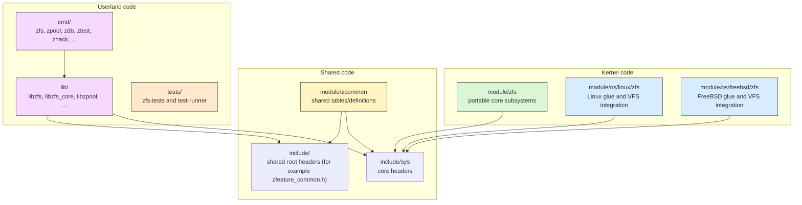

# Part 2 - Repository Layout

> Where things live in OpenZFS, and how to find the right code quickly.

## Introduction

Part 1 gave us the architecture mental model. This chapter maps that model to real directories.

This is the practical question we are answering:

- "I know what subsystem I care about, but where is that code in the tree?"

All paths in this chapter are relative to an OpenZFS checkout root (for example `zfs/` from `git clone https://github.com/openzfs/zfs.git`).

Snapshot counts at the pinned reference revision (see README; they
drift as OpenZFS evolves, but the shape stays the same):

- `module/zfs`: 138 `.c` files
- `module/zcommon`: 17 `.c` files
- `module/os/linux/zfs`: 34 `.c` files
- `include/sys`: 140 headers
- `tests/zfs-tests/tests/functional`: 105 test categories

---

## How To Use This Map

There are three axes you should keep in your head while navigating:

1. Runtime context: kernel, shared, or userland.
2. Platform scope: portable core vs OS-specific integration.
3. Subsystem ownership: SPA, DMU, DSL, ARC, ZIO, VDEV, ZIL, etc.

If you identify all three, you usually find the right directory in one jump.

---

## Diagram 1 - Runtime Boundaries



---

## Top-Level Tree (What Each Folder Is For)

```text
openzfs/
├── cmd/       user-facing binaries and tools
├── config/    build-system configuration and probes
├── contrib/   optional integrations and external helpers
├── etc/       init/service/runtime config templates
├── include/   headers used across kernel and userland
├── lib/       userland libraries
├── man/       man pages
├── module/    kernel code (portable + OS-specific)
├── rpm/       RPM packaging assets
├── scripts/   build and developer scripts
├── tests/     test framework and zfs-tests
└── udev/      udev rules for Linux device handling
```

Two practical anchors:

- If you are debugging behavior, start in `module/`.
- If you are changing CLI behavior, start in `cmd/` and usually also touch `lib/`.

---

## `module/zfs/` - Portable Core Kernel Implementation

This is the heart of OpenZFS core logic.

Important point:

- `module/zfs/` is organized mostly by subsystem, not by tutorial layer order.

High-value subsystem anchors:

- Pool and txg orchestration: `spa.c`, `spa_misc.c`, `txg.c`
- Object and transaction core: `dmu.c`, `dmu_tx.c`, `dnode.c`, `dmu_objset.c`
- Dataset/snapshot semantics: `dsl_dataset.c`, `dsl_dir.c`, `dsl_pool.c`
- Send/receive replication: `dmu_send.c`, `dmu_recv.c`
- Cache and buffers: `arc.c`, `dbuf.c`, `abd.c`
- I/O engine and integrity: `zio.c`, `zio_checksum.c`, `zio_compress.c`
- Allocation and free-space management: `metaslab.c`, `space_map.c`, `range_tree.c`
- Storage topology and dispatch: `vdev.c`, `vdev_queue.c`, `vdev_mirror.c`, `vdev_raidz.c`
- Intent logging: `zil.c`
- Attribute/object stores: `zap.c`, `zap_micro.c`, `zap_leaf.c`

When in doubt:

- Find the subsystem noun in the file name (`spa_`, `dsl_`, `dmu_`, `vdev_`, `zio_`).

---

## `module/os/linux/zfs/` and `module/os/freebsd/` - OS Integration

This is where OpenZFS connects to each OS kernel's VFS and device interfaces.

Linux path:

- `module/os/linux/zfs/zpl_file.c`, `zpl_inode.c`, `zpl_super.c`
- `module/os/linux/zfs/zfs_vnops_os.c`, `zfs_vfsops.c`
- `module/os/linux/zfs/vdev_disk.c`

Key distinction that trips people up:

- Core vnode operations (`zfs_read`, `zfs_write`) are in `module/zfs/zfs_vnops.c`.
- Linux-specific wrappers and integration paths are in `module/os/linux/zfs/zfs_vnops_os.c`.

Use this directory when behavior depends on Linux kernel interfaces, credentials, inode rules, mount plumbing, or block-layer specifics.

Sibling directory worth knowing: `module/os/linux/spl/` is the kernel
Solaris Portability Layer. It implements Solaris-style primitives (taskqs,
kmem caches, kstats, condvars, TSD, ...) on top of Linux kernel APIs, in
files named `spl-*.c` (`spl-taskq.c`, `spl-kmem.c`, `spl-kstat.c`). It is
Linux-only; FreeBSD supplies its own equivalents under
`module/os/freebsd/spl/`. The userland counterpart is `lib/libspl/`, which
provides the same Solaris-style shims to tools and libraries (see the `lib/`
section below).

---

## `module/zcommon/` - Shared Tables and Common Definitions

`module/zcommon/` is compiled into multiple targets and holds code intentionally shared across boundaries.

Examples:

- `zfeature_common.c` for feature registration tables
- `zfs_prop.c`, `zpool_prop.c`, `zprop_common.c` for property definitions
- checksum/property utility code used by more than one build target

If you are adding a new pool feature or property, this directory is almost always involved.

---

## Other `module/` Subdirectories - Embedded Support Code

`module/zfs/` and the `module/os/` trees are not the whole kernel build.
These siblings hold support code, most of them kernel-side counterparts of
like-named userland libraries in `lib/`:

- `module/avl/`: AVL tree implementation used across subsystems (userland twin: `lib/libavl/`).
- `module/nvpair/`: name-value pair encoding used for configs, properties, and ioctl payloads (userland twin: `lib/libnvpair/`).
- `module/icp/`: Illumos Crypto Provider; supplies the crypto primitives behind dataset encryption and cryptographic checksums (userland twin: `lib/libicp/`).
- `module/lua/`: embedded Lua interpreter that executes channel programs (`zfs program`); the ZFS-side glue is `module/zfs/zcp*.c`.
- `module/zstd/`: vendored Zstandard library plus glue (`zfs_zstd.c`) for `compression=zstd` (userland twin: `lib/libzstd/`).

---

## `include/` and `include/sys/` - Header Ground Truth

`include/sys/` mirrors core subsystems and is the fastest way to find major types:

- SPA: `spa.h`, `spa_impl.h`
- DMU: `dmu.h`, `dmu_tx.h`, `dnode.h`
- DSL: `dsl_dataset.h`, `dsl_pool.h`, `dsl_dir.h`
- ZIO: `zio.h`, `zio_impl.h`
- VDEV: `vdev.h`, `vdev_impl.h`
- ARC/dbuf: `arc.h`, `arc_impl.h`, `dbuf.h`

Headers also mirror the `module/os/` split:

- `include/os/linux/` (with `kernel/`, `spl/`, and `zfs/` subtrees) holds Linux-specific headers.
- `include/os/freebsd/` (with `spl/` and `zfs/` subtrees, plus a small `linux/` compat-shim directory) holds the FreeBSD side.

The usual pattern is a portable contract in `include/sys/` with a platform half under `include/os/<platform>/.../sys/`, distinguished by name: `include/sys/zfs_znode.h` (portable) pairs with `include/os/linux/zfs/sys/zfs_znode_impl.h` (Linux), and `zfs_vnops_os.h` / `zpl.h` live only on the OS side.

One gotcha worth remembering:

- `include/zfeature_common.h` is at `include/` root, not `include/sys/`.

---

## `lib/` - Userland Libraries

`lib/` provides the userland API and tooling substrate. At the pinned reference revision there are 12 top-level libraries (current master has since added `libbtree/` and `librange_tree/`, userland builds of the like-named kernel data structures):

- `libzfs/` (high-level administrative API used by `zfs`/`zpool`)
- `libzfs_core/` (lower-level ioctl interface for programmatic control)
- `libzpool/` (kernel-style core logic built for userland tools like `zdb`/`ztest`)
- `libzutil/` (shared utility helpers used across OpenZFS userland)
- `libzdb/` (helpers specific to `zdb` inspection logic)
- `libnvpair/` (name-value pair encoding used in pool and feature metadata)
- `libspl/` (Solaris Portability Layer shims for userland/kernel portability)
- `libavl/` (AVL tree implementation reused across subsystems)
- `libefi/` (EFI/GPT-related helpers)
- `libicp/` (cryptography provider pieces used by encryption/checksum paths)
- `libzfsbootenv/` (boot environment support helpers)
- `libzstd/` (vendored Zstandard compression library integration)

How to think about the most commonly touched ones:

- `libzfs`: high-level administrative API used by `zfs` and `zpool`.
- `libzfs_core`: lower-level ioctl-driven interface.
- `libzpool`: kernel-style logic linked into userland tools like `zdb`/`ztest`.

---

## `cmd/` - Binaries and Developer Tools

`cmd/` contains both end-user commands and contributor-oriented tools.

Core admin and inspection tools:

- `cmd/zfs/`
- `cmd/zpool/`
- `cmd/zdb/`
- `cmd/zed/`

Contributor tools you will use often:

- `cmd/zhack.c` for format and feature experiments
- `cmd/ztest.c` for stress and race testing
- `cmd/zinject/` for fault injection
- `cmd/zstream/` for send/receive stream work

---

## `tests/` - Test Framework and Suites

Primary areas:

- `tests/test-runner/` for execution framework
- `tests/runfiles/` for suite selection
- `tests/zfs-tests/tests/functional/` for functional tests (105 categories)
- `tests/zfs-tests/tests/perf/` for performance tests

If you add behavior:

- expect to touch `tests/zfs-tests/tests/functional/<category>/`.

---

## `contrib/` - Integrations and External Helpers

`contrib/` is for optional integrations and bundled support artifacts that are not the core portable engine.

In this checkout it includes areas such as:

- `contrib/dracut/`, `contrib/initramfs/`, `contrib/debian/` for distro/initramfs integration
- `contrib/bash_completion.d/` for shell completion assets
- `contrib/pyzfs/` for Python bindings/utilities
- `contrib/bpftrace/` for tracing scripts
- `contrib/pam_zfs_key/` for PAM integration

If you are changing core filesystem behavior, you usually will not start here. If you are packaging, bootstrapping, or integrating OpenZFS into system environments, this directory becomes important quickly.

---

## Build and Packaging Directories

These are less exciting but important:

- `config/` and `scripts/`: configure probes, build helper logic
- `man/`: canonical user-facing documentation updates
- `etc/`: init/service and runtime config templates (pool feature compatibility files live in `cmd/zpool/compatibility.d/`)
- `udev/`: Linux device rule integration
- `rpm/`: packaging metadata

Many PRs are blocked in review because code changed but man pages or compatibility files were not updated.

---

## Diagram 2 - "Where Do I Start?" Task Map

```mermaid
flowchart TD
    Q["What are you changing?"]

    Q --> A["File I/O behavior"]
    Q --> B["Pool layout/allocation"]
    Q --> C["Feature flag or property"]
    Q --> D["CLI output/UX"]
    Q --> E["Test failure only on Linux"]

    A --> A1["module/os/linux/zfs/zpl_file.c"]
    A --> A2["module/zfs/zfs_vnops.c"]
    A --> A3["module/zfs/dmu*.c"]

    B --> B1["module/zfs/zio.c"]
    B --> B2["module/zfs/metaslab.c"]
    B --> B3["module/zfs/vdev*.c"]

    C --> C1["include/zfeature_common.h"]
    C --> C2["module/zcommon/zfeature_common.c"]
    C --> C3["module/zcommon/zfs_prop.c or zpool_prop.c"]

    D --> D1["cmd/zfs or cmd/zpool"]
    D --> D2["lib/libzfs"]
    D --> D3["man/"]

    E --> E1["module/os/linux/zfs/*"]
    E --> E2["tests/zfs-tests/*"]

    style Q fill:#f5f5f5,stroke:#333
    style A fill:#d7ecff,stroke:#333
    style B fill:#d9f7d6,stroke:#333
    style C fill:#fff4c2,stroke:#333
    style D fill:#f7d9ff,stroke:#333
    style E fill:#ffe8cc,stroke:#333
```



---

## Common Navigation Traps

1. `module/zfs/zfs_vnops.c` vs `module/os/linux/zfs/zfs_vnops_os.c`:
`zfs_vnops.c` is core vnode logic; `zfs_vnops_os.c` is Linux glue.
2. `include/zfeature_common.h` location:
it lives under `include/`, not `include/sys/`.
3. `libzpool` context:
it is userland, but reads like kernel code by design.
4. `module/zcommon/` role:
shared code, not "misc leftovers."
5. Test location assumptions:
most behavior tests are in `tests/zfs-tests/tests/functional/`, not under subsystem directories in `module/`.

---

## Practical Reading Order (Layout-Oriented)

Use this pass when your goal is orientation rather than deep subsystem mastery:

For a call-flow-oriented reading order (foreground path, txg sync, and durable commit semantics), see [Part 1's reading order](01-architecture-overview.md#practical-reading-order-for-new-contributors).

1. Top-level tree (`cmd`, `lib`, `module`, `include`, `tests`)
2. `module/zfs/` high-level file scan (`spa*`, `dmu*`, `dsl*`, `zio*`, `vdev*`)
3. `module/os/linux/zfs/` for OS boundary understanding
4. `include/sys/` for type and API anchors
5. `module/zcommon/` for shared definitions
6. `cmd/` + `lib/` pairings for userland behavior
7. `tests/zfs-tests/tests/functional/` categories for coverage map

---

## Next

-> [Part 3 - The I/O Path](03-io-path.md): trace a write end-to-end with concrete function-level control flow.
