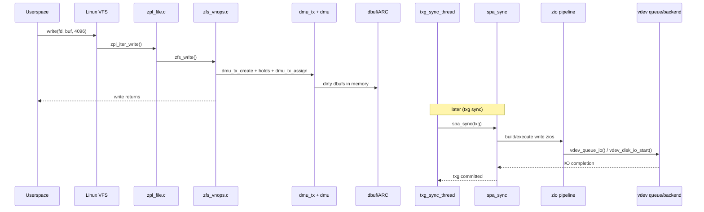
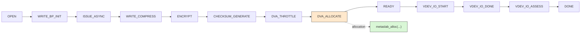
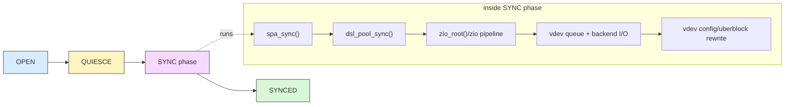
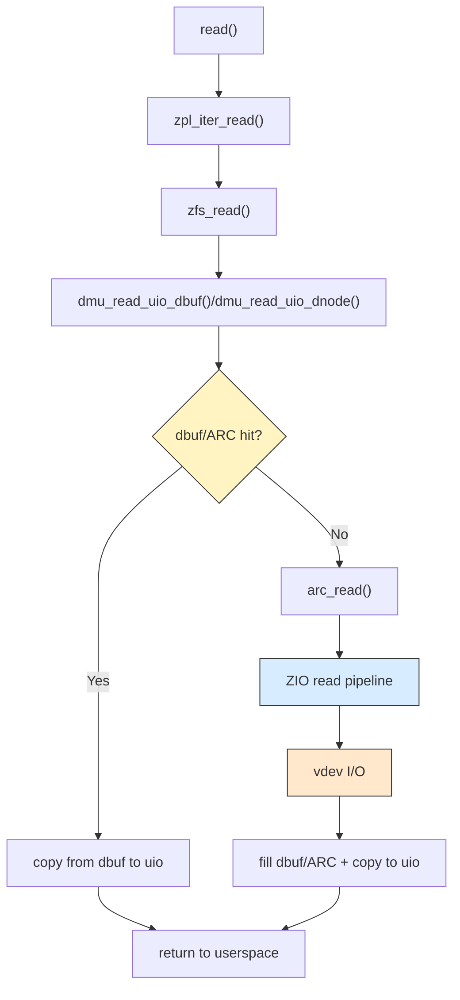

# Part 3 - The I/O Path

> Let's trace what actually happens when a 4 KB write hits OpenZFS.

## Why This Chapter Matters

Most confusion about ZFS behavior comes from one mismatch:

- syscall completion and durable pool commit are not the same moment.

This chapter follows the write path from Linux VFS entry, through DMU transaction work, into txg sync, through ZIO and VDEV, and finally to uberblock/config rewrite. It ends with a condensed read-path summary so "I/O path" is covered in both directions.

---

## Scope and Assumptions

To keep the trace concrete, we assume:

- Linux platform (`module/os/linux/zfs/*`)
- normal buffered write (not `O_DIRECT`)
- 4 KB write to a regular file
- no catastrophic I/O error path

We still call out where sync writes (`O_SYNC`/`O_DSYNC`/`fsync`) diverge via ZIL.

---

## Diagram 1 - End-to-End Write Sequence



---

## Step 1 - Syscall Entry at ZPL

Primary file:

- `module/os/linux/zfs/zpl_file.c`

Entry wiring:

- `zpl_file_operations` registers `.write_iter = zpl_iter_write`.

What `zpl_iter_write()` does:

1. validates generic write constraints
2. builds `zfs_uio_t` from kernel iterator state
3. acquires credentials/fstrans context
4. calls `zfs_write(ITOZ(ip), &uio, filp->f_flags | zfs_io_flags(kiocb), cr)`

This is the Linux adapter layer. It converts VFS-facing structures into the core vnode path.

---

## Step 2 - Core Write Logic in `zfs_write()`

Primary files:

- `module/zfs/zfs_vnops.c` (core `zfs_write()`)
- `module/os/linux/zfs/zfs_vnops_os.c` (Linux glue paths that invoke core vnode logic)

Important ownership detail:

- `zfs_write()` is implemented in `module/zfs/zfs_vnops.c`.
- For the specific path traced in this chapter, `zpl_iter_write()` calls core `zfs_write()` directly.

Inside `zfs_write()` the write is processed in chunks, and each chunk typically gets its own DMU transaction.

Key responsibilities in this stage:

- range locking (`RL_APPEND`/`RL_WRITER`)
- block size and offset handling
- quota/limit checks
- transaction hold setup and assignment
- write logging intent (`zfs_log_write(...)`)
- sync policy decision:
  - `commit = (O_SYNC | O_DSYNC) || os_sync == ZFS_SYNC_ALWAYS`

---

## Step 3 - DMU Transaction Setup and Assignment

Primary files:

- `module/zfs/zfs_vnops.c`
- `module/zfs/dmu_tx.c`
- `module/zfs/dmu.c`

Canonical pattern visible in `zfs_write()`:

1. `dmu_tx_create(...)`
2. `dmu_tx_hold_sa(...)`
3. `dmu_tx_hold_write_by_dnode(...)`
4. `dmu_tx_assign(tx, DMU_TX_WAIT)`

Then payload writes occur via:

- `dmu_write_uio_dbuf(...)` in `module/zfs/dmu.c`

Inside `dmu_write_uio_dbuf()` (via `dmu_write_uio_dnode()`):

- target dbufs are prepared with `dmu_buf_will_dirty_flags(...)` / `dmu_buf_will_fill_flags(...)`
- bytes are copied from the `uio` into `db->db_data` with `zfs_uio_fault_move(...)`
- dirty state is attached to the txg through the dbuf dirty-record path (`dbuf_dirty(...)`)

And finally:

- `dmu_tx_commit(tx)`

This means foreground writes are transactional and ordered, but still memory-first at this point.

One caveat on "memory-first": `dmu_tx_assign(tx, DMU_TX_WAIT)` is not
unconditional in-memory progress.

- if the open txg cannot take the tx (`ERESTART`), assignment retries via
  `dmu_tx_wait(...)`, which can sleep until a txg syncs out.
- if pool-wide dirty data has hit `zfs_dirty_data_max`, `dmu_tx_wait()`
  blocks until the sync thread frees dirty space.
- even below that hard limit, `dmu_tx_delay(...)` injects an artificial
  sleep once dirty data crosses
  `zfs_dirty_data_max * zfs_delay_min_dirty_percent / 100` (60% by
  default), and the delay grows sharply as dirty data approaches the max.

This is the write throttle (`module/zfs/dmu_tx.c`; see the large block
comment above `dmu_tx_delay()`). It paces foreground writers to match
sync-thread throughput instead of letting dirty data grow without bound.

---

## Step 4 - Dirtying Happens in Memory (`dbuf`/ARC)

Primary files:

- `module/zfs/dmu.c`
- `module/zfs/dbuf.c`
- `module/zfs/arc.c`

In the DMU write path:

- dbufs are marked dirty (`dmu_buf_will_dirty_flags(...)` and `dbuf_dirty(...)`)
- in-memory state is updated under transaction context
- no immediate requirement to write final data blocks to disk before syscall return

Conceptually:

- DMU/dbuf records "what changed in txg N"
- a single dbuf can hold multiple dirty records (`db_dirty_records`) for different txgs at once
- those records are tracked newest-to-oldest, which allows one txg to sync while a newer txg is still taking foreground writes
- txg sync later turns that dirty state into physical I/O

---

## Step 5 - ZIL Branch for Sync Semantics

Primary files:

- `module/zfs/zfs_vnops.c`
- `module/os/linux/zfs/zpl_file.c`
- `module/zfs/zil.c`

For sync semantics:

- `zfs_write()` may call `zil_commit(zilog, zp->z_id)` when commit policy requires it.
- `zpl_fsync()` eventually reaches `zfs_fsync()`, which also drives `zil_commit(...)`.

What ZIL provides:

- per-dataset intent logging for synchronous semantics
- replayable records after crash/power loss
- lower latency sync behavior than waiting for full txg sync

Important nuance:

- ZIL is for sync/replay semantics; final long-term pool state still converges through txg sync.
- `zil_commit()` does not bypass the I/O stack: it packs intent records into
  log write blocks (lwbs), and `zil_lwb_write_issue()` (`module/zfs/zil.c`)
  issues each lwb as a real zio (`zio_rewrite(...)` under a `zio_root(...)`,
  dispatched with `zio_nowait(...)`) immediately, before txg sync runs.
- net effect: a sync write traverses the ZIO pipeline and vdev layers twice -
  once right away via the ZIL lwb write, and again later when `spa_sync()`
  writes the final block tree.

---

## Step 6 - txg Scheduler Hands Off to Sync Thread

Primary file:

- `module/zfs/txg.c`

Key anchors:

- `txg_sync_thread(...)`
- `txg_quiesce_thread(...)` and `txg_quiesce(...)`

Default timeout behavior:

- `zfs_txg_timeout = 5` seconds (`module/zfs/txg.c`)

Who performs the quiesce:

- `txg_quiesce_thread()` picks the current open txg and calls `txg_quiesce()`.
- `txg_quiesce()` grabs every per-CPU `tc_open_lock` so no new tx can enter
  that txg, advances `tx_open_txg` (opening txg N+1 for new writers), then
  waits for all outstanding tx handles in txg N to be released.
- the now-quiesced txg is handed to the sync thread via `tx_quiesced_txg`.

So the open -> quiesced transition happens in `txg_quiesce_thread`, before
the sync thread ever sees the txg.

When a txg is quiesced and ready:

- sync thread consumes `tx_quiesced_txg` and calls `spa_sync(spa, txg)`

This is where dirty in-memory intent starts becoming durable on-disk state.

---

## Step 7 - `spa_sync()` and `dsl_pool_sync()` Converge Dirty State

Primary files:

- `module/zfs/spa.c`
- `module/zfs/dsl_pool.c`

Key anchors:

- `spa_sync(...)`
- `spa_sync_iterate_to_convergence(...)`
- `dsl_pool_sync(...)`

What happens conceptually:

1. `spa_sync` establishes sync context for this txg.
2. `dsl_pool_sync` drains dirty datasets and calls `dsl_dataset_sync(...)`.
3. root zios are created (`zio_root(...)`) and waited on.
4. passes continue until dirty state converges.

The convergence loop is why "one write syscall" does not map to "one immediate disk write."

---

## Step 8 - ZIO Write Pipeline Executes

Primary files:

- `include/sys/zio_impl.h`
- `module/zfs/zio.c`

Pipeline definition facts:

- `enum zio_stage` defines 27 stage bits
- `ZIO_WRITE_PIPELINE` composes a default write stage set
- stage execution dispatch goes through `zio_pipeline[]` function table

Common write-stage flow:

```text
OPEN
-> WRITE_BP_INIT
-> ISSUE_ASYNC
-> WRITE_COMPRESS
-> ENCRYPT
-> CHECKSUM_GENERATE
-> DVA_THROTTLE
-> DVA_ALLOCATE
-> READY
-> VDEV_IO_START
-> VDEV_IO_DONE
-> VDEV_IO_ASSESS
-> DONE
```

Stage handlers in `module/zfs/zio.c` include:

- `zio_write_bp_init`
- `zio_write_compress`
- `zio_encrypt`
- `zio_checksum_generate`
- `zio_dva_throttle`
- `zio_dva_allocate`
- `zio_vdev_io_start`
- `zio_vdev_io_done`
- `zio_vdev_io_assess`

Conditional pipeline behavior is worth calling out explicitly:

- deduplicated writes can switch to/include `ZIO_STAGE_DDT_WRITE` (`ZIO_DDT_WRITE_PIPELINE`)
- gang behavior activates `ZIO_STAGE_GANG_ASSEMBLE` / `ZIO_STAGE_GANG_ISSUE` (`ZIO_GANG_STAGES`) when gang assembly is needed
- all of these are composed through the same stage-bitmask mechanism (`io_pipeline`), not a completely separate engine

For the 4 KB buffered write traced in this chapter, you usually stay on the default write pipeline and do not take gang paths.

### Diagram 2 - Write Pipeline (Mermaid)



---

## Step 9 - VDEV Queueing and Device I/O

Primary files:

- `module/zfs/zio.c`
- `module/zfs/vdev_queue.c`
- `module/os/linux/zfs/vdev_disk.c`

Execution anchors:

- `zio_vdev_io_start(...)` calls into vdev layer and queues leaf I/O via `vdev_queue_io(...)`
- completion path returns through `zio_vdev_io_done(...)` and `vdev_queue_io_done(...)`
- Linux leaf backend submits via `vdev_disk_io_start(...)`

This is where logical ZIO work becomes actual block-layer requests.

---

## Step 10 - Atomic Commit Boundary (Uberblock/Config Rewrite)

Primary files:

- `module/zfs/spa.c`
- `module/zfs/vdev_label.c`
- `include/sys/uberblock.h`
- `include/sys/uberblock_impl.h`

Key anchors:

- `spa_sync_rewrite_vdev_config(...)` (spa.c)
- `vdev_config_sync(...)` (vdev_label.c; drives the label and uberblock sync lists)

During sync completion:

- vdev configuration (including uberblock-bearing label writes) is rewritten to commit the txg state
- then `spa->spa_ubsync` is advanced at end of `spa_sync`

Practically, this is the durable boundary that later imports select from label uberblocks.

---

## Diagram 3 - txg State vs Sync Internals

This diagram intentionally repeats Part 1's txg framing so this chapter can be read standalone.



---

## Read Path Summary (Condensed)

The write path above is txg-centric. The read path is shorter and split by cache hit vs miss.

Primary files:

- `module/os/linux/zfs/zpl_file.c`
- `module/zfs/zfs_vnops.c`
- `module/zfs/dmu.c`
- `module/zfs/dbuf.c`
- `module/zfs/arc.c`
- `module/zfs/zio.c`

Typical read flow:

1. `read()` enters `zpl_iter_read()` in `module/os/linux/zfs/zpl_file.c`.
2. `zpl_iter_read()` calls core `zfs_read()` in `module/zfs/zfs_vnops.c`.
3. `zfs_read()` calls `dmu_read_uio_dbuf()`/`dmu_read_uio_dnode()` (`module/zfs/dmu.c`) to fetch dbufs and copy data to the `uio`.
4. ARC/dbuf hit case: dbuf data is already resident, so bytes are copied and returned without issuing new device I/O.
5. ARC/dbuf miss case: dbuf/ARC path issues `arc_read(...)`, which drives the ZIO read pipeline and VDEV I/O before data is copied back to the caller.

Key contrast with writes:

- reads do not create txg dirty state. Under the default sync policy they do not involve the ZIL either, but with `sync=always` (or FRSYNC platforms) `zfs_read()` calls `zil_commit()` before taking the range lock, so pending sync writes are durable before the read proceeds.

### Diagram 4 - Read Path (Hit vs Miss)



---

## Practical "Where To Put Breakpoints" List

If you are debugging this path live, these are high-signal anchors:

1. `module/os/linux/zfs/zpl_file.c`: `zpl_iter_write`
2. `module/zfs/zfs_vnops.c`: `zfs_write`
3. `module/zfs/dmu_tx.c`: `dmu_tx_assign`
4. `module/zfs/dmu.c`: `dmu_write_uio_dbuf`
5. `module/zfs/dbuf.c`: `dbuf_dirty`
6. `module/zfs/txg.c`: `txg_sync_thread`
7. `module/zfs/spa.c`: `spa_sync`
8. `module/zfs/dsl_pool.c`: `dsl_pool_sync`
9. `module/zfs/zio.c`: `zio_dva_allocate` / `zio_vdev_io_start`
10. `module/os/linux/zfs/vdev_disk.c`: `vdev_disk_io_start`

---

## Key Takeaways

1. `write()` return does not imply full txg commit to final pool state.
2. Foreground path records transactional intent; sync path materializes it.
3. ZIO is the unifying execution engine for real I/O work.
4. Metaslab allocation is where physical placement decisions happen.
5. ZIL exists to satisfy sync semantics without waiting for full txg flush.
6. Uberblock/config rewrite during `spa_sync` is the durable transaction boundary.

---

## Next

-> [Part 4 - Block Pointers in Code](04-block-pointers.md): connect this runtime path to `blkptr_t`, DVA encoding, and checksum/compression metadata.
