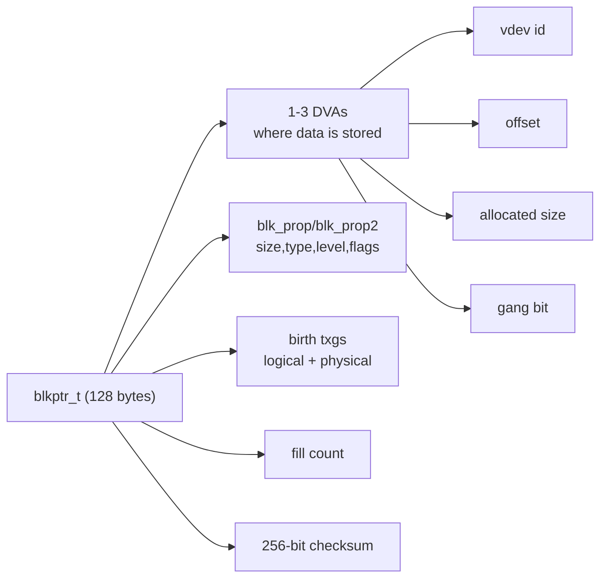
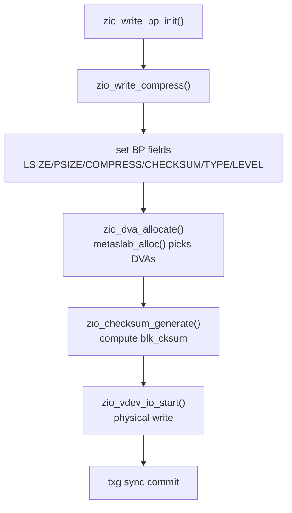
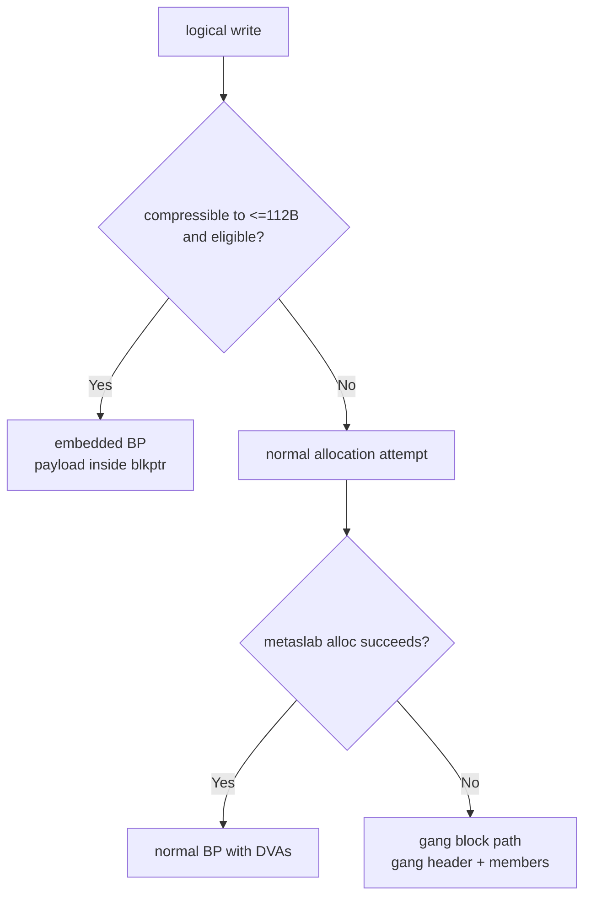

# Part 4 - Block Pointers in Code

> `blkptr_t` is the contract between logical objects and physical storage.

## Why This Chapter Matters

If Part 3 explained how I/O moves, this chapter explains what I/O is moving: block pointers.

Almost every important ZFS operation eventually reads or writes a `blkptr_t`:

- normal file data writes
- metadata updates
- checksum verification and healing
- snapshot destroy and deferred frees
- send/receive bookkeeping

Understanding block pointers is how on-disk format knowledge becomes practical source navigation.

---

## Scope

This chapter focuses on:

1. `blkptr_t`/`dva_t` layout and accessor macros in `include/sys/spa.h`
2. where those fields are populated in the write pipeline (`module/zfs/zio.c`)
3. how checksum/compression metadata is dispatched (`zio_checksum*`, `zio_compress*`)
4. special cases: embedded data, gang blocks, and deferred-free containers (`bpobj`/`bptree`)

Line-number anchors in this chapter are based on the reference revision listed in `README.md`. If you are on a newer OpenZFS commit, expect some drift and use symbol names to relocate.

---

## Diagram 1 - What a Block Pointer Represents



Primary source: `include/sys/spa.h:124`, `include/sys/spa.h:374`, `include/sys/spa.h:393`.

---

## `blkptr_t` and `dva_t` in Source

Primary definitions:

- `dva_t`: `include/sys/spa.h:110`
- `blkptr_t`: `include/sys/spa.h:374`

Key facts straight from the layout:

- `blkptr_t` is 128 bytes (`SPA_BLKPTRSHIFT=7`).
- each pointer has up to `SPA_DVAS_PER_BP=3` DVAs.
- `blk_prop` and `blk_prop2` are packed control words.
- birth is split into logical and physical txg (`blk_birth_word[2]`).
- checksum is a 256-bit value (`blk_cksum`).

`dva_t` itself is opaque 128-bit storage (`dva_word[2]`), with access through macros:

- `DVA_GET_ASIZE(...)`
- `DVA_GET_VDEV(...)`
- `DVA_GET_OFFSET(...)`
- `DVA_GET_GANG(...)`

Source: `include/sys/spa.h:393`, `include/sys/spa.h:399`, `include/sys/spa.h:403`, `include/sys/spa.h:408`.

---

## Encrypted `blkptr_t` Variant (Why It Matters)

Yes, this is worth mentioning because the encrypted layout reuses words differently.

The encrypted layout is documented directly in `include/sys/spa.h` and is not just a cosmetic flag change:

- parts of the "third DVA area" are reused for encryption parameters (salt/IV fields)
- `blk_fill` also carries crypto-related bits (`BP_GET_IV2`/`BP_SET_IV2`)
- helper macros account for this, for example `BP_GET_ASIZE` and `BP_GET_NDVAS` treat encrypted pointers differently

Practical implication for readers:

- do not manually reason about "3 DVAs always present" for encrypted blocks
- rely on `BP_GET_*`/`DVA_GET_*`/crypto-aware helpers instead of raw word assumptions

Related macros and comments:

- layout commentary: `include/sys/spa.h:188`
- crypto state helpers: `include/sys/spa.h:452`
- NDVA/ASIZE handling with encryption: `include/sys/spa.h:552`
- IV2 in `blk_fill`: `include/sys/spa.h:531`

We keep this section brief here because the chapter's goal is navigation and code-reading fluency, not full encryption design internals.

---

## `blk_prop` and `blk_prop2`: Packed Metadata

Most fields you care about are decoded through macros in `include/sys/spa.h`.

Frequently used getters:

- `BP_GET_LSIZE`, `BP_GET_PSIZE`
- `BP_GET_COMPRESS`, `BP_GET_CHECKSUM`
- `BP_GET_TYPE`, `BP_GET_LEVEL`
- `BP_GET_NDVAS` (how many DVAs this pointer is currently using)
- `BP_GET_DEDUP`, `BP_GET_BYTEORDER`
- `BP_GET_BIRTH`, `BP_GET_LOGICAL_BIRTH`, `BP_GET_PHYSICAL_BIRTH`
- `BP_GET_REWRITE` (from `blk_prop2`)

Important nuance:

- `BP_GET_DEDUP` is in `blk_prop` (bit-packed there), not `blk_prop2`.
- `BP_GET_REWRITE` is in `blk_prop2`.

Source anchors: `include/sys/spa.h:411`, `include/sys/spa.h:430`, `include/sys/spa.h:438`, `include/sys/spa.h:446`, `include/sys/spa.h:472`, `include/sys/spa.h:494`, `include/sys/spa.h:540`.

---

## Birth Semantics (Logical vs Physical)

One of the most useful details for debugging:

- logical birth: when data is logically born/modified
- physical birth: when this physical placement was written

Why it matters:

- dedup, remap, rewrite, and clone paths can decouple logical and physical time.
- code distinguishes these through `BP_GET_LOGICAL_BIRTH`, `BP_GET_PHYSICAL_BIRTH`, and `BP_GET_BIRTH`.

Source commentary and macros: `include/sys/spa.h:481`.

---

## How Write Pipeline Populates a Block Pointer

Primary write-path anchor: `module/zfs/zio.c:1847` (`zio_write_bp_init`) and `module/zfs/zio.c:1911` (`zio_write_compress`).

Where fields are set for normal writes:

- `BP_SET_LSIZE`
- `BP_SET_PSIZE`
- `BP_SET_COMPRESS`
- `BP_SET_CHECKSUM`
- `BP_SET_TYPE`
- `BP_SET_LEVEL`
- `BP_SET_DEDUP`
- `BP_SET_BYTEORDER`

Source: `module/zfs/zio.c:2107`.

How this maps conceptually:

1. choose compression and possibly transform payload (`zio_write_compress`)
2. set pointer properties from `zio_prop_t`
3. allocate DVAs (`zio_dva_allocate`)
4. generate checksum (`zio_checksum_generate`)
5. issue device I/O (`zio_vdev_io_start`)

---

## Diagram 2 - Write-Time Pointer Materialization



Anchors:

- `module/zfs/zio.c:1847`
- `module/zfs/zio.c:1911`
- `module/zfs/zio.c:4346`
- `module/zfs/zio.c:5184`

---

## Compression Metadata in Practice

Compression registry:

- enum + interface: `include/sys/zio_compress.h:41`
- table: `module/zfs/zio_compress.c:43`

Algorithms visible in current table include:

- `lzjb`
- `gzip-1` through `gzip-9`
- `zle`
- `lz4`
- `zstd`

Dispatch helpers:

- `zio_compress_data(...)`: `module/zfs/zio_compress.c:117`
- `zio_decompress_data(...)`: `module/zfs/zio_compress.c:154`

Pipeline behavior worth remembering:

- if compressed size is not smaller, write falls back to uncompressed.
- resulting algorithm is recorded in `BP_SET_COMPRESS(...)`/`BP_GET_COMPRESS(...)`.

Compression stage reference: `ZIO_STAGE_WRITE_COMPRESS` in `include/sys/zio_impl.h:135`.

---

## Checksum Metadata in Practice

Checksum registry:

- `zio_checksum_info_t`: `include/sys/zio_checksum.h:88`
- global table: `zio_checksum_table[...]` in `module/zfs/zio_checksum.c:170`

Algorithms in the active table include:

- `fletcher2`, `fletcher4`
- `sha256`, `sha512`
- `skein`, `edonr`, `blake3`
- special entries like `label`, `gang_header`, `zilog`

Pipeline handlers:

- write-time generation: `zio_checksum_generate(...)` (`module/zfs/zio.c:5184`)
- read-time verify: `zio_checksum_verify(...)` (`module/zfs/zio.c:5215`)

Stage constants:

- `ZIO_STAGE_CHECKSUM_GENERATE`: `include/sys/zio_impl.h:138`
- `ZIO_STAGE_CHECKSUM_VERIFY`: `include/sys/zio_impl.h:163`

---

## Embedded Block Pointers

For small highly-compressible payloads, ZFS can store bytes inside the block pointer itself.

Key locations:

- layout and macros: `include/sys/spa.h:325`
- encode/decode helpers: `module/zfs/blkptr.c:48`
- write-path decision: `module/zfs/zio.c:1991`

Important facts:

- payload budget is `BPE_PAYLOAD_SIZE` (112 bytes): `include/sys/spa.h:357`
- encoded by `encode_embedded_bp_compressed(...)`
- decoded by `decode_embedded_bp(...)`
- represented via `BP_IS_EMBEDDED(...)` and `BPE_GET_*` macros

This is a major reason `blkptr.c` is short: it mainly implements embedded-data encode/decode helpers, while most generic pointer population still lives in `zio.c`.

---

## Gang Blocks

Gang blocks are the fallback when normal contiguous allocation fails for a write.

Core trigger path:

- `zio_dva_allocate(...)` tries `metaslab_alloc(...)`
- on `ENOSPC` for that shape, it can call `zio_write_gang_block(...)`

Source: `module/zfs/zio.c:4346`, `module/zfs/zio.c:4413`, `module/zfs/zio.c:4423`.

Gang processing stages are explicit pipeline stages:

- `ZIO_STAGE_GANG_ASSEMBLE`
- `ZIO_STAGE_GANG_ISSUE`

Source: `include/sys/zio_impl.h:149`, `module/zfs/zio.c:5908`.

On-disk indicator:

- `DVA_GET_GANG(...)` / `BP_IS_GANG(...)` indicates gang addressing

Source: `include/sys/spa.h:408`, `include/sys/spa.h:588`.

---

## Diagram 3 - Normal vs Embedded vs Gang



---

## Block Pointer Containers for Deferred Work

These files answer "where do lots of block pointers live when we are not directly in a single I/O?"

### `bpobj` (`module/zfs/bpobj.c`)

Used for persistent collections of block pointers, especially deadlist/livelist style workflows.

Useful anchors:

- `bpobj_alloc`, `bpobj_open`, `bpobj_iterate`, `bpobj_enqueue`

Source: `module/zfs/bpobj.c:79`, `module/zfs/bpobj.c:151`, `module/zfs/bpobj.c:544`, `module/zfs/bpobj.c:872`.

### `bptree` (`module/zfs/bptree.c`)

Queue of destroyed-dataset root block pointers so deletion can finish quickly and block traversal/freeing can continue asynchronously.

Useful anchors:

- `bptree_add`
- `bptree_iterate`

Source: `module/zfs/bptree.c:40`, `module/zfs/bptree.c:120`, `module/zfs/bptree.c:190`.

### `bplist` (`module/zfs/bplist.c`)

Simple in-memory list wrapper for block pointers (`append`, `iterate`, `clear`).

Source: `module/zfs/bplist.c:47`, `module/zfs/bplist.c:64`, `module/zfs/bplist.c:80`.

---

## Practical Debugging Anchors

If you need to debug pointer state in live flow, start here:

1. `module/zfs/zio.c`: `zio_write_bp_init`
2. `module/zfs/zio.c`: `zio_write_compress`
3. `module/zfs/zio.c`: `zio_dva_allocate`
4. `module/zfs/zio.c`: `zio_checksum_generate`
5. `module/zfs/zio.c`: `zio_checksum_verify`
6. `module/zfs/blkptr.c`: `encode_embedded_bp_compressed`
7. `module/zfs/blkptr.c`: `decode_embedded_bp`
8. `module/zfs/bpobj.c`: `bpobj_enqueue`
9. `module/zfs/bptree.c`: `bptree_iterate`

Useful inspection macro families while stepping:

- `BP_GET_*`
- `DVA_GET_*`
- `BPE_GET_*`

---

## Mapping Back to On-Disk Investigation

The in-memory structure here maps directly to the 128-byte on-disk block pointer format described in `include/sys/spa.h`.

A practical bridge when correlating runtime with disk inspection:

1. identify target block pointer fields in code (`BP_GET_*`, `DVA_GET_*`)
2. inspect pool structures with `zdb` for the same object tree
3. compare birth txg, size, checksum/compress algorithm, and DVA placement

Useful starting commands:

```bash
# high-verbosity block-pointer stats for a pool
zdb -bbbb poolname

# dataset/object inspection (increase -d count for more detail)
zdb -dddd poolname/dataset object-id
```

This is the exact bridge between "format archaeology" and "kernel code behavior."

---

## Key Takeaways

1. `blkptr_t` is the central metadata unit linking logical objects to physical storage.
2. `blk_prop`/`blk_prop2` are packed and should be read through macros, not ad-hoc bit logic.
3. Pointer fields are mostly materialized during ZIO write stages, not in DMU call sites.
4. Embedded and gang block forms are first-class paths, not edge-case hacks.
5. `bpobj`/`bptree` are critical for scalable deferred free/destroy behavior.

---

## Next

-> [Part 5 - Feature Flags](05-feature-flags.md): where compatibility features are registered, enabled, and enforced in OpenZFS.
