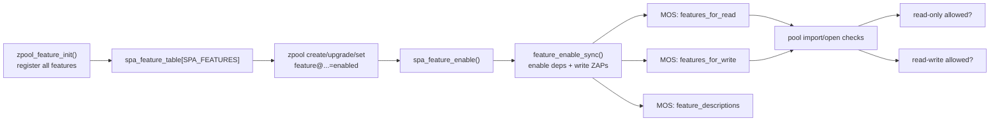
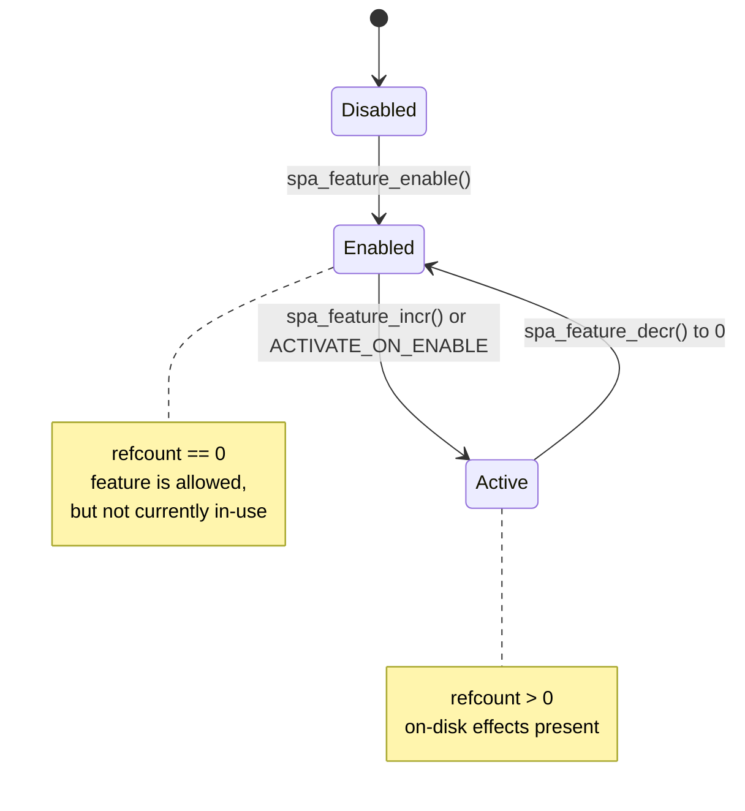
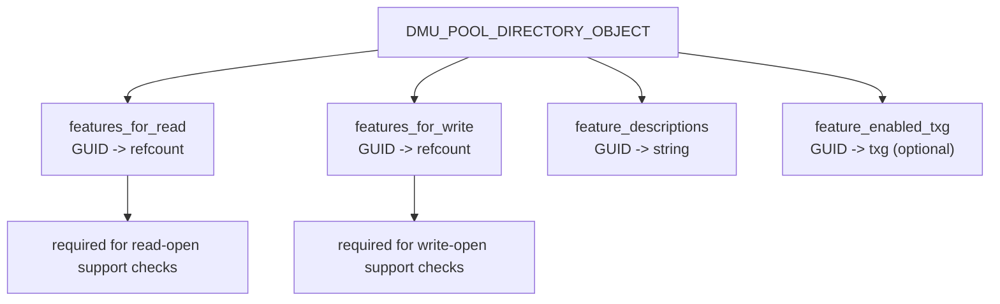
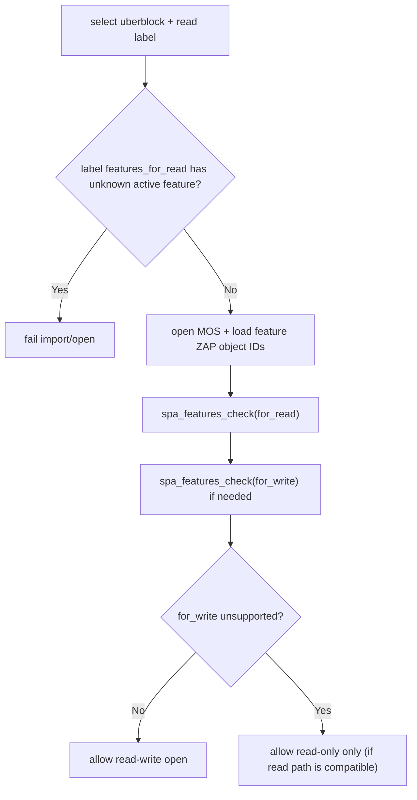

# Part 5 - Feature Flags in Code

> Feature flags are OpenZFS's compatibility contract for on-disk format evolution.

## Why This Chapter Matters

Feature flags are where three concerns meet:

- on-disk compatibility
- runtime behavior gates in kernel code
- user-visible policy (`feature@...`, `compatibility`, `zpool upgrade`)

If you want to add or reason about a format-affecting change, this is the system you have to understand.

---

## Scope

This chapter focuses on:

1. how features are declared and registered (`spa_feature_t`, `zfeature_info_t`, `zpool_feature_init()`)
2. how state is represented on disk (disabled/enabled/active via refcount in MOS ZAPs)
3. how import compatibility is enforced (label precheck plus MOS checks)
4. how userland policy (`compatibility`) shapes create/upgrade behavior
5. a practical "add a feature" workflow

Line-number anchors in this chapter are based on the reference revision listed in `README.md`. If you are on a newer OpenZFS commit, expect drift and relocate by symbol names.

---

## Diagram 1 - Big Picture



---

## Core Data Structures

Primary anchors:

- feature enum: `include/zfeature_common.h:44`
- flags: `include/zfeature_common.h:98`
- feature type enum: `include/zfeature_common.h:120`
- descriptor: `include/zfeature_common.h:126`
- global feature table declaration: `include/zfeature_common.h:142`
- global feature table definition: `module/zcommon/zfeature_common.c:54`

The central table is:

```c
zfeature_info_t spa_feature_table[SPA_FEATURES];
```

`spa_feature_t` is the internal index. `fi_guid` is the on-disk identity. That distinction matters:

- enum order is code-local bookkeeping
- GUID string is the persistent compatibility contract

---

## Registration Flow in `zpool_feature_init()`

Primary anchors:

- `zfeature_register(...)`: `module/zcommon/zfeature_common.c:323`
- `zpool_feature_init(...)`: `module/zcommon/zfeature_common.c:369`

Registration pattern:

```c
zfeature_register(SPA_FEATURE_ASYNC_DESTROY,
    "com.delphix:async_destroy", "async_destroy",
    "Destroy filesystems asynchronously.",
    ZFEATURE_FLAG_READONLY_COMPAT, ZFEATURE_TYPE_BOOLEAN, NULL,
    sfeatures);
```

Each call sets:

1. enum ID (`SPA_FEATURE_*`)
2. on-disk GUID (`org.vendor:feature`)
3. user-visible short name (`feature@short_name`)
4. human description
5. behavior flags
6. feature type
7. dependency list (`... SPA_FEATURE_NONE`)

`zfeature_type_t` currently has two values:

- `ZFEATURE_TYPE_BOOLEAN`
- `ZFEATURE_TYPE_UINT64_ARRAY` (for example `SPA_FEATURE_REDACTED_DATASETS`)

Concrete examples worth reading:

- simple read-only compatible: `SPA_FEATURE_ASYNC_DESTROY` (`module/zcommon/zfeature_common.c:374`)
- activate-at-enable: `SPA_FEATURE_LZ4_COMPRESS` (`module/zcommon/zfeature_common.c:386`)
- dependency on enabled-txg: `SPA_FEATURE_HOLE_BIRTH` (`module/zcommon/zfeature_common.c:414`)
- opt-out from blanket `zpool upgrade`: `SPA_FEATURE_DYNAMIC_GANG_HEADER` (`module/zcommon/zfeature_common.c:795`)

---

## Flags That Drive Behavior

Primary definitions: `include/zfeature_common.h:100`.

- `ZFEATURE_FLAG_READONLY_COMPAT`: unsupported feature may still allow read-only import.
- `ZFEATURE_FLAG_MOS`: feature affects MOS-level behavior/requirements.
- `ZFEATURE_FLAG_ACTIVATE_ON_ENABLE`: initial refcount starts at 1 when enabled.
- `ZFEATURE_FLAG_PER_DATASET`: feature usage is tracked per dataset context.
- `ZFEATURE_FLAG_NO_UPGRADE`: `zpool upgrade` does not auto-enable it.

Important registration constraint:

- `zfeature_register()` asserts `READONLY_COMPAT` and `MOS` are not combined (`module/zcommon/zfeature_common.c:334`).

---

## State Model: Disabled, Enabled, Active

The canonical explanation is in the header comment of `module/zfs/zfeature.c` (starting near `module/zfs/zfeature.c:40`).

The state machine is refcount-based:

- disabled: no ZAP entry
- enabled: ZAP entry exists, refcount = 0
- active: ZAP entry exists, refcount > 0

This is exactly how `spa_feature_is_enabled()` and `spa_feature_is_active()` behave (see `module/zfs/zfeature.c`, functions `spa_feature_is_enabled` and `spa_feature_is_active`).

### Diagram 2 - Feature Lifecycle



---

## Where Feature State Lives On Disk

Constants:

- `DMU_POOL_FEATURES_FOR_WRITE`: `include/sys/dmu.h:384`
- `DMU_POOL_FEATURES_FOR_READ`: `include/sys/dmu.h:385`
- `DMU_POOL_FEATURE_DESCRIPTIONS`: `include/sys/dmu.h:386`
- `DMU_POOL_FEATURE_ENABLED_TXG`: `include/sys/dmu.h:387`

Creation path:

- `spa_feature_create_zap_objects(...)` in `module/zfs/zfeature.c` (around the mid-400s in the reference revision)

Mutation path:

- `feature_sync(...)` writes refcount entry: `module/zfs/zfeature.c:305`
- `feature_enable_sync(...)` creates description entry and initial state: `module/zfs/zfeature.c:340`

Placement rule:

- if feature has `READONLY_COMPAT`, it is stored in `features_for_write`
- otherwise it is stored in `features_for_read`

That rule is visible in both `feature_sync()` and `feature_enable_sync()` via the `zapobj` selection.

### Diagram 3 - MOS Feature Objects



---

## Enable Path and Dependency Handling

Primary control entry points:

- `spa_feature_enable(...)` in `module/zfs/zfeature.c`
- `spa_feature_incr(...)` in `module/zfs/zfeature.c`
- `spa_feature_decr(...)` in `module/zfs/zfeature.c`

`feature_enable_sync()` does the heavy lifting:

1. chooses initial refcount (`1` with `ACTIVATE_ON_ENABLE`, else `0`)
2. returns early if already enabled
3. recursively enables dependencies (`feature->fi_depends`)
4. writes `feature_descriptions` entry
5. writes initial refcount in read/write feature ZAP
6. records enabling txg if `enabled_txg` is active

Anchors: `module/zfs/zfeature.c:340` through `module/zfs/zfeature.c:377`.

Dependency query helper:

- `zfeature_depends_on(...)`: `module/zcommon/zfeature_common.c:149`

---

## Import-Time Compatibility Enforcement

Import/open checks are two-stage:

1. pre-MOS check from label `features_for_read` list
2. MOS check via `spa_features_check()` for read and optionally write mode

Primary anchors:

- early label feature check: `module/zfs/spa.c:4840`
- load-time feature reconciliation: `spa_ld_check_features(...)` at `module/zfs/spa.c:5142`
- core validator: `spa_features_check(...)` at `module/zfs/zfeature.c:175`

What this means operationally:

- unsupported active feature in read set blocks pool open
- unsupported active feature only in write set can still allow read-only open
- `spa_ld_check_features()` also builds userland-visible nvlists of enabled/unsupported features

### Diagram 4 - Import Decision Model



---

## Userland State and Policy

### How `feature@...` strings are computed

`zpool_prop_get_feature()` maps raw refcount to property text:

- absent -> `disabled`
- present, `0` -> `enabled`
- present, `>0` -> `active`

Anchor: `lib/libzfs/libzfs_pool.c:1145`.

### Compatibility property parsing

`zpool_load_compat(...)` parses the `compatibility` property and feature files:

- unset/`off`/empty -> all features allowed
- `legacy` -> all features disallowed
- comma list of file names -> intersection of listed feature sets
- search paths include `/etc/zfs/compatibility.d` and `/usr/share/zfs/compatibility.d`

Anchor: `lib/libzfs/libzfs_pool.c:5176`.

### Where compatibility is enforced in workflows

- `zpool create` applies compatibility set and auto-adds allowed features: `cmd/zpool/zpool_main.c:2236`
- `zpool upgrade` skips `NO_UPGRADE` features and respects compatibility: `cmd/zpool/zpool_main.c:11486`

---

## Practical Inspection Commands

Quick commands that are usually high-signal:

```bash
# Show per-feature state (disabled/enabled/active) for a pool
zpool get all POOL | rg 'feature@'

# See pool compatibility policy
zpool get compatibility POOL

# List importable pools; the scan reports unsupported-feature status
zpool import
```

When tracing code behavior, these anchors are usually the best first breakpoints:

1. `module/zcommon/zfeature_common.c`: `zpool_feature_init`
2. `module/zfs/zfeature.c`: `feature_enable_sync`
3. `module/zfs/zfeature.c`: `feature_sync`
4. `module/zfs/zfeature.c`: `spa_features_check`
5. `module/zfs/spa.c`: `spa_ld_check_features`
6. `lib/libzfs/libzfs_pool.c`: `zpool_prop_get_feature`

---

## How To Add a New Feature Flag

This is the shortest reliable workflow for contributors.

1. Add enum value in `include/zfeature_common.h` just before `SPA_FEATURES`.
2. Register it in `zpool_feature_init()` in `module/zcommon/zfeature_common.c`.
3. Choose flags deliberately.
4. Add dependency list ending with `SPA_FEATURE_NONE`.
5. Gate behavior with `spa_feature_is_enabled()` and increment/decrement usage with `spa_feature_incr()`/`spa_feature_decr()` in syncing context.
6. Add/extend tests in `tests/zfs-tests/tests/functional/features/` or the subsystem-specific suite.
7. Update `man/man7/zpool-features.7`.
8. Consider compatibility file implications in `cmd/zpool/compatibility.d/` (installed to `/usr/share/zfs/compatibility.d/`; `/etc/zfs/compatibility.d/` is only the admin-local override path).

Two design rules from `module/zfs/zfeature.c` comments are worth keeping front-and-center:

- do not assume enable-time metadata initialization has happened
- treat "enabled but not active" as a first-class state your code can encounter

---

## Key Takeaways

1. Feature flags are refcounted, not binary toggles.
2. GUID strings are the durable compatibility identity.
3. Import compatibility is enforced in two stages: label-first, MOS-second.
4. `compatibility` is policy; feature ZAP state is reality.
5. `NO_UPGRADE` features intentionally require explicit operator intent.

---

## Next

-> [Part 6 - Contributing Guide](06-contributing-guide.md): build, test, debug tools, and patch workflow.
