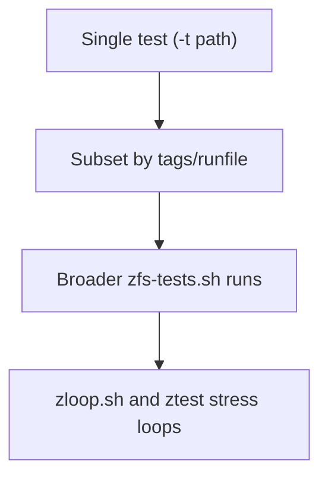

# Part 6 - Contributing Guide

> A practical path from "I can read the code" to "I can land useful patches."

## Why This Chapter Matters

OpenZFS contribution work usually fails for process reasons, not technical reasons:

- changes are too broad
- tests are run too late
- style/commit expectations are discovered at PR time
- debugging setup is weak

This chapter is about building a repeatable developer loop so feedback comes early and cheaply.

---

## Scope

This chapter focuses on:

1. development-oriented build setup
2. in-tree helper scripts for faster local iteration
3. test strategy from targeted checks to stress loops
4. how the ZFS Test Suite is wired (runfiles, test-runner, test scripts)
5. submission expectations from OpenZFS's own contributing guide

---

## Diagram 1 - Contributor Feedback Loop


---

## Build for Development (Not Just Installation)

Primary references:

- top-level project intro: `README.md:1`
- debug recommendation: `.github/CONTRIBUTING.md:49`
- build/check targets: `Makefile.am:106`

The minimum development loop is:

```bash
git clone https://github.com/openzfs/zfs.git
cd zfs
./autogen.sh
./configure --enable-debug
make -j"$(nproc)"
```

After building kernel-side changes, reload the in-tree modules before testing:

```bash
sudo ./scripts/zfs.sh -r
```

Why `--enable-debug` matters:

- OpenZFS upstream explicitly recommends it for development (`.github/CONTRIBUTING.md:51`)
- it enables ASSERT-heavy validation paths that catch problems earlier

Useful build targets:

- `make checkstyle` (`Makefile.am:111`)
- `make lint` (`Makefile.am:165`)
- `make pkg-utils` for utility/test packaging workflows (`tests/README.md:9`)
- `make ctags`, `make cscopelist` for source navigation (`Makefile.am:187`, `Makefile.am:199`)

---

## In-Tree Runtime Helpers

For fast local iteration, OpenZFS ships helper scripts in `scripts/`.

### `scripts/zfs.sh` - load/unload module stack

Source: `scripts/zfs.sh:1`.

What it gives you:

- controlled module reload (`-r`), unload (`-u`), verbose mode (`-v`)
- Linux and FreeBSD handling in one script
- root checks and safety checks for missing/loaded modules

### `scripts/zfs-helpers.sh` - in-tree helper symlinks

Source: `scripts/zfs-helpers.sh:4`.

What it gives you:

- installs/removes helper symlinks for in-tree development
- lets you iterate on helper scripts without full reinstall cycles
- supports dry-run and verbose modes for safer setup

---

## Style and Static Checks Before Tests

Primary references:

- contributor expectation: run `make checkstyle` (`.github/CONTRIBUTING.md:153`)
- checkstyle wiring: `Makefile.am:111`
- commit message checks integrated in `checkstyle`: `Makefile.am:114`

What `checkstyle` covers in-tree:

- code checks (`codecheck`)
- commit message checks (`scripts/commitcheck.sh`)
- `cstyle.pl` formatting/style checks over C sources

Style baseline is illumos/Solaris-derived C style (hard tabs, K&R-style braces, and strict spacing rules), enforced by `cstyle.pl` and the project conventions in `.github/CONTRIBUTING.md`.

Recommended pre-test sequence:

```bash
make checkstyle
make lint
```

This catches low-cost failures before expensive integration testing.

---

## Testing Strategy: Narrow to Wide

Think in layers:

1. one changed path or one test
2. focused functional category
3. stress/fault loops

### Diagram 2 - Test Pyramid



---

## ZFS Test Suite Internals You Should Know

Primary references:

- test suite guide: `tests/README.md:1`
- zfs-tests wrapper script: `scripts/zfs-tests.sh:1`
- runfile packaging location: `tests/Makefile.am:18`
- canonical runfiles: `tests/runfiles/common.run:1`
- test-runner implementation: `tests/test-runner/bin/test-runner.py.in:1`

### `zfs-tests.sh` wrapper behavior

From `scripts/zfs-tests.sh`:

- default runfiles are `common.run` and platform runfile (`scripts/zfs-tests.sh:45`)
- wrapper can create sparse-file/loopback test disks
- cleanup modes include dangerous full cleanup (`-x`)

From `tests/README.md`, practical usage:

```bash
# from installed tree
sudo /usr/share/zfs/zfs-tests.sh

# from source tree
./scripts/zfs-tests.sh

# targeted execution examples
./scripts/zfs-tests.sh -T functional
./scripts/zfs-tests.sh -t tests/functional/cli_root/zpool_create/zpool_create_001_pos
```

For a concrete source-tree single-test loop after local changes:

```bash
sudo ./scripts/zfs.sh -r
sudo ./scripts/zfs-tests.sh -t tests/functional/cli_root/zpool_create/zpool_create_001_pos
```

Two flag interactions worth knowing:

- `-t` and `-T` cannot be combined; the wrapper fails with
  "-t and -T are mutually exclusive." (`scripts/zfs-tests.sh:499`).
- `-T` also accepts a fraction like `1/3` or `2/3` to run that slice of
  the full test list, which is how one full run gets split across
  multiple machines (usage text at `scripts/zfs-tests.sh:380`). The
  split logic (`split_tags()`, `scripts/zfs-tests.sh:214`) expands the
  fraction into a per-test tag list and interleaves selection by
  modulus, so each slice gets a balanced mix rather than an
  alphabetical chunk.

### Runfiles are first-class test definitions

Example runfile: `tests/runfiles/common.run:19`.

Runfiles define:

- pre/post scripts
- timeouts
- tags
- explicit test lists per directory/group

This is why changing test coverage often involves both test scripts and runfile updates.

### test-runner options you actually use

Option parser: `tests/test-runner/bin/test-runner.py.in:1173`.

Common flags:

- `-c` runfiles
- `-i` test tree root
- `-T` tags
- `-t` timeout
- `-I` iterations
- `-q` quiet summary-focused output

---

## Writing and Registering New Tests

Primary references:

- add-test walkthrough: `tests/README.md:158`
- generated test file lists and regeneration guidance: `tests/zfs-tests/tests/Makefile.am:36`
- regen target at repo root: `Makefile.am:183`

Practical workflow:

1. Copy an existing nearby test as template.
2. Use the existing shell test helper patterns (`log_must`, `log_mustnot`, cleanup hooks) as shown in `tests/README.md:226`.
3. Register the new file in the appropriate test `Makefile.am`.
4. Update runfile coverage if needed (`tests/runfiles/*.run`).
5. If list generation drift occurs, run `make regen-tests`.

Tip:

- keep new tests narrowly scoped to one behavior; broad "integration mega-tests" are harder to debug and review.

---

## Essential Debug/Validation Tools

### `zdb`

- sources: `cmd/zdb/`, man page `man/man8/zdb.8`
- use for pool/object/block introspection
- especially valuable when validating on-disk effects of kernel changes

### `zhack`

- source: `cmd/zhack.c:29`
- explicitly documented as unsafe pool mutation tool for testing
- good for controlled feature-flag and label experiments on disposable pools

### `zinject`

- source: `cmd/zinject/zinject.c:286`
- fault injection across device/data-path scenarios
- useful for validating recovery/error-handling paths that are hard to trigger naturally

### `ztest` and `zloop.sh`

- `ztest` stress framework: `cmd/ztest.c:37`
- usage/help entry: `cmd/ztest.c:867`
- `zloop.sh` repeatedly runs randomized `ztest` and captures crash artifacts: `scripts/zloop.sh:48`
- compared to one long `ztest -T ...` run, `zloop.sh` intentionally varies run parameters across iterations and preserves failing run context/artifacts for reproduction

---

## Pull Request and Commit Expectations

Primary source: `.github/CONTRIBUTING.md`.

Upstream reference:

- https://github.com/openzfs/zfs/blob/master/.github/CONTRIBUTING.md

### Core PR expectations

- base on current `master` for normal development (`.github/CONTRIBUTING.md:129`)
- keep PRs scoped; ideally one issue-focused commit (`.github/CONTRIBUTING.md:131`)
- all CI checks must pass before merge (`.github/CONTRIBUTING.md:159`)

### Commit message requirements

- summary line <= 72 chars (`.github/CONTRIBUTING.md:207`)
- wrapped body explaining change and rationale (`.github/CONTRIBUTING.md:209`)
- required `Signed-off-by:` trailer (`.github/CONTRIBUTING.md:213`)

### Special-case commit message formats

The "Commit Message Formats" section (`.github/CONTRIBUTING.md:204`)
defines one more first-class format beyond plain new changes:

- Coverity defect fixes (`.github/CONTRIBUTING.md:229`): subject line
  in the shape `Fix coverity defects: CID dddd, dddd...`, a body that
  lists each CID and how it was corrected, and the usual
  `Signed-off-by:` trailer last.

One documentation drift to be aware of: the table of contents still
links an "OpenZFS Patch Ports" format
(`.github/CONTRIBUTING.md:31`), but that section body was removed in
2020 (commit `eb267f08c`). The historical port format used the ported
commit's summary as the subject (prefixed `OpenZFS dddd, dddd - `),
`Authored by:`/`Reviewed by:`/`Approved by:`/`Ported-by:` attribution
lines, and `OpenZFS-issue:`/`OpenZFS-commit:` link trailers. You will
still see it throughout older git history, but it is no longer a
documented requirement.

### CI mode override trailers

The `ZFS-CI-Type` trailer set implemented by the CI script is a superset of what the contributing guide documents:

- quick/full overrides documented in `.github/CONTRIBUTING.md:150`
- implemented in `.github/workflows/scripts/generate-ci-type.py:66`, which additionally accepts `linux` and `freebsd` platform-only overrides not mentioned in CONTRIBUTING.md
- current master further auto-detects docs-only PRs and skips the qemu matrix for them

Examples:

```text
ZFS-CI-Type: quick
ZFS-CI-Type: full
ZFS-CI-Type: linux
ZFS-CI-Type: freebsd
```

---

## Further Resources

- Main PR and commit procedure: https://github.com/openzfs/zfs/blob/master/.github/CONTRIBUTING.md
- OpenZFS "Participate": https://openzfs.org/wiki/Participate
- OpenZFS "Developer resources": https://openzfs.org/wiki/Developer_resources
- OpenZFS GitHub contribution entrypoint: https://github.com/openzfs/zfs/contribute

---

## Practical First-Patch Playbook

This is a reliable starter sequence for new contributors:

1. Pick one small behavior fix in one subsystem file.
2. Build with `--enable-debug`.
3. Run `make checkstyle`.
4. Run one targeted test that reproduces/guards the behavior.
5. Run a broader relevant suite slice (`zfs-tests.sh` by tag or runfile).
6. Commit with signoff (`git commit -s`).
7. Open PR with a short reproduction/validation note.

If your change touches on-disk format behavior:

1. Also add a focused test.
2. Validate with `zdb`/`zhack` on disposable pools.
3. Cross-check with Part 5 feature-flag workflow.

---

## Series Recap

You now have a complete map from architecture to contribution workflow:

1. [Part 1 - Architecture Overview](01-architecture-overview.md)
2. [Part 2 - Repository Layout](02-repo-layout.md)
3. [Part 3 - The I/O Path](03-io-path.md)
4. [Part 4 - Block Pointers in Code](04-block-pointers.md)
5. [Part 5 - Feature Flags in Code](05-feature-flags.md)
6. [Part 6 - Contributing Guide](06-contributing-guide.md)

This is enough to start making small, high-quality OpenZFS patches confidently.
