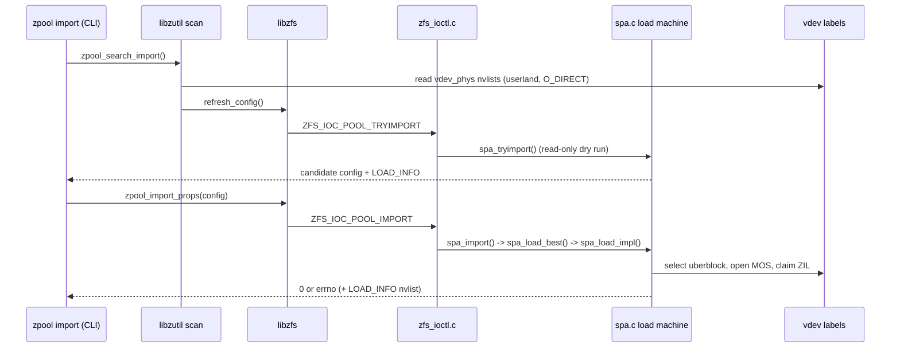
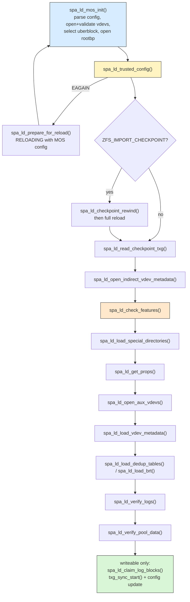

# Part 7 - Pool Import: How a Pool Comes Up

> Import is a state machine that must bootstrap trust from raw device labels.

## Why This Chapter Matters

Import is the most-debugged path in ZFS operations. When a pool will not
import, the failure can originate in userland device scanning, in uberblock
selection, in the MMP activity check, in feature gating, or deep in MOS
loading - and the error you see at the CLI is often several layers removed
from the code that produced it.

This chapter answers one question: "where do I look when a pool will not
import". It traces `zpool import <pool>` end to end and maps observable
symptoms back to the stage functions that produce them.

The core structural insight up front:

- Import runs in two phases: userland discovery (reading labels directly
  from devices) and kernel load (a staged `spa_ld_*` state machine).
- The kernel never trusts the config userland hands it. It re-derives the
  config from the MOS and may restart the whole load with the trusted copy.

---

## Scope and Assumptions

To keep the trace concrete, we assume:

- Linux platform, non-root pool, `zpool import tank` (no cachefile)
- default flags first; `-f`, `-F`, `-X`, `--rewind-to-checkpoint` are
  covered where they change the path

Line-number anchors in this chapter are based on the reference revision
listed in `README.md` (`0f9564e85`). If you are on a newer OpenZFS commit,
expect some drift and use symbol names to relocate.

---

## Diagram 1 - Two-Phase Import Sequence



---

## Step 1 - CLI Entry: `zpool_do_import()`

Primary file:

- `cmd/zpool/zpool_main.c`

Key anchors:

- `zpool_do_import()` (`cmd/zpool/zpool_main.c:4337`)
- `import_pools()` (`cmd/zpool/zpool_main.c:3941`)
- `do_import()` (`cmd/zpool/zpool_main.c:3803`)

`zpool_do_import()` parses flags into two separate containers:

1. import flags (`ZFS_IMPORT_*` bits, `include/sys/fs/zfs.h:1851`) passed
   as the ioctl cookie: `-f` -> `ZFS_IMPORT_ANY_HOST`, `-m` ->
   `ZFS_IMPORT_MISSING_LOG`, `-N` -> `ZFS_IMPORT_ONLY`, `-V` ->
   `ZFS_IMPORT_VERBATIM`, `--rewind-to-checkpoint` ->
   `ZFS_IMPORT_CHECKPOINT`
2. a load policy nvlist (`ZPOOL_LOAD_POLICY`) built from
   `-F`/`-n`/`-X`/`-T`: `ZPOOL_LOAD_REQUEST_TXG` plus
   `ZPOOL_LOAD_REWIND_POLICY` (`ZPOOL_NO_REWIND`/`ZPOOL_TRY_REWIND`/
   `ZPOOL_DO_REWIND`/`ZPOOL_EXTREME_REWIND`, `include/sys/fs/zfs.h:710`)

`import_pools()` attaches the policy nvlist to every candidate config, so
the rewind policy rides inside the config all the way into the kernel.

---

## Step 2 - Userland Label Scanning (libzutil)

Primary files:

- `lib/libzutil/zutil_import.c`
- `lib/libzutil/os/linux/zutil_import_os.c`

Key anchors:

- `zpool_search_import()` (`lib/libzutil/zutil_import.c:1851`)
- `zpool_find_import()` (`lib/libzutil/zutil_import.c:1810`)
- `zpool_find_import_impl()` (`lib/libzutil/zutil_import.c:1448`)
- `zpool_read_label()` (`lib/libzutil/zutil_import.c:1008`)
- `get_configs()` (`lib/libzutil/zutil_import.c:490`)
- `zpool_open_func()` (`lib/libzutil/os/linux/zutil_import_os.c:102`)
- `zpool_find_import_blkid()` (`lib/libzutil/os/linux/zutil_import_os.c:295`)

The important fact: label reading happens in userland first. The kernel is
not involved in discovering which devices belong to which pool.

Flow:

1. `zpool_search_import()` picks cachefile vs scan
   (`zpool_find_import_cached()` at `zutil_import.c:1634` vs
   `zpool_find_import()`), and enumeration uses libblkid by default
   (`zpool_find_import_blkid()`) or directory scanning with `-d`/`-s`
   (`zpool_find_import_scan()` at `zutil_import.c:1383`).
2. `zpool_find_import_impl()` spins up a taskq named `zpool_find_import`
   and dispatches `zpool_open_func()` per candidate device.
3. `zpool_open_func()` opens the device (`O_RDONLY | O_DIRECT` to bypass
   stale block caches) and calls `zpool_read_label()`, which reads the
   `vdev_phys_t` nvlist from all four label slots. A label must carry a
   vdev guid, a pool state, and (for non-aux devices) a nonzero
   `ZPOOL_CONFIG_POOL_TXG` to count.
4. `get_configs()` assembles one candidate config per pool: for each
   top-level vdev it picks the label config with the highest txg, then
   stitches the top-levels into a full vdev tree and fixes up paths.
5. For each assembled pool, `get_configs()` calls `zutil_pool_active()`
   (skip already-imported pools) and `zutil_refresh_config()`
   (`zutil_import.c:838`).

That last call is where the kernel first sees the config:
`zutil_refresh_config()` dispatches through `pco_refresh_config` to
`refresh_config()` (`lib/libzfs/libzfs_import.c:71`), which issues
`ZFS_IOC_POOL_TRYIMPORT`. In the kernel, `zfs_ioc_pool_tryimport()`
(`module/zfs/zfs_ioctl.c:1661`) calls `spa_tryimport()`
(`module/zfs/spa.c:7514`), which performs a full read-only load of the pool
under a temporary spa named `$import-<thread>-<pool>` (`TRYIMPORT_NAME`,
`spa.c:237`) and returns a refreshed config plus a `ZPOOL_CONFIG_LOAD_INFO`
nvlist (MMP state, unsupported features, missing devices, rewind info).

So a normal `zpool import tank` actually runs the kernel load machine
twice: once as a `SPA_LOAD_TRYIMPORT` dry run, once for real.

---

## Step 3 - The Ioctl Handoff

Primary files:

- `cmd/zpool/zpool_main.c`
- `lib/libzfs/libzfs_pool.c`
- `module/zfs/zfs_ioctl.c`

Before issuing the real import, `do_import()` checks
`zfs_force_import_required()` (`zpool_main.c:3763`): if the pool was not
cleanly exported and the hostid in `LOAD_INFO` differs from
`get_system_hostid()`, or the tryimport recorded a non-inactive MMP state,
the CLI refuses without `-f` (`ZFS_IMPORT_ANY_HOST`). This is a userland
policy gate - the "use 'zpool import -f'" message never comes from the
kernel.

Then `zpool_import_props()` (`lib/libzfs/libzfs_pool.c:2154`) packs the
config nvlist and issues `zfs_ioctl(hdl, ZFS_IOC_POOL_IMPORT, &zc)` with
the `ZFS_IMPORT_*` flags in `zc_cookie`. In the kernel,
`zfs_ioc_pool_import()` (`module/zfs/zfs_ioctl.c:1554`) unpacks the
config, cross-checks the pool guid against `zc_guid`, and calls
`spa_import(zc->zc_name, config, props, zc->zc_cookie)`. On failure it
still copies the config (now containing `ZPOOL_CONFIG_LOAD_INFO`) back
out, which is how userland gets enough detail to print a useful
diagnosis.

---

## Step 4 - `spa_import()` and the Rewind Driver

Primary file:

- `module/zfs/spa.c`

Key anchors:

- `spa_import()` (`module/zfs/spa.c:7332`)
- `spa_load_best()` (`module/zfs/spa.c:6299`)
- `spa_load_retry()` (`module/zfs/spa.c:6273`)
- `spa_load()` (`module/zfs/spa.c:3655`)

`spa_import()` rejects a name collision with `EEXIST`, handles
`ZFS_IMPORT_VERBATIM` (`-V`: insert into the namespace and write the
cachefile, no load at all), reads the policy with
`zpool_get_load_policy()` (`module/zcommon/zfs_comutil.c:98`) -
`ZPOOL_DO_REWIND` switches `SPA_LOAD_IMPORT` to `SPA_LOAD_RECOVER` - and
calls `spa_load_best(spa, state, policy.zlp_txg, policy.zlp_rewind)`.

`spa_load_best()` implements `-F`/`-X` txg rewind:

- First attempt: `spa_load(spa, state, SPA_IMPORT_EXISTING)`.
- Errors that never trigger rewind (`spa.c:6322`):
  `ZFS_ERR_NO_CHECKPOINT`, `EREMOTEIO` (MMP says active elsewhere),
  `EBADF` (config cache out of sync), `EINTR`.
- Otherwise, if rewind is allowed, `spa_load_retry()` sets
  `spa_load_max_txg = ub_txg - 1` and reloads, looping backwards. The
  safe rewind floor is `spa_last_ubsync_txg - TXG_DEFER_SIZE`; with
  `ZPOOL_EXTREME_REWIND` (`-X`) it drops to `TXG_INITIAL` (`spa.c:6364`).

`spa_load()` is a thin wrapper that sets `spa_load_state`, records
progress, and calls `spa_load_impl()`.

---

## Step 5 - The Kernel Load State Machine: `spa_load_impl()`

Key anchor:

- `spa_load_impl()` (`module/zfs/spa.c:5968`)

The stage order below is the order the code executes at the pinned
revision. Every stage logs through `spa_load_failed()` on error, so the
dbgmsg log tells you exactly which stage stopped the import.

### Diagram 2 - Stage Order (Mermaid)



### Stage 5a - `spa_ld_mos_init()` (`spa.c:5750`)

Runs with the untrusted userland config (`spa_trust_config = B_FALSE`):

1. `spa_ld_parse_config()` (`spa.c:4500`): validate pool guid, reject
   already-imported guids with `EEXIST`, parse the nvlist into a vdev
   tree via `spa_config_parse()`.
2. `spa_ld_open_vdevs()` (`spa.c:4618`): `vdev_open()` the whole tree;
   tolerated missing top-level vdevs depend on the config source
   (`zfs_max_missing_tvds*` tunables).
3. `spa_ld_validate_vdevs()` (`spa.c:4682`): `vdev_validate()` checks
   label guids against the config; `ENXIO` if the tree cannot open after.
4. `spa_ld_select_uberblock()` (`spa.c:4720`): pick the best uberblock
   (detail below), run the MMP activity check, verify pool version and
   the label's `features_for_read`.
5. `spa_ld_open_rootbp()` (`spa.c:4887`): `dsl_pool_init()` opens the MOS
   root blkptr from the selected uberblock.

### Stage 5b - Untrusted vs Trusted Config

Key anchors:

- `spa_ld_trusted_config()` (`spa.c:4904`)
- `spa_ld_mos_with_trusted_config()` (`spa.c:5917`)
- `spa_ld_prepare_for_reload()` (`spa.c:5703`)
- `spa_load_note()` / `spa_load_failed()` (`module/zfs/spa_misc.c:422`,
  `spa_misc.c:408`)

The label-derived config got us far enough to read the MOS - nothing
more. `spa_ld_trusted_config()` loads the authoritative config object
from the MOS (`DMU_POOL_CONFIG`), builds a new vdev tree from it, copies
device paths from the scanned tree (`vdev_copy_path_strict()`, falling
back to `vdev_copy_path_relaxed()`), swaps it in as `spa_root_vdev`, sets
`spa_trust_config = B_TRUE`, and re-opens and re-validates all vdevs.

If the provided config misses too many top-level vdevs compared to the
MOS config (`SPA_SYNC_MIN_VDEVS` or more), it returns `EAGAIN` and
`spa_ld_mos_with_trusted_config()` restarts the whole mos-init sequence
with the trusted config (`spa_load_note(spa, "RELOADING")`).

This is why dbgmsg shows the trust state in every line: the format in
`spa_load_note()`/`spa_load_failed()` is `"spa_load(%s, config %s): ..."`
where `%s` is `trusted` or `untrusted` per `spa_trust_config`.

### Stage 5c - Checkpoint Rewind Branch

Key anchor: `spa_ld_checkpoint_rewind()` (`spa.c:5825`)

With `--rewind-to-checkpoint` (`ZFS_IMPORT_CHECKPOINT`), after the first
trusted-config load succeeds, `spa_load_impl()` extracts the checkpointed
uberblock from the MOS ZAP entry `DMU_POOL_ZPOOL_CHECKPOINT`, bumps its
txg/timestamp above the current uberblock so label search will select it,
writes it to the vdev labels via `vdev_config_sync()` when writeable
(making the rewind permanent), and repeats the whole load. `ENOENT`
becomes `ZFS_ERR_NO_CHECKPOINT`.

Contrast with `-F`/`-X`: txg rewind retries `spa_load()` with
progressively older uberblocks still present in the label uberblock rings
(driven from `spa_load_best()`, outside `spa_load_impl()`), while
checkpoint rewind jumps to one specific uberblock preserved in the MOS,
inside a single `spa_load()` attempt.

### Stage 5d - MOS-Wide Stages

After the trusted config is in place, `spa_load_impl()` drops the
namespace lock and runs (each with the `spa_import_progress_set_notes()`
string it publishes):

1. `spa_ld_read_checkpoint_txg()` (`spa.c:5721`) - "Loading checkpoint txg"
2. `spa_ld_open_indirect_vdev_metadata()` (`spa.c:5112`) - device-removal
   mappings; must run before anything that might read through indirect
   vdevs (`spa_remove_init()` + `spa_condense_init()`)
3. `spa_ld_check_features()` (`spa.c:5142`) - "Checking feature flags"
   (detail below)
4. `spa_ld_load_special_directories()` (`spa.c:5267`) - `dsl_pool_open()`
5. `spa_ld_get_props()` (`spa.c:5284`) - checksum salt, deferred-frees
   bpobj, pool properties, errata detection
6. `spa_ld_open_aux_vdevs()` (`spa.c:5447`) - spares and l2cache from the
   MOS config
7. `spa_ld_load_vdev_metadata()` (`spa.c:5506`) - hostid-zero multihost
   gate, `vdev_load()` (metaslabs, DTLs), `spa_ld_log_spacemaps()`
8. `spa_ld_load_dedup_tables()` (`spa.c:5570`) - `ddt_load()`
9. `spa_ld_load_brt()` (`spa.c:5585`) - block-cloning reference table
10. `spa_ld_verify_logs()` (`spa.c:5600`) - `spa_check_logs()` walks the
    ZIL chains before claiming; an unreadable log chain fails with
    `ENXIO`/`VDEV_AUX_BAD_LOG` (missing log *devices* were already handled
    earlier by `spa_check_for_missing_logs()`, `spa.c:2772`, called from
    `spa_ld_trusted_config()` at `spa.c:5095`; `-m` /
    `ZFS_IMPORT_MISSING_LOG` switches that check to dropping the ZIL)
11. `missing_feat_write` check - a tryimport that is only read-only
    importable stops here with `ENOTSUP`
12. `spa_ld_verify_pool_data()` (`spa.c:5623`) - `spa_load_verify()`
    (`spa.c:3049`) traverses recent txgs; with extreme rewind it scans the
    whole pool ("This may take a very long time")

### Stage 5e - Writeable-Only Tail

Only when `spa_writeable()` and this is the final (non-tryimport) load:

- finish raidz expansion scratch copy if needed
- `spa_ld_claim_log_blocks()` (`spa.c:5646`) - ZIL claim (detail below)
- `txg_sync_start()` + `mmp_thread_start()` - the pool is now live
- `txg_wait_synced(dp, spa_claim_max_txg)` - wait for claims to sync
- `spa_ld_check_for_config_update()` (`spa.c:5671`) - an import always
  schedules `SPA_ASYNC_CONFIG_UPDATE` to rewrite labels and the cachefile
- restart rebuilds/resilvers, device removals, initialize/TRIM, delete
  inconsistent datasets

Then `spa_load_note(spa, "LOADED")`.

---

## Key Stage Details

### Uberblock Selection

Key anchors:

- `vdev_uberblock_load()` (`module/zfs/vdev_label.c:1596`)
- `vdev_uberblock_load_done()` (`vdev_label.c:1536`)
- `vdev_uberblock_compare()` (`vdev_label.c:1495`)

Every uberblock slot of every label of every readable leaf vdev is read.
`vdev_uberblock_compare()` orders candidates by:

1. `ub_txg` (higher wins)
2. `ub_timestamp` (tie-break for the split-brain-after-power-loss case
   described in the block comment above the function)
3. MMP sequence number (`MMP_SEQ`, treated as 0 for pre-MMP writers)

Rewind hooks in right here: `vdev_uberblock_load_done()` ignores any
uberblock with `ub_txg > spa_load_max_txg` (`vdev_label.c:1551`), so
"rewind" is literally "select an older uberblock". The config nvlist is
then re-read from the same vdev that carried the winning uberblock.

### MMP Activity Check

Key anchors:

- `spa_activity_check_required()` (`spa.c:3821`)
- `spa_ld_activity_check()` (`spa.c:4344`)
- `spa_activity_check_tryimport()` (`spa.c:4087`)
- `spa_activity_check_claim()` (`spa.c:4191`, called from
  `spa_ld_trusted_config()` at `spa.c:5086`)

For `multihost=on` pools, `spa_ld_select_uberblock()` checks whether the
pool might be alive on another host. The check is skipped for
`ZFS_IMPORT_SKIP_MMP` (zdb), for pools without MMP state in the
uberblock, and for clean exports by the same hostid. During tryimport,
the kernel re-reads the best uberblock in a loop and fails with
`EREMOTEIO` if it changes. The real import first verifies the
tryimport's recorded MMP state (`spa_activity_verify_config()`,
`spa.c:3741`), then - after the trusted config is loaded - writes claim
uberblocks with a random MMP sequence and verifies they survive
(`spa_activity_check_claim()`). A host with hostid 0 gets `ENXIO`
internally, surfaced as `EREMOTEIO` (`spa_ld_activity_result()`,
`spa.c:4050`). `EREMOTEIO` is one of the errors `spa_load_best()`
refuses to rewind past.

### Feature Gate

Key anchor: `spa_ld_check_features()` (`spa.c:5142`)

Feature checking happens twice. First, at uberblock selection, the
label's `ZPOOL_CONFIG_FEATURES_FOR_READ` list is screened with
`zfeature_is_supported()` (`spa.c:4844`) - without that we could not even
parse the MOS. Second, `spa_ld_check_features()` reads the full
`DMU_POOL_FEATURES_FOR_READ`/`FEATURES_FOR_WRITE` objects from the MOS
and runs `spa_features_check()` for read and (if writeable or tryimport)
for write. Read-incompatible features fail immediately;
write-only-missing features set `missing_feat_write` and the load
continues far enough to prove the pool is importable read-only
(`ZPOOL_CONFIG_CAN_RDONLY` in `LOAD_INFO`) - the mechanism behind "All
unsupported features are only required for writing ... can be imported
using '-o readonly=on'". The read/write split is
`ZFEATURE_FLAG_READONLY_COMPAT` on the feature definition.

This stage also sets errata: encryption enabled without `bookmark_v2`
flags `spa->spa_errata = ZPOOL_ERRATA_ZOL_8308_ENCRYPTION`
(`spa.c:5260`); the `ZPOOL_ERRATA_*` enum is `include/sys/fs/zfs.h:1261`.

### ZIL Claim - Why Import Commits a txg

Key anchors:

- `spa_ld_claim_log_blocks()` (`spa.c:5646`)
- `zil_claim()` (`module/zfs/zil.c:1142`)
- `zil_claim_log_block()` (`zil.c:617`)

Unreplayed ZIL blocks are allocated but not yet referenced by the block
tree; a txg sync that did not know about them would consider that space
free. So a writeable import creates a transaction pinned to
`spa_first_txg` (`dmu_tx_create_assigned()`) and walks every dataset with
`dmu_objset_find_dp(..., zil_claim, ...)`. `zil_claim()` stamps
`zh_claim_txg` in each ZIL header and claims each log block via
`zio_claim()`; completion callbacks bump `spa_claim_max_txg` through
`spa_claim_notify()`. Right after, `spa_load_impl()` starts the sync
thread and blocks in `txg_wait_synced(dp, spa_claim_max_txg)` - this is
why even a "read-mostly" import commits at least one txg, and why
rewinding a pool abandons its logs (`spa_set_log_state(spa,
SPA_LOG_CLEAR)` in `spa_load_best()`).

---

## Observability for Debugging

### zfs_dbgmsg

Every stage narrates into the debug log (`/proc/spl/kstat/zfs/dbgmsg`;
`zfs_dbgmsg_enable` defaults to on) via `spa_load_note()` and
`spa_load_failed()`. A healthy import has this shape (values are
examples; formats are the real ones):

```text
spa_load(tank, config untrusted): LOADING
spa_load(tank, config untrusted): using uberblock with txg=123456
spa_load(tank, config trusted): LOADED
```

A failing import replaces the tail with a `FAILED:` line naming the stage:

```text
spa_load(tank, config untrusted): FAILED: no valid uberblock found
spa_load(tank, config trusted): FAILED: spa_check_logs failed
spa_load(tank, config untrusted): FAILED: mmp: pool is active on remote host, state=0
```

The `config untrusted`/`trusted` marker tells you which side of the
`spa_ld_trusted_config()` round trip you died on.

### Import Progress kstat

`spa_import_progress_set_notes()` publishes each stage's note string to a
procfs list installed as `import_progress` under the zfs kstat directory
(`procfs_list_install("zfs", NULL, "import_progress", ...)`,
`module/zfs/spa_misc.c:2405`), i.e.
`/proc/spl/kstat/zfs/import_progress` on Linux. For a hung import, `cat`
it: the `notes` column shows the exact stage ("Verifying Log Devices",
"Claiming ZIL blocks", "Checking MMP activity, waiting ... ms").

### Userland Error Strings

The strings `zpool import` prints come from the `switch (error)` in
`zpool_import_props()` (`lib/libzfs/libzfs_pool.c`), keyed on the errno
from the ioctl plus the `ZPOOL_CONFIG_LOAD_INFO` nvlist: `ENOTSUP` prints
the unsupported feature list, `EREMOTEIO` prints the MMP hostname/hostid,
`ENXIO` prints `ZPOOL_CONFIG_MISSING_DEVICES`; everything else falls
through to `zpool_standard_error()`, and the default case appends the
rewind suggestion via `zpool_explain_recover()`. Set
`ZFS_LOAD_INFO_DEBUG=1` to dump the raw `LOAD_INFO` nvlist.

---

## Where Imports Fail in Practice

| Symptom | Stage | Code location |
| --- | --- | --- |
| "no such pool available" | userland scan found no labels | `zpool_find_import_impl()` / `zpool_read_label()` |
| "pool is imported on host ..." / "pool is busy" | MMP activity check, `EREMOTEIO` | `spa_ld_activity_check()` (`spa.c:4344`), claim recheck at `spa.c:5086` |
| "pool uses the following feature(s) not supported" | feature gate, `ENOTSUP` | `spa_ld_check_features()` (`spa.c:5142`); label-level check at `spa.c:4844` |
| "no valid uberblock found" in dbgmsg, `ENXIO` | uberblock selection | `spa_ld_select_uberblock()` (`spa.c:4759`) |
| "one or more devices is currently unavailable", missing-device list | vdev open/validate | `spa_ld_open_vdevs()` (`spa.c:4618`), `spa_ld_validate_vdevs()` (`spa.c:4682`) |
| "The devices below are missing or corrupted ... use '-m'" (log device) | trusted-config validation | `spa_check_for_missing_logs()` (`spa.c:2772`), sets `ZPOOL_CONFIG_MISSING_DEVICES` |
| import hangs with slow progress | data verification or extreme rewind scan | `spa_ld_verify_pool_data()` -> `spa_load_verify()` (`spa.c:3049`); watch `import_progress` |
| "one or more devices are already in use" | userland exclusive-open pruning or kernel `EBUSY` | `zpool_find_import_impl()` `O_EXCL` check (`zutil_import.c:1541`) |
| "a pool with that name already exists" | guid/name collision | CLI check, then `spa_ld_parse_config()` `EEXIST` (`spa.c:4543`) |

---

## FreeBSD Parity (Brief)

The kernel load machine (`module/zfs/spa.c`) is shared code. Only the
userland device-enumeration layer is platform-split:
`lib/libzutil/os/freebsd/zutil_import_os.c` provides its own
`zpool_open_func()` and `zpool_find_import_blkid()` (no libblkid on
FreeBSD), and everything above `zpool_find_import_impl()` is common.

---

## End-to-End Flow Recap

```text
zpool import tank
  -> zpool_do_import()                      (cmd/zpool/zpool_main.c:4337)
    -> zpool_search_import()                (lib/libzutil/zutil_import.c:1851)
      -> zpool_find_import_impl()           (label scan, userland)
        -> zpool_open_func() / zpool_read_label()
      -> get_configs() -> refresh_config()  (ZFS_IOC_POOL_TRYIMPORT dry run)
    -> import_pools() -> do_import()        (force/MMP policy gate)
      -> zpool_import_props()               (lib/libzfs/libzfs_pool.c:2154)
        -> ZFS_IOC_POOL_IMPORT
          -> zfs_ioc_pool_import()          (module/zfs/zfs_ioctl.c:1554)
            -> spa_import()                 (module/zfs/spa.c:7332)
              -> spa_load_best()            (rewind driver, spa.c:6299)
                -> spa_load() -> spa_load_impl()
                  -> spa_ld_mos_init()      (untrusted config, uberblock, rootbp)
                  -> spa_ld_trusted_config() (MOS config, maybe RELOADING)
                  -> spa_ld_* MOS stages    (features, props, vdev metadata, logs)
                  -> spa_ld_claim_log_blocks() + txg_sync_start()
                    -> txg_wait_synced()    (import commits a txg)
```

---

## Key Takeaways

1. Discovery is userland: labels are read from raw devices by libzutil
   before the kernel ever sees a config.
2. A normal import runs the kernel loader twice: tryimport (read-only dry
   run) then the real load.
3. The label config is untrusted by design; the MOS config is the truth,
   and the loader will restart itself to honor it.
4. Uberblock selection order is txg, then timestamp, then MMP sequence -
   and rewind is just capping the acceptable txg.
5. Feature and MMP failures are policy stops with structured `LOAD_INFO`;
   userland turns them into the messages you actually see.
6. A writeable import always commits a txg (ZIL claim + config update),
   which is why rollback-style rewinds discard logs.
7. When stuck, read `/proc/spl/kstat/zfs/dbgmsg` for the `spa_load(...)`
   lines and `/proc/spl/kstat/zfs/import_progress` for the live stage.

---

## Next

-> [Part 3 - The I/O Path](03-io-path.md): what the pool does with txgs
once it is imported - the sync machinery that import just started with
`txg_sync_start()`.
