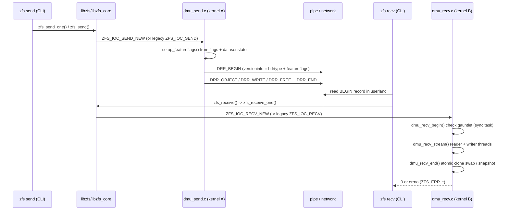
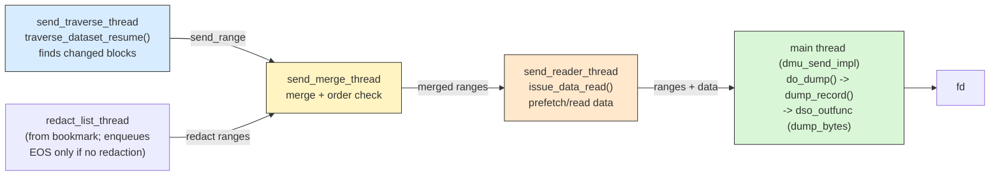

# Part 8 - Send and Receive: The Replication Path

> A send stream is a contract between two pools' histories, and the
> feature flags in its first record are the fine print.

## Why This Chapter Matters

Send/receive is where three things that are usually separate concerns
collide: the on-disk format (Part 4), feature flags (Part 5), and the
divergent histories of two different pools. A stream generated on one
system must be replayable, byte for byte, on a system with a different
pool version, different enabled features, and a different snapshot
lineage.

Most replication failures are not I/O errors. They are contract
violations between sender and receiver: the stream promises something
the receiver cannot honor, or the receiver requires something the
stream does not carry. Worse, the error messages often point the wrong
way - the receive side prints the error, but the bug is frequently in
what the send side chose to put (or silently not put) in the stream.
This chapter traces both directions end to end and closes with a real
case study of exactly such a failure: the `-L` deadlock, where
`zfs receive` demands a flag that `zfs send` was already given.

The core structural insights up front:

- The BEGIN record's `drr_versioninfo` feature flags are the entire
  compatibility contract. The receiver decides whether it can accept a
  stream almost exclusively from that one 64-bit word.
- Send flags like `-L`, `-w`, `-e`, `-c` are requests, not commands:
  `setup_featureflags()` combines them with *source dataset state* to
  decide what actually goes in the stream.
- The receive is not applied in place. It lands in a hidden `%recv`
  child (or a brand-new inconsistent dataset) and only becomes visible
  in one atomic sync task at `dmu_recv_end()`.

---

## Scope and Assumptions

To keep the trace concrete, we assume:

- Linux platform, `zfs send tank/fs@b | zfs recv tank2/fs` style usage
- single-snapshot sends via the modern ioctl path first; `-R`/`-I`
  package streams, resume (`-t`), and raw (`-w`) are covered where
  they change the path
- redaction is summarized only briefly

Line-number anchors in this chapter are based on the reference revision
listed in `README.md` (`0f9564e85`). If you are on a newer OpenZFS
commit, expect some drift and use symbol names to relocate.

---

## Diagram 1 - Send and Receive Sequence



---

## Step 1 - Userland Entry: `zfs send` and `zfs receive`

Primary files:

- `cmd/zfs/zfs_main.c`
- `lib/libzfs/libzfs_sendrecv.c`
- `lib/libzfs_core/libzfs_core.c`

Key anchors:

- `zfs_do_send()` (`cmd/zfs/zfs_main.c:4730`)
- `zfs_do_receive()` (`cmd/zfs/zfs_main.c:5138`)
- `zfs_send()` (`lib/libzfs/libzfs_sendrecv.c:2558`)
- `zfs_send_one()` (`libzfs_sendrecv.c:2863`)
- `zfs_send_resume()` (`libzfs_sendrecv.c:2054`)
- `zfs_receive()` (`libzfs_sendrecv.c:5585`)
- `zfs_receive_impl()` (`libzfs_sendrecv.c:5441`)
- `lzc_send_resume_redacted()` (`lib/libzfs_core/libzfs_core.c:901`)
- `recv_impl()` (`libzfs_core.c:1047`)

### The send side

`zfs_do_send()` parses flags into a `sendflags_t`: `-L` sets
`flags.largeblock` (`zfs_main.c:4831`), `-e` sets `embed_data`, `-c`
sets `compress`, and `-w` sets `raw` *plus* `compress`, `embed_data`,
and `largeblock` all at once (`zfs_main.c:4843`). Then it picks one of
three libzfs paths:

1. `-t <token>`: `zfs_send_resume()` decodes the resume token and
   restarts a partial send (Step 5).
2. `-R` or `-I` ("everything except -R and -I use the new, cleaner
   code path", per the comment above the dispatch at
   `zfs_main.c:4999`): `zfs_send()` walks snapshot lists per
   filesystem (`send_iterate_fs()`, `libzfs_sendrecv.c:498`) and emits
   one substream per snapshot via `dump_ioctl()`
   (`libzfs_sendrecv.c:811`), which issues the *legacy* `ZFS_IOC_SEND`
   ioctl (`libzfs_sendrecv.c:835`). The whole package is wrapped in a
   compound-stream header written in userland by
   `send_prelim_records()` (`libzfs_sendrecv.c:2198`), which sets the
   header type to `DMU_COMPOUNDSTREAM` (`libzfs_sendrecv.c:2285`) and
   carries an nvlist of filesystems/properties as the BEGIN payload.
3. everything else: `zfs_send_one()` ->
   `zfs_send_one_cb_impl()` (`libzfs_sendrecv.c:2655`) ->
   `lzc_send_redacted()` (`libzfs_core.c:819`), which lands in
   `lzc_send_resume_redacted_cb_impl()` (`libzfs_core.c:849`). That
   function translates `LZC_SEND_FLAG_*` bits into nvlist booleans -
   `"largeblockok"`, `"embedok"`, `"compressok"`, `"rawok"`,
   `"savedok"` - and issues `ZFS_IOC_SEND_NEW` (`libzfs_core.c:877`).

So there are two send ioctls at the pin:

- `ZFS_IOC_SEND_NEW` -> `zfs_ioc_send_new()`
  (`module/zfs/zfs_ioctl.c:6947`) -> `dmu_send()` (by name)
- `ZFS_IOC_SEND` (legacy, used by `-R`/`-I` per-snapshot substreams)
  -> `zfs_ioc_send()` (`zfs_ioctl.c:5930`) -> `dmu_send_obj()` (by
  objset id); the lzc flags arrive as raw bits in `zc_flags`
  (`0x1` embedok, `0x2` large_block, `0x4` compress, `0x8` raw,
  `0x10` saved, `zfs_ioctl.c:5935`)

Both handlers build a `dmu_send_outparams_t` whose `dso_outfunc` is
`dump_bytes()` (`zfs_ioctl.c:5862`): every record the DMU send engine
emits is handed to a `zfs_file_write()` on the target fd, dispatched
through a single-threaded `z_send` taskq (`dump_bytes_init()`,
`zfs_ioctl.c:5883`).

Size estimation (`zfs send -nv`) uses a third ioctl,
`ZFS_IOC_SEND_SPACE` (`lzc_send_space()`, `libzfs_core.c:1012`;
`zfs_ioc_send_space()`, `zfs_ioctl.c:7044`), which runs
`dmu_send_estimate_fast()` (`module/zfs/dmu_send.c:3029`) instead of a
real traversal.

### The receive side

`zfs_do_receive()` parses `-F` (`flags.force`), `-s`
(`flags.resumable`), `-A` (abort a suspended receive), `-c` (healing
receive), `-o`/`-x` property overrides. `zfs_receive()` ->
`zfs_receive_impl()` reads the BEGIN record *in userland*
(`libzfs_sendrecv.c:5475`), byteswaps it if needed, screens the
feature flags with `DMU_STREAM_SUPPORTED()` (`libzfs_sendrecv.c:5517`),
and dispatches on header type: `DMU_SUBSTREAM` ->
`zfs_receive_one()` (`libzfs_sendrecv.c:4418`); `DMU_COMPOUNDSTREAM`
-> `zfs_receive_package()` (`libzfs_sendrecv.c:3822`), which unpacks
the userland-generated nvlist, performs `-F`-driven snapshot
destroys/renames, then loops calling `zfs_receive_impl()` per
substream.

`zfs_receive_one()` funnels into libzfs_core's `recv_impl()`
(`libzfs_core.c:1047`), which picks the kernel interface: if
`resumable || heal || raw || wkeydata != NULL || payload` it packs an
nvlist (`"begin_record"`, `"input_fd"`, `"force"`, `"resumable"`,
`"heal"`, props) and issues `ZFS_IOC_RECV_NEW` (`libzfs_core.c:1147`,
handler `zfs_ioc_recv_new()` at `zfs_ioctl.c:5748`); otherwise it uses
the legacy `ZFS_IOC_RECV` (`libzfs_core.c:1204`, handler
`zfs_ioc_recv()` at `zfs_ioctl.c:5644`). Both converge on
`zfs_ioc_recv_impl()` (`zfs_ioctl.c:5302`), which calls the three-act
kernel sequence: `dmu_recv_begin()` (`zfs_ioctl.c:5330`),
`dmu_recv_stream()` (`zfs_ioctl.c:5437`), `dmu_recv_end()`
(`zfs_ioctl.c:5457`), with received properties applied in between via
`zfs_set_prop_nvlist()` (`zfs_ioctl.c:5399`).

---

## Step 2 - The Stream Format: `dmu_replay_record_t`

Primary file:

- `include/sys/zfs_ioctl.h`

Key anchors:

- `dmu_replay_record_t` and the `DRR_*` enum (`zfs_ioctl.h:246`)
- `drr_versioninfo` layout comment (`zfs_ioctl.h:77`)
- `DMU_GET_STREAM_HDRTYPE` / `DMU_GET_FEATUREFLAGS`
  (`zfs_ioctl.h:101`, `zfs_ioctl.h:104`)
- `DMU_BACKUP_FEATURE_*` (`zfs_ioctl.h:118`)
- `DMU_BACKUP_FEATURE_MASK` / `DMU_STREAM_SUPPORTED`
  (`zfs_ioctl.h:155`, `zfs_ioctl.h:165`)
- `DMU_BACKUP_MAGIC` (`zfs_ioctl.h:171`)

A send stream is a flat sequence of fixed-size (312-byte)
`dmu_replay_record_t` headers, some followed by a payload (WRITE,
OBJECT, SPILL, and the BEGIN nvlist; FREE and friends are header-only). The record
types at the pin (`zfs_ioctl.h:248`):

```text
DRR_BEGIN          stream identity + feature flags (+ nvlist payload)
DRR_OBJECT         dnode: type, blocksize, bonus, (raw: crypt params)
DRR_FREEOBJECTS    range of freed object numbers
DRR_WRITE          one logical block of data
DRR_FREE           punched hole / freed range
DRR_END            trailing checksum + toguid
DRR_WRITE_BYREF    legacy dedup back-reference (no longer generated;
                   convert old streams with zstream redup)
DRR_SPILL          spill (SA overflow) block
DRR_WRITE_EMBEDDED blkptr-embedded data (-e)
DRR_OBJECT_RANGE   raw-send dnode-block crypt parameters
DRR_REDACT         redacted (withheld) range
```

Every record except BEGIN carries a running fletcher4 checksum of the
whole stream so far, filled in by the sender in
`drr_u.drr_checksum.drr_checksum` (`dump_record()`,
`module/zfs/dmu_send.c:263`) and verified by the receiver record by
record (`receive_read_payload_and_next_header()`,
`module/zfs/dmu_recv.c:2795`, `ECKSUM` on mismatch at
`dmu_recv.c:2853`).

### The BEGIN record is the contract

`struct drr_begin` (`zfs_ioctl.h:235`) carries the magic
(`0x2F5bacbac`), `drr_toguid`/`drr_fromguid` (which snapshots this
stream goes between), `drr_toname`, per-stream flags (`DRR_FLAG_CLONE`,
`DRR_FLAG_FREERECORDS`, `DRR_FLAG_SPILL_BLOCK`; `zfs_ioctl.h:177`),
and the packed `drr_versioninfo`:

```text
64      56      48      40      32      24      16      8       0
+-------+-------+-------+-------+-------+-------+-------+-------+
|reserve|                 feature-flags                     |C|S|
+-------+-------+-------+-------+-------+-------+-------+-------+
  low 2 bits: header type, DMU_SUBSTREAM (0x1) or
              DMU_COMPOUNDSTREAM (0x2)
  bits 2..57: DMU_BACKUP_FEATURE_* flags
```

The feature flags say what the receiver *must understand* to replay
the stream: `LARGE_BLOCKS (1<<19)`, `RESUMING (1<<20)`,
`REDACTED (1<<21)`, `COMPRESSED (1<<22)`, `LARGE_DNODE (1<<23)`,
`RAW (1<<24)`, `ZSTD (1<<25)`, `HOLDS (1<<26)`,
`SWITCH_TO_LARGE_BLOCKS (1<<27)`, `LONGNAME (1<<28)`,
`LARGE_MICROZAP (1<<29)`, plus the older `SA_SPILL`, `EMBED_DATA`,
`LZ4`. `DMU_BACKUP_FEATURE_MASK` is the receiver's "what I understand"
set; `DMU_STREAM_SUPPORTED(x)` is simply "no bits outside the mask".
Note the mask deliberately excludes `DEDUP`/`DEDUPPROPS`: dedup
streams can no longer be received directly and must be rewritten with
`zstream redup`.

`zstream dump` (`cmd/zstream/zstream_dump.c`) decodes all of this from
a stream on stdin; the BEGIN printout includes `hdrtype` and a raw hex
`features = %llx` line (`zstream_dump.c:370`) - see the Observability
section for how to decode it.

One asymmetry worth internalizing: `SWITCH_TO_LARGE_BLOCKS` is defined
and honored on receive, but the block comment at `zfs_ioctl.h:133`
states "This flag is currently not set on any send streams." It exists
as forward compatibility for a planned world where `-L` is the
default. That comment is load-bearing for the case study below.

---

## Step 3 - Kernel Send Path: `module/zfs/dmu_send.c`

Key anchors:

- `dmu_send()` (`dmu_send.c:2748`) - by-name entry (`ZFS_IOC_SEND_NEW`)
- `dmu_send_obj()` (`dmu_send.c:2658`) - by-objsetid entry (legacy)
- `dmu_send_impl()` (`dmu_send.c:2363`)
- `setup_featureflags()` (`dmu_send.c:1954`)
- `create_begin_record()` (`dmu_send.c:2036`)
- `do_dump()` (`dmu_send.c:883`)
- `dump_record()` (`dmu_send.c:263`)

`dmu_send()` resolves names (including `#bookmark` incremental
sources), owns the dataset when sending from a head dataset so it
cannot change mid-send, fills a `struct dmu_send_params` with the
boolean flags from the ioctl (`embedok`, `large_block_ok`,
`compressok`, `rawok`, `savedok`, resume coordinates), and calls
`dmu_send_impl()`. `dmu_send_obj()` does the same from objset ids and
also loads the incremental source's ivset guid from the
`DS_FIELD_IVSET_GUID` ZAP entry for raw sends (`dmu_send.c:2705`).

### 3a - `setup_featureflags()`: where flags become (or fail to become) stream bits

This function (`dmu_send.c:1954`) is the single most important
function in this chapter. It computes the BEGIN record's feature
flags from *both* the send flags and the source dataset's state:

- `SA_SPILL`: set for any ZPL dataset with `version >= ZPL_VERSION_SA`
  (`dmu_send.c:1960`).
- `LARGE_BLOCKS`: set only if (`rawok || large_block_ok`) **and**
  `dsl_dataset_feature_is_active(to_ds, SPA_FEATURE_LARGE_BLOCKS)`
  (`dmu_send.c:1970`). The per-dataset feature is activated the first
  time a block larger than `SPA_OLD_MAXBLOCKSIZE` (128K) is born on
  that dataset (`dsl_dataset_block_born()`,
  `module/zfs/dsl_dataset.c:139`, activation at `dsl_dataset.c:173`).
  If the dataset never had a large block, `-L` changes nothing, and
  there is no warning. The comment "raw sends imply large_block_ok"
  (`dmu_send.c:1969`) means `-w` is subject to the same gate.
- `EMBED_DATA`: (`embedok || rawok`) and the dataset is not encrypted
  and the pool has `SPA_FEATURE_EMBEDDED_DATA` active
  (`dmu_send.c:1976`).
- `COMPRESSED`: `compressok || rawok` (`dmu_send.c:1982`).
- `RAW`: `rawok` and the objset is actually encrypted
  (`dmu_send.c:1985`) - `-w` on an unencrypted dataset degrades to a
  compressed send.
- `LZ4`, `ZSTD`: derived from the above plus pool/dataset feature
  state (`dmu_send.c:1988`, `dmu_send.c:2000`).
- `RESUMING`: nonzero resume object/offset (`dmu_send.c:2006`).
- `REDACTED`: a redaction bookmark was given (`dmu_send.c:2010`).
- `LARGE_DNODE`, `LONGNAME`: per-dataset feature active
  (`dmu_send.c:2014`, `dmu_send.c:2018`).
- `LARGE_MICROZAP`: per-dataset feature active, and this is the one
  place the function can *fail*: a large microzap block can never be
  split, so if `LARGE_BLOCKS` did not make it into the stream the send
  aborts with `ZFS_ERR_STREAM_LARGE_MICROZAP` (`dmu_send.c:2027`),
  which libzfs renders as "source snapshot contains large microzaps,
  need -L (--large-block) or -w (--raw) to generate stream"
  (`libzfs_sendrecv.c:2834`).

`create_begin_record()` (`dmu_send.c:2036`) then packs the flags with
`DMU_SET_FEATUREFLAGS()` (`dmu_send.c:2053`), always sets
`DRR_FLAG_SPILL_BLOCK` (`dmu_send.c:2061`), and sets
`DRR_FLAG_FREERECORDS` per the `zfs_send_set_freerecords_bit` tunable.

### 3b - The send thread pipeline

At the pin, a send is executed by a pipeline of kernel threads
connected by size-capped blocking queues (`bqueue_t`). The large block
comment above `dmu_send_impl()` (`dmu_send.c:2244`) diagrams all
three configurations; the simple (non-redacted) case:



- `setup_to_thread()` (`dmu_send.c:2078`) spawns
  `send_traverse_thread()` (`dmu_send.c:1204`), which runs
  `traverse_dataset_resume(to_ds, fromtxg, ...)` with `send_cb()`
  (`dmu_send.c:1071`) enqueuing a `struct send_range` per block
  changed since the incremental source's birth txg.
- `setup_from_thread()` (`dmu_send.c:2099`) always spawns a
  `redact_list_thread()` (`dmu_send.c:1294`) for the incremental
  source's redaction list; with no redaction it immediately enqueues
  an end-of-stream marker.
- `send_merge_thread()` (`dmu_send.c:1489`) merges and order-checks.
- `send_reader_thread()` (`dmu_send.c:1753`) issues the actual data
  reads (`issue_data_read()`, `dmu_send.c:1589`) for ranges that will
  really be sent - after redaction decisions, so nothing is read just
  to be thrown away. Queue depths are bounded by
  `zfs_send_queue_length` / `zfs_send_no_prefetch_queue_length`.
- The main thread loops `do_dump()` over dequeued ranges
  (`dmu_send.c:2569`) and finishes with a `DRR_END` record carrying
  the accumulated checksum (`dmu_send.c:2619`) - unless this is a
  saved (`-S`) send, where END is deliberately omitted so the receiver
  keeps its partial state.

### 3c - `do_dump()` record emission

`do_dump()` (`dmu_send.c:883`) dispatches on range type: OBJECT ->
`dump_dnode()` (`dmu_send.c:713`), HOLE -> `dump_free()` /
`dump_freeobjects()` (aggregated across calls via
`dsc_pending_op`), REDACT -> `dump_redact()`, OBJECT_RANGE (raw sends
only) -> `dump_object_range()`, DATA -> embedded-capable blocks to
`dump_write_embedded()` (`dmu_send.c:565`), spill blocks to
`dump_spill()` (`dmu_send.c:605`), and plain data to
`dmu_dump_write()` (`dmu_send.c:458`).

The DATA case contains the physical half of the `-L` story
(`dmu_send.c:983`): if the on-disk block is larger than
`SPA_OLD_MAXBLOCKSIZE` but `DMU_BACKUP_FEATURE_LARGE_BLOCKS` did not
make it into the stream, the block is *split* into 128K `DRR_WRITE`
records in a loop. This is the compatibility default - and the reason
the receiving dataset of a no-`-L` send ends up with 128K blocks
regardless of the source's recordsize.

`dump_record()` (`dmu_send.c:263`) frames every record: fold the
header into the running fletcher4, stamp the checksum (except in
BEGIN), write the 312-byte header then the payload through
`dso_outfunc`. A payload length must be a multiple of 8 unless the
stream is raw (assert at `dmu_send.c:311`).

Redaction, in one paragraph: a redacted send (`--redact bookmark`)
adds a fifth thread (`setup_redact_list_thread()`, `dmu_send.c:2119`)
feeding the merge thread ranges that must *not* be sent; matching
blocks become `DRR_REDACT` records instead of data, and the receiving
dataset records which snapshots it is redacted with respect to. The
BEGIN payload nvlist carries the redaction snapshot guids
(`BEGINNV_REDACT_SNAPS` / `BEGINNV_REDACT_FROM_SNAPS`,
`dmu_send.c:2488`). Everything else in this chapter applies unchanged.

---

## Step 4 - Kernel Receive Path: `module/zfs/dmu_recv.c`

Key anchors:

- `dmu_recv_begin()` (`dmu_recv.c:1276`)
- `dmu_recv_begin_check()` (`dmu_recv.c:621`)
- `recv_begin_check_existing_impl()` (`dmu_recv.c:362`)
- `recv_begin_check_feature_flags_impl()` (`dmu_recv.c:562`)
- `recv_check_large_blocks()` (`dmu_recv.c:353`)
- `dmu_recv_begin_sync()` (`dmu_recv.c:838`)
- `dmu_recv_stream()` (`dmu_recv.c:3344`)
- `receive_writer_thread()` (`dmu_recv.c:3252`)
- `dmu_recv_end()` (`dmu_recv.c:3836`)

### 4a - `dmu_recv_begin()` and the check gauntlet

`dmu_recv_begin()` validates the magic (byteswapping the whole record
if the stream came from an opposite-endian host, `dmu_recv.c:1299`),
extracts the feature flags into `drc_featureflags`
(`dmu_recv.c:1315`), reads the BEGIN payload nvlist, and dispatches a
DSL sync task: `dmu_recv_begin_check` + `dmu_recv_begin_sync`
(`dmu_recv.c:1392`), or the `dmu_recv_resume_begin_*` pair when
`DMU_BACKUP_FEATURE_RESUMING` is set (`dmu_recv.c:1369`).

`dmu_recv_begin_check()` (`dmu_recv.c:621`) is the gauntlet:

1. `recv_begin_check_feature_flags_impl()` (`dmu_recv.c:562`):
   - unknown bits (`!DMU_STREAM_SUPPORTED`) ->
     `ZFS_ERR_UNKNOWN_SEND_STREAM_FEATURE` (`dmu_recv.c:568`)
   - each known stream feature requires the corresponding pool
     feature to be *enabled*: LZ4, ZSTD, EMBED_DATA, LARGE_BLOCKS,
     LARGE_DNODE, LARGE_MICROZAP, REDACTED, LONGNAME each return
     `ENOTSUP` if missing (`dmu_recv.c:583` onward). The comment
     explains why: the receiver never decompresses / un-embeds /
     splits blocks on the way in.
2. Raw-stream shape checks: raw requires `SPA_FEATURE_ENCRYPTION`,
   raw+embedded is `EINVAL`, and raw requires `DRR_FLAG_SPILL_BLOCK`
   in the stream, else `ZFS_ERR_SPILL_BLOCK_FLAG_MISSING`
   (`dmu_recv.c:653`).
3. If the target fs exists: `recv_begin_check_existing_impl()`
   (`dmu_recv.c:362`) -
   - no leftover `%recv` clone and no resume state (`EBUSY`)
   - target snapshot name must not exist (`EEXIST`,
     `dmu_recv.c:393`)
   - for incrementals (`fromguid != 0`): walk the snapshot chain to
     find the snapshot matching `drr_fromguid`; not found ->
     `ENODEV` (`dmu_recv.c:478`), which libzfs renders as "most
     recent snapshot of ... does not match incremental source"
   - without `-F`: `dsl_dataset_modified_since_snap()` -> `ETXTBSY`
     (`dmu_recv.c:492`), rendered as "destination ... has been
     modified since most recent snapshot"; raw incrementals also
     demand the from-snap be the latest snapshot (no "noop" snapshots
     in between) for ivset checking to work
   - `recv_check_large_blocks(snap, featureflags)`
     (`dmu_recv.c:510`): if the matched from-snapshot has the
     per-dataset `large_blocks` feature active but the stream lacks
     `DMU_BACKUP_FEATURE_LARGE_BLOCKS`, fail with
     `ZFS_ERR_STREAM_LARGE_BLOCK_MISMATCH` (`dmu_recv.c:357`). This
     is the receiving half of the case study.
4. If the target fs does not exist: must be a full stream or a clone
   (`ENOENT` otherwise), parent must exist and be a filesystem
   (`ZFS_ERR_WRONG_PARENT`), encryption creation rules are checked,
   and a clone origin, if given, gets the same redaction and
   large-block checks (`dmu_recv.c:821`).

### 4b - `dmu_recv_begin_sync()`: the landing zone

The sync half (`dmu_recv.c:838`) creates where the data will land:
for an existing fs, a hidden temporary clone named `%recv`
(`recv_clone_name`) of the from-snapshot (`dmu_recv.c:891`); for a
new fs, the dataset itself, flagged `DS_FLAG_INCONSISTENT`
(`dmu_recv.c:1001`) so it is unusable until the receive completes.
Resumable receives get their bookkeeping ZAP entries created here
(`DS_FIELD_RESUME_*`, `dmu_recv.c:934`; see Step 5).

Then comes a block worth reading closely (`dmu_recv.c:1003`): if the
stream carries `DMU_BACKUP_FEATURE_LARGE_BLOCKS`, the new dataset
*activates* the per-dataset `large_blocks` feature immediately -
whether or not any large block ever arrives:

```c
/*
 * When receiving, we refuse to accept streams that are missing the
 * large block feature flag if the large block is already active
 * (see ZFS_ERR_STREAM_LARGE_BLOCK_MISMATCH). To prevent this
 * check from being spuriously triggered, we always activate
 * the large block feature if the feature flag is present in the
 * stream.  This covers the case where the sending side has the feature
 * active, but has since deleted the file containing large blocks.
 */
```

(`dmu_recv.c:1003-1017`; the same pattern follows for LONGNAME at
`dmu_recv.c:1022` and LARGE_MICROZAP at `dmu_recv.c:1029`.) This is
the receive-side fix from upstream PR #18105, present at the pin - it
matters in the case study.

### 4c - `dmu_recv_stream()`: reader + writer

`dmu_recv_stream()` (`dmu_recv.c:3344`) mirrors the send pipeline in
miniature: the calling thread reads records off the fd and a single
`receive_writer_thread()` (`dmu_recv.c:3252`) applies them.

The reader loop (`dmu_recv.c:3465`) calls `receive_read_record()`
(`dmu_recv.c:2895`), which reads each header+payload
(`receive_read()`, `dmu_recv.c:1588` - a short read here becomes
`ZFS_ERR_STREAM_TRUNCATED` at `dmu_recv.c:1610`), verifies the
per-record fletcher4 (`ECKSUM` at `dmu_recv.c:2853`), issues indirect
block prefetches, and enqueues onto `rwa->q`.

For raw streams, the reader first applies the `crypt_keydata` nvlist
from the BEGIN payload via `dsl_crypto_recv_raw()`
(`dmu_recv.c:3387`; new datasets get the key immediately, existing
ones stash `drc_keynvl` for `dmu_recv_end`), and captures
`to_ivset_guid` (`dmu_recv.c:3395`).

The writer thread dispatches per record type in
`receive_process_record()` (`dmu_recv.c:3124`):

- `receive_object()` (`dmu_recv.c:1913`) validates dnode parameters
  against pool limits, and for existing objects defers to
  `receive_handle_existing_object()` (`dmu_recv.c:1702`). That
  function encodes the blocksize-change rules: a mismatched block
  size means either "object was reallocated on the source" (free the
  contents and restructure) or "previous receive split large blocks
  and this stream does not" (keep the smaller local blocksize and
  contents). Distinguishing the two uses the ZPL generation number
  (`receive_object_is_same_generation()`, `dmu_recv.c:1674`) - and
  the code comments there lean directly on
  `recv_check_large_blocks()` having already excluded the dangerous
  "-L to no-L" direction (`dmu_recv.c:1802`, `dmu_recv.c:1820`).
- `DRR_WRITE` records are not applied one at a time:
  `receive_process_write_record()` (`dmu_recv.c:2417`) requires
  records in (object, offset) order (`EINVAL` otherwise,
  `dmu_recv.c:2480`), accumulates a batch per object bounded by
  `zfs_recv_write_batch_size`, and `flush_write_batch_impl()`
  (`dmu_recv.c:2238`) applies the batch in one tx using
  "lightweight" writes (`dmu_lightweight_write_by_dnode()`,
  `dmu_recv.c:2368`) that carry compressed/raw payloads straight into
  the ZIO pipeline. Here lives the other half of the large-block
  logic (`dmu_recv.c:2273`): a WRITE record *larger* than the
  object's block size (the legal no-L -> -L direction) is
  decompressed if necessary and written with a plain `dmu_write()` so
  the DMU splits it along the existing 128K structure.
- `receive_write_embedded()` (`dmu_recv.c:2513`),
  `receive_spill()` (`dmu_recv.c:2557`), `receive_free()`
  (`dmu_recv.c:2657`), `receive_freeobjects()` (`dmu_recv.c:2198`),
  `receive_object_range()` (`dmu_recv.c:2678`, raw dnode-block crypt
  params) handle the rest.
- After each applied write, `save_resume_state()` (`dmu_recv.c:1637`)
  records (object, offset, bytes) into the dataset's in-core resume
  state, which the dataset sync path persists into the
  `DS_FIELD_RESUME_*` ZAP entries every txg.

### 4d - `dmu_recv_end()`: one atomic rename

`dmu_recv_end()` (`dmu_recv.c:3836`) runs the final sync task
(`dmu_recv_end_check` at `dmu_recv.c:3574` / `dmu_recv_end_sync` at
`dmu_recv.c:3653`). For an existing fs: with `-F`, destroy any
snapshots created after the incremental origin (`dmu_recv.c:3675`);
apply a stashed raw key if any; then
`dsl_dataset_clone_swap_sync_impl()` (`dmu_recv.c:3705`) swaps the
`%recv` clone's contents with the head dataset,
`dsl_dataset_snapshot_sync_impl()` creates the target snapshot, its
guid and creation time are overwritten with the stream's
`drr_toguid`/`drr_creation_time` (`dmu_recv.c:3717`) so future
incrementals can match it, the `DS_FLAG_INCONSISTENT` flags are
cleared, and the clone is destroyed. For a new fs the dataset is
snapshotted in place and its resume ZAP entries removed
(`dmu_recv.c:3753`). Raw receives stamp the snapshot's
`DS_FIELD_IVSET_GUID` from the stream's `to_ivset_guid`
(`dmu_recv.c:3783`).

Until `dmu_recv_end_sync` commits, nothing the stream wrote is
visible; a crash or error leaves either nothing (non-resumable
receives clean up via `dmu_recv_cleanup_ds()`) or a hidden
inconsistent dataset plus a resume token.

---

## Case Study - The -L Deadlock

This section walks a real, current bug family end to end, because it
exercises every mechanism above: send-side feature gating, the stream
contract, and the receive-side gauntlet - and because its error
message actively points the wrong way.

### The 2020 root: why the check exists at all

Commit `7bcb7f084` (Matthew Ahrens, June 2020, "File incorrectly
zeroed when receiving incremental stream that toggles -L") documents
the original data-loss bug: receiving an incremental where the `-L`
flag was *toggled* relative to the previous receive could silently
zero file contents. The commit made three decisions that still shape
the pin:

1. "-L to no-L" incrementals are rejected -
   `recv_check_large_blocks()` (`dmu_recv.c:353`) fails with
   `ZFS_ERR_STREAM_LARGE_BLOCK_MISMATCH` when the destination has
   `large_blocks` active but the stream lacks the flag. libzfs prints:
   "incremental send stream requires -L (--large-block), to match
   previous receive." (`libzfs_sendrecv.c:5232`).
2. "no-L to -L" is handled correctly (the
   `receive_handle_existing_object()` generation-number logic and the
   oversized-WRITE split in `flush_write_batch_impl()`,
   `dmu_recv.c:2273`).
3. `DMU_BACKUP_FEATURE_SWITCH_TO_LARGE_BLOCKS` was defined for a
   future where `-L` is default - and, per `zfs_ioctl.h:142`, is still
   set on no stream at the pin.

### The deadlock scenario

Now run a bidirectional replication, the kind every
backup-and-restore or failover setup performs:

```text
 host A: tank/fs   recordsize=1M, has >128K blocks
         => per-dataset large_blocks ACTIVE
            (dsl_dataset_block_born(), dsl_dataset.c:173)

 step 1: A sends full stream WITHOUT -L
         setup_featureflags(): large_block_ok == B_FALSE
           -> no LARGE_BLOCKS stream bit     (dmu_send.c:1970)
         do_dump(): 1M blocks split into 128K DRR_WRITEs
                                             (dmu_send.c:983)

 host B: receives. Stream has no LARGE_BLOCKS bit, so the
         activation block at dmu_recv.c:1012 does NOT run.
         B's copy: 128K blocks only, large_blocks never active.

 step 2: roles reverse (failover). B takes writes, snapshots.

 step 3: B sends incremental back to A, and the operator,
         reading the manpage, passes -L this time:
           zfs send -L -i @s1 tank/fs@s2 | ssh A zfs recv ...

         B's setup_featureflags():
           dspp->large_block_ok == B_TRUE     (user asked)
           dsl_dataset_feature_is_active(to_ds,
               SPA_FEATURE_LARGE_BLOCKS) == B_FALSE
           -> LARGE_BLOCKS bit NOT set. Silently. (dmu_send.c:1970)

         A's dmu_recv_begin_check():
           recv_begin_check_existing_impl() matches @s1,
           recv_check_large_blocks(snap, featureflags)
                                              (dmu_recv.c:510)
           snap has large_blocks ACTIVE (it always did on A),
           stream lacks the bit
           -> ZFS_ERR_STREAM_LARGE_BLOCK_MISMATCH

 zfs recv prints:
   "incremental send stream requires -L (--large-block),
    to match previous receive."

 ...but -L WAS passed. There is no flag the operator can add on
 either side to make this incremental work. That is the deadlock.
```

The failure is a pure contract violation: the sender's gate
(`dmu_send.c:1970`) keys on *its own dataset's* feature state, the
receiver's gate (`dmu_recv.c:353`) keys on *its* dataset's feature
state, and after one asymmetric replication the two states disagree
permanently. The error text blames the flag, but the flag never had a
chance.

### Upstream state at the pin

- Issue openzfs/zfs#18101 (Jan 2026) reported the adjacent variant:
  source has `large_blocks` *active but empty* (the large files were
  deleted), destination copy never activated it, and the reversed
  incremental hits the same mismatch. Its fix, PR #18105 (commit
  `794f1587d`, "When receiving a stream with the large block flag,
  activate feature", Jan 2026), is the receive-side activation block
  you saw at `dmu_recv.c:1012`: any stream that *carries* the flag now
  activates the feature on the receiving dataset, so round-trips of
  flag-carrying streams stay symmetric. That commit is an ancestor of
  the pinned revision.
- Issue openzfs/zfs#18908 (Aug 2026) is the send-side half - the
  scenario traced above, where the forward stream never carried the
  flag because `-L` was silently dropped by `setup_featureflags()`.
  It is still open at the time of writing; the recv-side activation
  cannot help because there is no flag in the stream to react to.
- Workarounds today: re-seed with a full `zfs send -L` (or `-w`) so
  the copy activates the feature via the PR #18105 path, or write one
  >128K block on the reversed source before snapshotting to activate
  the feature the organic way.

The debugging lesson generalizes: when a receive rejects a stream,
run `zstream dump` on the actual stream and compare the BEGIN
`features` word against what the receiver requires. The stream is the
contract; both CLIs' flags are just requests.

---

## Step 5 - Resumable Receive and Resume Tokens

Primary files:

- `module/zfs/dmu_recv.c`, `module/zfs/dsl_dataset.c`
- `include/sys/dsl_dataset.h`
- `lib/libzfs/libzfs_sendrecv.c`

Key anchors:

- `DS_FIELD_RESUME_*` ZAP names (`include/sys/dsl_dataset.h:103`)
- token generation: `get_receive_resume_token_impl()`
  (`module/zfs/dsl_dataset.c:2383`)
- token decode: `zfs_send_resume_token_to_nvlist()`
  (`libzfs_sendrecv.c:1522`)
- resume send: `zfs_send_resume_impl_cb_impl()`
  (`libzfs_sendrecv.c:1819`)
- resume recv checks: `dmu_recv_resume_begin_check()`
  (`dmu_recv.c:1071`), `resume_check()` (`dmu_recv.c:3306`)

With `zfs recv -s`, `dmu_recv_begin_sync()` zapifies the landing
dataset and seeds `DS_FIELD_RESUME_{FROMGUID,TOGUID,TONAME,OBJECT,
OFFSET,BYTES}` plus flag markers (`...LARGEBLOCK`, `...EMBEDOK`,
`...COMPRESSOK`, `...RAWOK`) (`dmu_recv.c:934`). As records are
applied, `save_resume_state()` keeps (object, offset, bytes) current.
If the receive dies, the dataset stays inconsistent and the
`receive_resume_token` property materializes: `get_receive_resume_token()`
(`dsl_dataset.c:2504`, checking the dataset itself and then its
`%recv` child) packs those ZAP fields into an nvlist, gzip-compresses
it, and renders `<version>-<fletcher4>-<len>-<hex>` (the
`kmem_asprintf()` at `dsl_dataset.c:2489`).

`zfs send -t <token>` reverses this entirely in userland:
`zfs_send_resume_token_to_nvlist()` unpacks the token, and
`zfs_send_resume_impl_cb_impl()` resolves `toname`/`toguid` back to a
live snapshot (tolerating renames via `guid_to_name()`), then calls
`lzc_send_resume_redacted()` with `resume_object`/`resume_offset`.
Note the lzc flags are the *union* of command-line flags and the
token's saved flags (`libzfs_sendrecv.c:1916`) - the stream shape is
pinned by the original send, not by what you type at resume time.

In the kernel, the resuming send seeds every pipeline thread's start
bookmark via `setup_resume_points()` (`dmu_send.c:2175`) and adds
`resume_object`/`resume_offset` to the BEGIN payload. On the receive
side, `dmu_recv_resume_begin_check()` re-verifies toguid/fromguid
against the saved ZAP state (`EINVAL` on mismatch, `dmu_recv.c:1144`;
resuming a full receive over an existing `%recv` without `-F` is
`ZFS_ERR_RESUME_EXISTS`, `dmu_recv.c:1127`), re-runs the feature and
large-block checks (`dmu_recv.c:1219`), and `resume_check()`
(`dmu_recv.c:3306`) confirms the stream's resume point equals the
saved one. `zfs recv -A` aborts and reclaims a suspended receive.

Related but distinct: a *saved* send (`zfs send -S`, `savedok`) sends
the partially received state itself onward - it omits the DRR_END
record on purpose (`dmu_send.c:2614`) so the destination also ends up
resumable.

---

## Step 6 - Raw Sends (Brief)

For encrypted datasets, `zfs send -w` changes the contract rather
than the machinery:

- No decryption: the traversal runs with `TRAVERSE_NO_DECRYPT`
  (`setup_to_thread()`, `dmu_send.c:2090`); `DRR_WRITE` payloads are
  ciphertext with salt/IV/MAC carried in the record, and dnode blocks
  get `DRR_OBJECT_RANGE` records with their crypt parameters
  (`do_dump()`, `dmu_send.c:896`).
- The BEGIN payload carries `crypt_keydata` - the wrapped key and
  objset crypt parameters from `dsl_crypto_populate_key_nvlist()`
  (`module/zfs/dsl_crypt.c:2417`) - so the receiver can store the key
  without ever seeing plaintext.
- ivset guids police incremental continuity: each snapshot of an
  encrypted dataset records an IV-set guid (`DS_FIELD_IVSET_GUID`,
  `dsl_dataset.h:130`). On receive,
  `dsl_crypto_recv_raw_objset_check()` compares the stream's
  `from_ivset_guid` with the destination's from-snapshot:
  missing -> `ZFS_ERR_FROM_IVSET_GUID_MISSING`, different ->
  `ZFS_ERR_FROM_IVSET_GUID_MISMATCH` (`dsl_crypt.c:2073`), tunable
  escape hatch `zfs_disable_ivset_guid_check` (`dsl_crypt.c:81`).
  This is what rejects a raw incremental whose source chain was
  broken (e.g. by a non-raw receive or an intermediate snapshot
  mismatch).
- Structure becomes contract: `receive_handle_existing_object()`
  enforces matching indirect block size, nlevels, and dnode slots for
  raw receives (`dmu_recv.c:1852`), because the receiver cannot
  re-shape ciphertext.
- Raw implies large-block-ok and compress-ok on the send side, and
  `DMU_BACKUP_FEATURE_RAW` is set only if the objset is actually
  encrypted (`dmu_send.c:1985`). Raw and embedded data are mutually
  exclusive (`dmu_recv.c:659`).

---

## Observability for Debugging

### zstream dump: read the contract

`zstream dump` (`cmd/zstream/zstream.c`) prints every record; the
BEGIN block shows the raw contract:

```text
BEGIN record
        hdrtype = 1
        features = 2430004
        magic = 2f5bacbac
        ...
        toguid = c9cf49b5a34a3fbe
        fromguid = 0
```

`features` is plain hex of the `DMU_BACKUP_FEATURE_*` bits
(`zstream_dump.c:370`). Decode it against `zfs_ioctl.h:118`: e.g.
`0x2430004` = `SA_SPILL (1<<2) | EMBED_DATA (1<<16) | LZ4 (1<<17) |
COMPRESSED (1<<22) | ZSTD (1<<25)`. When debugging a rejected stream,
the first question is always "is bit 19 (`LARGE_BLOCKS`, 0x80000)
set" - checked here, not in either CLI's flags. `zstream token
<token>` prints a resume token's nvlist without needing the sending
dataset.

### zfs send -nvP

Dry-run estimates go through `ZFS_IOC_SEND_SPACE` ->
`dmu_send_estimate_fast()` and print `full`/`incremental` lines plus
"total estimated size" (`send_print_verbose()`,
`libzfs_sendrecv.c:1079`). A running send can be observed via
`ZFS_IOC_SEND_PROGRESS` (`zfs_ioc_send_progress()`,
`zfs_ioctl.c:6022`), polled by libzfs's `send_progress_thread` -
that is what the periodic `-v` progress lines and `-V` proctitle use.

### Receive-side error mapping

The kernel returns errnos and `ZFS_ERR_*` codes
(`include/sys/fs/zfs.h:1660`); the strings you actually see come from
the `switch (ioctl_errno)` in `zfs_receive_one()`
(`libzfs_sendrecv.c:5160`). The "requires -L" text lives at
`libzfs_sendrecv.c:5232`. Two mappings actively mislead:

- `ZFS_ERR_UNKNOWN_SEND_STREAM_FEATURE` falls through to
  `zfs_standard_error_fmt()` (`lib/libzfs/libzfs_util.c:494`), where
  it shares a case with `ZFS_ERR_IOC_CMD_UNAVAIL` and prints "the
  loaded zfs module does not support this operation. A reboot may be
  required..." - the real meaning is "this stream has feature bits
  this kernel has never heard of". (Userland usually catches it first
  with the clearer "stream has unsupported feature, feature flags =
  %llx" at `libzfs_sendrecv.c:5531`, which triggers only when the
  *userland* mask is also too old.)
- A resume-point/toguid mismatch surfaces as `EINVAL`, which for
  resumable receives prints "kernel modules must be upgraded to
  receive this stream." (`libzfs_sendrecv.c:5215`).

On interruption, `recv_ecksum_set_aux()` (`libzfs_sendrecv.c:4149`)
prints the resume token and the exact `zfs send -t <token>` command.

### Kernel-side breadcrumbs

`dmu_send.c`/`dmu_recv.c` do not narrate to `zfs_dbgmsg` the way the
import path does. What you get instead: `zpool history -i` internal
events - `dmu_recv_begin_sync()` logs `receive`
(`dmu_recv.c:1067`), resume logs `resume receive` (`dmu_recv.c:1268`),
and `dmu_recv_end_sync()` logs `finish receiving`
(`dmu_recv.c:3660`) - plus per-record `dprintf` tracing
(`dprintf_drr()`, `dmu_recv.c:3012`) on debug builds. A receive that
began but never finished is therefore visible as a `receive` history
entry with no matching `finish receiving`, and as a `%recv` child or
`inconsistent` dataset in `zfs list -t all` / `zdb -d`.

---

## Where Send/Receive Fails in Practice

| Symptom | Producing site | Code location |
| --- | --- | --- |
| "incremental send stream requires -L (--large-block), to match previous receive" | `recv_check_large_blocks()`, `ZFS_ERR_STREAM_LARGE_BLOCK_MISMATCH`; may be the -L deadlock (case study) - check `zstream dump` features word | `dmu_recv.c:353` (called at `:510`, `:821`, `:1219`); string `libzfs_sendrecv.c:5232` |
| "stream has unsupported feature, feature flags = %llx" / "loaded zfs module does not support this operation" | unknown feature bits; userland mask check, else kernel `ZFS_ERR_UNKNOWN_SEND_STREAM_FEATURE` | `libzfs_sendrecv.c:5517`; `dmu_recv.c:568`; misleading mapping `libzfs_util.c:494` |
| "pool must be upgraded to receive this stream" (`ENOTSUP`) | stream feature known but pool feature not enabled (LZ4/ZSTD/EMBED/LARGE_BLOCKS/LARGE_DNODE/...) | `recv_begin_check_feature_flags_impl()` (`dmu_recv.c:583`-`:615`) |
| "IV set guid mismatch" / "IV set guid missing" (raw incremental) | from-snapshot ivset continuity check | `dsl_crypto_recv_raw_objset_check()` (`dsl_crypt.c:2073`); strings `libzfs_sendrecv.c:5260` |
| "destination X has been modified since most recent snapshot" (`ETXTBSY`) | writes on the target since the from-snapshot; `-F` rolls back instead | `recv_begin_check_existing_impl()` (`dmu_recv.c:492`); string `libzfs_sendrecv.c:5170` |
| "most recent snapshot of X does not match incremental source" (`ENODEV`) | `drr_fromguid` matches no snapshot in the target's chain | `dmu_recv.c:464`-`:479`; string `libzfs_sendrecv.c:5161` |
| "destination already exists" (`EEXIST`) | target snapshot name already present | `dmu_recv.c:393`; string `libzfs_sendrecv.c:5195` |
| "checksum mismatch or incomplete stream ... zfs send -t <token>" | per-record fletcher4 mismatch (`ECKSUM`) or short read (`ZFS_ERR_STREAM_TRUNCATED`) | `dmu_recv.c:2853`; `dmu_recv.c:1610`; token printout `libzfs_sendrecv.c:4149` |
| resume send fails `EINVAL`, "kernel modules must be upgraded" (misleading) | resume token does not match saved `DS_FIELD_RESUME_*` state (toguid/fromguid/object/offset) | `dmu_recv_resume_begin_check()` (`dmu_recv.c:1144`); `resume_check()` (`dmu_recv.c:3306`); string `libzfs_sendrecv.c:5215` |
| "Resuming recv on existing dataset without force" | resumed full receive collides with existing `%recv` | `ZFS_ERR_RESUME_EXISTS` (`dmu_recv.c:1127`) |
| "incompatible embedded data stream feature with encrypted receive" (`EINVAL`) | `-e` stream into an encryption context (raw+embed, or embed into to-be-encrypted child) | `dmu_recv.c:659`, `:741`, `:798`; string `libzfs_sendrecv.c:5211` |
| send fails: "source snapshot contains large microzaps, need -L (--large-block) or -w (--raw)" | large microzap cannot be split; only send-side featureflags error | `setup_featureflags()` (`dmu_send.c:2027`); string `libzfs_sendrecv.c:2834` |
| "Spill block flag missing for raw send" | raw stream from pre-SPILL_BLOCK sender | `dmu_recv.c:663`, `:1108`; string `libzfs_sendrecv.c:5275` |

---

## End-to-End Flow Recap

```text
send:
zfs send [-Lwec] tank/fs@b
  -> zfs_do_send()                        (cmd/zfs/zfs_main.c:4730)
    -> zfs_send_one()                     (libzfs_sendrecv.c:2863)
      -> lzc_send_redacted()              (libzfs_core.c:819)
        -> ZFS_IOC_SEND_NEW               ("largeblockok" etc. nvlist)
          -> zfs_ioc_send_new()           (zfs_ioctl.c:6947)
            -> dmu_send()                 (dmu_send.c:2748)
              -> dmu_send_impl()          (dmu_send.c:2363)
                -> setup_featureflags()   (flags + dataset state -> bits)
                -> create_begin_record() + dump_record(BEGIN)
                -> traverse/merge/reader threads -> do_dump() per range
                -> dump_record(...) -> dump_bytes() -> fd
                -> DRR_END (unless saved send)

recv:
zfs recv [-sF] tank2/fs
  -> zfs_do_receive()                     (cmd/zfs/zfs_main.c:5138)
    -> zfs_receive() -> zfs_receive_impl() (BEGIN read in userland)
      -> zfs_receive_one()                (libzfs_sendrecv.c:4418)
        -> recv_impl()                    (ZFS_IOC_RECV_NEW or ZFS_IOC_RECV)
          -> zfs_ioc_recv_impl()          (zfs_ioctl.c:5302)
            -> dmu_recv_begin()           (check gauntlet, sync task,
                                           %recv clone / new inconsistent ds)
            -> dmu_recv_stream()          (reader thread + receive_writer_thread,
                                           batched lightweight writes)
            -> dmu_recv_end()             (atomic clone swap + snapshot,
                                           guid/ctime stamped from stream)
```

---

## Key Takeaways

1. The BEGIN record's feature-flag word is the entire compatibility
   contract; both sides' CLI flags are only inputs to it. When
   debugging, read the stream (`zstream dump`), not the commands.
2. Send flags are requests: `setup_featureflags()` gates `-L` (and
   others) on source dataset state and drops them silently. `-w`
   implies `-L -c -e` but passes through the same gates.
3. Without `-L` in the stream, large blocks are split into 128K
   WRITE records at `do_dump()` - a lossless but *sticky* transform:
   the copy's blocksize and feature state now differ from the
   source's, which is how the -L deadlock is born.
4. The receive gauntlet is two-layered: unknown stream bits fail
   `DMU_STREAM_SUPPORTED`; known bits require the matching pool
   feature enabled (`ENOTSUP`); dataset-state checks
   (large-block match, fromguid chain, ivset guids) come after.
5. Received data lands in a hidden `%recv` clone or an
   `DS_FLAG_INCONSISTENT` dataset; `dmu_recv_end()`'s sync task is
   the single atomic commit point, and it stamps the new snapshot's
   guid from the stream so future incrementals can chain.
6. Resume state is a handful of `DS_FIELD_RESUME_*` ZAP entries; the
   token is just those entries gzip-compressed and hex-encoded, and
   resume flags come from the token, not the resumed command line.
7. Raw sends swap "trust the receiver to re-encode" for "ship exact
   ciphertext + structure": ivset guids and dnode-shape checks are
   the price, and their errors implicate the snapshot chain, not the
   data.
8. Several receive errors are mapped to misleading strings ("requires
   -L" when -L was given, "kernel modules must be upgraded" for a
   token mismatch); map the errno back to the producing site before
   believing the text.

---

## Next

-> [Part 7 - Pool Import](07-pool-import.md) covers how the receiving
pool bootstrapped the feature state that this chapter's gauntlet
checks against - `spa_ld_check_features()` is the import-time cousin
of `recv_begin_check_feature_flags_impl()`.

-> [Part 9 - The Debugging Toolbox](09-debugging-toolbox.md): the
tools for inspecting everything this chapter described - including
`zstream dump` on the streams themselves and zdb on the datasets they
produce.
