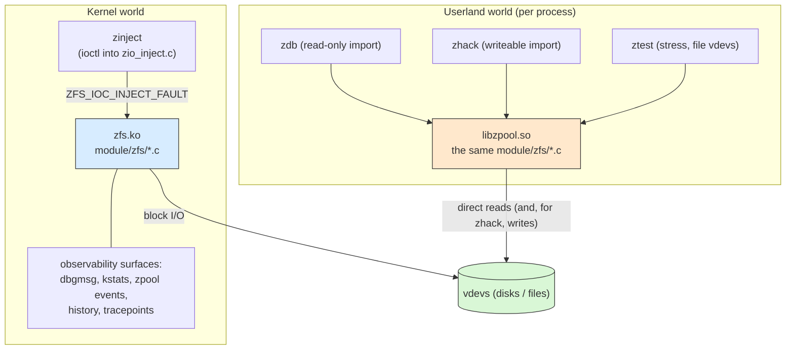

# Part 9 - The Debugging Toolbox

> Every ZFS debugging tool is defined by which copy of the state it can
> see - and the most powerful ones are not in the kernel at all.

## Why This Chapter Matters

When something goes wrong in ZFS, the first question is never "what
command do I run". It is "which state do I need to look at" - and only
then "which tool can see that state". The pool exists in several places
at once: on the disks, in the kernel module's in-memory SPA, in the ARC,
in the debug log, and (once you start a userland tool) in a second,
completely independent in-process import.

The single most misunderstood fact in ZFS debugging is that `zdb`,
`zhack`, and `ztest` are not clients of the kernel module. They are
*userland pool imports*: the same `module/zfs/*.c` files you have read
in Parts 1-8, compiled into a shared library (`libzpool`), importing the
pool inside an ordinary process address space, reading the disks
directly, independent of - and oblivious to - whatever the loaded kernel
module is doing. `zinject`, `zpool events`, and the kstats are the
opposite: they observe and manipulate the *kernel's* copy of the state.

Confusing the two worlds produces the classic mysteries: "zdb reports
leaked space but scrub is clean" (zdb raced the live kernel), "zdb works
on machine A but segfaults on machine B" (it silently loaded the
system's libzpool instead of the build tree's), "zinject does nothing"
(the target pool is a file-backed pool inside ztest, not in the
kernel). This chapter maps each tool to the state it can actually see,
with the code that proves it.

---

## Scope and Assumptions

- Linux platform; FreeBSD parity notes where the split matters.
- An in-tree autotools build (`./autogen.sh && ./configure && make`),
  because the library-path trap below is a build-tree phenomenon.

Line-number anchors in this chapter are based on the reference revision
listed in `README.md` (`0f9564e85`). If you are on a newer OpenZFS
commit, expect some drift and use symbol names to relocate.

---

## Diagram 1 - Two Worlds, One Set of Disks



The two worlds share nothing except the disks. There is no coherence
protocol between them.

---

## The libzpool Model: Kernel Code in a Library

Primary files:

- `lib/libzpool/Makefile.am`
- `lib/libzpool/kernel.c`
- `lib/libspl/` (thread/lock/taskq/kstat emulation)
- `config/Rules.am`

Key anchors:

- `nodist_libzpool_la_SOURCES` list (`lib/libzpool/Makefile.am:22`) -
  `module/zfs/spa.c`, `module/zfs/zio.c`, `module/zfs/dmu_send.c`,
  `module/zfs/metaslab.c`, ... compiled verbatim into the library
- "Emulation of kernel services in userland"
  (`lib/libzpool/kernel.c:60`)
- `kernel_init()` (`lib/libzpool/kernel.c:445`)
- `LIBZPOOL_CPPFLAGS = -DDEBUG -UNDEBUG -DZFS_DEBUG`
  (`config/Rules.am:77`)

`lib/libzpool/Makefile.am` does not wrap or reimplement the kernel
code - it lists the actual `module/zfs/*.c` and `module/zcommon/*.c`
files as library sources. What makes that compile is a shim layer:

- `lib/libspl/` provides the primitive-emulation files: `thread.c`
  (kernel threads as pthreads), `mutex.c`, `rwlock.c`, `condvar.c`,
  `taskq.c`, `kmem.c`, `kstat.c`, `procfs_list.c`, `tunables.c`.
- `lib/libzpool/kernel.c` provides the higher-level kernel services:
  `kernel_init()`/`kernel_fini()` (userland `spa_init()` plus config
  load), the `zfs_file_*` VFS shims (`zfs_file_open()` at
  `kernel.c:536` and friends, so "device" I/O is plain `pread`/
  `pwrite`), `zone_get_hostid()`, and no-op `zvol_*`/`spa_*_os()`
  stubs.
- `lib/libzpool/abd_os.c`, `arc_os.c`, `vdev_label_os.c`,
  `zfs_debug.c` replace the `module/os/linux/zfs/` platform halves.

`kernel_init()` (`kernel.c:445`) is the userland analogue of module
load: `libspl_init()`, `system_taskq_init()`, `icp_init()`,
`spa_init(mode)`, `spa_config_load()`. Note the hostid line: a
read-only caller gets `hostid = 0` and a writer gets the real system
hostid (`kernel.c:456`) - userland tools participate in MMP hostid
checks deliberately.

One build detail that bites embedders: libzpool is *always* compiled
with `-DZFS_DEBUG` (`config/Rules.am:74`: "Since ZFS_DEBUG can change
shared data structures, all libzpool users must be compiled with the
same flags"). Any code that includes OpenZFS internal headers and links
against libzpool must define `ZFS_DEBUG` too, or struct layouts
silently diverge.

### Consequence 1 - Userland tools read the disks directly

The zdb man page states it plainly (`man/man8/zdb.8:133`): zdb "is an
'offline' tool; it accesses the block devices underneath the pools
directly from userspace and does not care if the pool is imported or
datasets are mounted (or even if the system understands ZFS at all).
When operating on an imported and active pool it is possible, though
unlikely, that zdb may interpret inconsistent pool data and behave
erratically."

That is the polite version. In practice, on a busy imported pool:

- zdb's snapshot of the space maps and the block tree are taken at
  slightly different moments than the kernel's, so `zdb -b` can report
  *spurious leaks* or checksum errors that a scrub will not confirm.
- zdb sets `spa_load_verify_dryrun = B_TRUE` precisely so its own
  import does not fail on a "non-idle" pool (`cmd/zdb/zdb.c:9745`,
  comment: "Do not fail spa_load when spa_load_verify fails. This is
  needed to load non-idle pools").
- Transient read errors against blocks that were freed and reused
  mid-run are expected noise.

Rule of thumb: on a live pool, treat zdb output as advisory; for
consistency questions (`-b`, `-c`), export the pool or use a
checkpoint/snapshot of the truth you care about. If zdb and scrub
disagree on a quiescent pool, believe neither until you rerun both.

### Consequence 2 - The import is in-process

zdb does a real `spa_import()`/`spa_open()` - the Part 7 state machine,
executing inside the zdb process:

- For pools in the cachefile, `main()` calls `spa_open_rewind()`
  (`zdb.c:10023`) after `zdb_set_skip_mmp()` (`zdb.c:7896`) marks the
  spa with `ZFS_IMPORT_SKIP_MMP` - "Disable the activity check to allow
  examination of active pools". This is why Part 7 said the MMP check
  is skipped "for zdb".
- With `-e` (usage: "pool is exported/destroyed/has altroot/not in a
  cachefile"), zdb runs the *userland discovery* half of Part 7
  itself: `zpool_find_config()` (`zdb.c:9925`) scans `-p <path>`
  directories (default `/dev`) for labels, then
  `spa_import(target_pool, cfg, NULL, flags | ZFS_IMPORT_SKIP_MMP)`
  (`zdb.c:9945`) with `flags` defaulting to `ZFS_IMPORT_MISSING_LOG`.
  zdb even auto-detects the case where the pool has `cachefile=none`
  and quietly switches to this path (the "Automate cachefile" block,
  `zdb.c:9773`).
- `-t <txg>` feeds `ZPOOL_LOAD_REQUEST_TXG` into the load policy and
  `-F`/`-X` map to `ZPOOL_DO_REWIND`/`ZPOOL_EXTREME_REWIND`
  (`zdb.c:9855`, `zdb.c:9846`) - the same rewind machinery as
  `zpool import -F/-X`, but in-process and read-only.

Because the import is process-local, all of libzpool's global state
(the spa namespace, the ARC, the taskqs) is process-global and
per-process. Two zdb invocations know nothing about each other; a
long-lived embedder (see below) gets exactly one pool namespace and
must serialize accordingly.

### Consequence 3 - The library-path trap

This one costs people real hours, so here is the mechanism end to end.

In-tree binaries are libtool wrappers. After `make`, the `zdb` in the
top-level directory is a shell script:

```text
$ file zdb
zdb: Bourne-Again shell script, ASCII text executable
$ sed -n '3,10p' zdb
# zdb - temporary wrapper script for .libs/zdb
# Generated by libtool ...
# This wrapper script should never be moved out of the build directory.
# If it is, it will not operate correctly.
```

The wrapper's whole job is one line (generated with an *absolute*,
baked-in build path):

```text
LD_LIBRARY_PATH="/path/to/your/build/tree/.libs:$LD_LIBRARY_PATH"
```

and then it executes the real binary, `.libs/zdb`. The build is
non-recursive automake: every real library and binary lands in the
single *top-level* `.libs/` directory. The per-directory `lib/*/.libs/`
directories contain only object files - pointing `LD_LIBRARY_PATH`
there does nothing:

```text
build tree
|-- zdb                  <- shell wrapper, absolute path baked in
|-- .libs/
|   |-- zdb              <- the real ELF binary
|   |-- libzpool.so.7    <- the real libraries
|   |-- libnvpair.so.3
|   `-- libzfs_core.so.3
`-- lib/libzpool/.libs/
    `-- *.o only         <- NOT a library directory
```

Now the failure modes:

- Run the wrapper from a *moved or copied* tree: the baked-in absolute
  path points at the old location. The wrapper header warns about
  exactly this.
- Run `.libs/zdb` directly (or ship it to another machine): the binary
  has `NEEDED libzpool.so.7, libzfs_core.so.3, libnvpair.so.3` and *no
  RPATH*. The dynamic linker falls back to the system library
  directories. Whichever SONAMEs the distro's ZFS package provides get
  *silently substituted* - you are now running your zdb code against
  the system's libnvpair/libzfs_core. SONAMEs the system does not have
  fail loudly (`libzpool.so.7 => not found` if the distro ships
  `libzpool.so.6`).
- Mix versions - a zdb from one revision against a libzpool from
  another: libzpool exports raw internal structures (`spa_t`,
  `dnode_phys_t`, metaslab trees) with no ABI stability of any kind,
  and `ZFS_DEBUG` alone changes struct layouts (`config/Rules.am:74`).
  The typical result is a segfault at or shortly after startup;
  the insidious result is subtly wrong decoding.

The fix is always the same: point the loader at the *top-level*
`.libs` of the tree you built:

```text
LD_LIBRARY_PATH=/path/to/zfs/.libs /path/to/zfs/.libs/zdb -e tank
```

or run through the wrapper from an unmoved build tree, or use
`./libtool --mode=execute` (next section) which does this for you.

### Consequence 4 - The superpower: userland debugging of kernel logic

Because `spa_load_impl()`, `zio_done()`, `dsl_scan_sync()` and friends
are just functions in a process, every userland debugging tool works on
them:

- `gdb` - attach to or launch the *real* binary. The wrapper script is
  not debuggable directly; use either of:

  ```text
  ./libtool --mode=execute gdb --args ./zdb -e -p /var/tmp tank
  LD_LIBRARY_PATH=$PWD/.libs gdb --args .libs/zdb -e -p /var/tmp tank
  ```

  A breakpoint on `spa_ld_select_uberblock` or `zdb_blkptr_cb` now
  works like any application breakpoint. zdb and zhack both install
  SIGSEGV/SIGABRT handlers that print a backtrace and the debug buffer
  (`zdb.c:9471`, `cmd/zhack.c:1321`), so even without gdb a crash is
  informative.
- Sanitizers - `./configure --enable-debug --enable-asan
  --enable-ubsan` (`config/zfs-build.m4:44`,
  `config/always-compiler-options.m4:13`, `:60`) builds the userland
  half (libzpool, zdb, ztest) with ASan/UBSan. Memory corruption in
  DMU logic that would be a kernel panic plus a crash dump becomes an
  ASan report with a symbolized stack.
- `valgrind`, `perf`, `strace` - all apply. `ztest` runs under
  valgrind are a standard way to chase use-after-free bugs in shared
  code.

This is the practical reason the libzpool architecture exists at all:
`--enable-debug` turns on the `ASSERT`/`VERIFY` machinery everywhere,
and userland is where those assertions are cheapest to hit, debug, and
fix.

### Consequence 5 - The model is embeddable

Nothing restricts libzpool to the bundled tools. Upstream itself has
started extracting zdb's decoding helpers into a library
(`lib/libzdb/libzdb.c` at the pin), and out-of-tree projects can link
`-lzpool` and get a programmable zdb.

A worked example is
[zfs-explorer](https://github.com/mminkus/zfs-explorer): a web UI for
ZFS internals whose backend is a Rust API server calling a custom C
decode layer (`libzdbdecode.so`, functions prefixed `zdx_*`) built
against libzpool and the OpenZFS internal headers. Its design choices
independently confirm this chapter's constraints:

- It vendors OpenZFS as a pinned git submodule and links against that
  build's libraries via an explicit rpath - precisely to avoid the
  system-library SONAME substitution trap above. Its Makefile also
  carries the corollary: "OpenZFS forces libzpool users to compile
  with ZFS_DEBUG as well", adding `-DDEBUG -UNDEBUG -DZFS_DEBUG` to
  match `config/Rules.am`.
- It calls `kernel_init(SPA_MODE_READ)` exactly once (guarded by a
  once-primitive) and serializes *every* FFI call through one global
  mutex, because libzpool's spa namespace, ARC, and taskqs are
  process-global - there is no per-pool-handle isolation to lean on.
- It initializes read-only, the same posture zdb takes: in the
  userland-import model, "read-only process" is the only safety
  boundary between your bugs and the pool's disks.

The takeaway: "build your own zdb" is a real option - a few hundred
lines of C gets you decoded MOS objects served over HTTP - but the
model's constraints (one import per process, no ABI stability, global
state, ZFS_DEBUG flag matching) come with it.

---

## Tool 1 - zdb: The Read-Only Microscope

Primary file:

- `cmd/zdb/zdb.c` (plus `cmd/zdb/zdb_il.c` for ZIL records)

Key anchors:

- `usage()` (`cmd/zdb/zdb.c:722`), `main()` (`zdb.c:9438`)
- `kernel_init(SPA_MODE_READ)` (`zdb.c:9815`) - zdb is read-only by
  construction; there is no write mode

`main()` also quietly reshapes the environment for safety and speed:
ARC capped at 256 MB (`zdb.c:9726`), `spa_load_verify_dryrun`
(`zdb.c:9745`), `spa_mode_readable_spacemaps` (`zdb.c:9750`), and, once
the pool is open, `spa->spa_failmode = ZIO_FAILURE_MODE_PANIC`
(`zdb.c:10118`) so a suspended I/O kills the process instead of hanging
it forever.

### Flag families, mapped to their handlers

| Flag | What it dumps | Handler |
| --- | --- | --- |
| `-C` | pool config (cachefile if used alone) | `dump_config()` (`zdb.c:4507`), `dump_cachefile()` (`zdb.c:4531`) |
| `-l <device>` | all 4 labels of one device (+`-u` uberblocks) | `dump_label()` (`zdb.c:5448`) |
| `-u` | active uberblock | `dump_uberblock()` (`zdb.c:4456`) |
| `-d` | datasets and objects; more `d`s = more depth | `dump_objset()` (`zdb.c:4290`), `dump_object()` (`zdb.c:3944`) |
| `-i` | intent logs | `dump_intent_log()` (`cmd/zdb/zdb_il.c`) |
| `-b` | full block traversal + leak detection | `dump_block_stats()` (`zdb.c:7258`), `zdb_blkptr_cb()` (`zdb.c:6346`) |
| `-c` | + checksum metadata (twice: all data) | read issued inside `zdb_blkptr_cb()` (`zdb.c:6379`) |
| `-m` | metaslabs and space maps | `dump_metaslabs()` (`zdb.c:1932`), `dump_metaslab()` (`zdb.c:1708`) |
| `-M` | metaslab groups | `dump_metaslab_groups()` (`zdb.c:1815`) |
| `-D` | dedup table stats | `dump_all_ddts()` (`zdb.c:2194`) |
| `-h` | pool history (as stored in the MOS) | `dump_history()` (`zdb.c:2387`) |
| `-k` | the checkpointed state of the pool | `import_checkpointed_state()` (`zdb.c:7930`) |
| `-B` | re-emit an objset as a send stream | `dump_backup()` (`zdb.c:5279`) |
| `-O` / `-r` | path -> object lookup / copy object out | `dump_path()` (`zdb.c:5229`), `zdb_copy_object()` |
| `-R` | raw block read by `vdev:offset:size[:flags]` | `zdb_read_block()` (`zdb.c:9099`) |
| `-G` | dump the debug log on exit | `dump_debug_buffer()` (`zdb.c:870`) |
| `--allocated-map` | list allocated ranges (for zhack) | `ARG_ALLOCATED` (`zdb.c:9574`) |

Modifier flags: `-e`/`-p`/`-t`/`-F`/`-X`/`-V` shape the import (above);
`-U <cachefile>` and the `SPA_CONFIG_PATH` env var (`zdb.c:9485`)
choose the config source; `-I` bounds in-flight checksum I/O
(`zdb_blkptr_cb()` blocks while `spa_load_verify_bytes` exceeds it,
`zdb.c:6389`); `-A`/`-AA`/`-AAA` relax assertions (`-A` makes asserts
non-fatal, `-AA` sets `zfs_recover`, `zdb.c:9752`); `-o
name=value` sets libzpool tunables - the userland mirror of
`/sys/module/zfs/parameters`.

### Leak detection: how `-b` actually works

`dump_block_stats()` explains itself in a comment worth quoting
(`zdb.c:7288`): "When leak detection is enabled we load all space maps
as SM_ALLOC maps, then traverse the pool claiming each block we
discover. If the pool is perfectly consistent, the segment trees will
be empty when we're done. Anything left over is a leak; any block we
can't claim ... is a double allocation, reference to a freed block, or
an unclaimed log block."

Mechanically: `zdb_leak_init()` (`zdb.c:6938`) repurposes every
metaslab's `ms_allocatable` range tree to hold *allocated* segments
(loading space maps with `SM_ALLOC`), excludes checkpoint-referenced
ranges to avoid false positives, then the traversal
(`zdb_blkptr_cb()`) removes each visited block pointer's segments.
`zdb_leak_fini()` (`zdb.c:7077`) prints whatever survives as
`leaked space: vdev %llu, offset 0x%llx, size %llu` (`zdb.c:6440`), and
the summary line is either "No leaks (block sum matches space maps
exactly)" or a `block traversal size ... != alloc ...` mismatch
(`zdb.c:7389`). `-L` (`--disable-leak-tracking`) skips loading space
maps entirely - use it when you want block stats without the memory
cost or the false positives of a live pool.

On the MOS side, `-d` runs `dump_mos_leaks()` (`zdb.c:8419`) unless
`-L` is given: it marks every MOS object reachable from known roots
(`mos_obj_refd()`) and prints `MOS object %llu (%s) leaked` for
allocated-but-unreferenced objects, alongside per-feature refcount
verification ("feature refcount mismatch") in `dump_zpool()`
(`zdb.c:8635`).

Exit codes encode the verdict: zdb exits 3 when `corruption_found` was
set even if nothing else failed (`zdb.c:10204`), 2 for usage/config
problems, 1 for fatal errors.

### Practical notes

- On a live pool: expect transient errors from `-b`/`-c`; rerun before
  believing them, prefer an exported pool or `-k` (checkpoint) for
  verdicts you plan to act on.
- `zdb -dd` on a big pool emits gigabytes. Redirect to a file on real
  storage (not tmpfs) and grep; `-N`, object ranges
  (`<start>:<end>[:flags]`), and `<pool>/<objset-id>` arguments narrow
  the walk to what you need.
- `-G` appends the in-process `zfs_dbgmsg` buffer to stderr on exit
  via `zfs_dbgmsg_print()` (`lib/libzpool/zfs_debug.c:100`). This is
  the *userland import's* debug log - `spa_load()` breadcrumbs from
  zdb's own import, invaluable with `-e` on a damaged pool. It is not
  the kernel's `/proc/spl/kstat/zfs/dbgmsg`.

---

## Tool 2 - zhack: Writing With the Safety Off

Primary file:

- `cmd/zhack.c`

Key anchors:

- header comment (`cmd/zhack.c:29`): "zhack is a debugging tool that
  can write changes to ZFS pool using libzpool for testing purposes.
  Altering pools with zhack is unsupported and may result in corrupted
  pools."
- `usage()` (`zhack.c:73`), `main()` (`zhack.c:1305`)
- `zhack_import()` (`zhack.c:193`), `zhack_spa_open()` (`zhack.c:238`)

zhack is zdb's dangerous sibling: the same userland import, but
`kernel_init(SPA_MODE_READ | SPA_MODE_WRITE)` (`zhack.c:199`) and a
real writeable `spa_import()`. Two lines in `zhack_import()` deserve
attention:

- `zfeature_checks_disable = B_TRUE` around both `spa_import()` and
  `spa_open()` (`zhack.c:224`, `:244`) - zhack will open pools whose
  feature flags would stop a normal import, because operating on such
  pools is its job.
- read-only opens set `ZFS_IMPORT_SKIP_MMP` and
  `can_be_active` (`zhack.c:205`); writeable opens do *not* - and
  `main()` ends with a mandatory `spa_export()` (`zhack.c:1382`,
  "changes may not be committed to disk" if it fails).

The subcommands at the pin (`usage()`, `zhack.c:76`):

- `feature stat <pool>` - print the MOS feature ZAPs
  (`zhack_do_feature_stat()`, `zhack.c:299`).
- `feature enable [-r] [-d desc] <pool> <guid>` - inject a new enabled
  feature via a real DSL sync task (`zhack_do_feature_enable()`,
  `zhack.c:342`, dispatching `feature_enable_sync()` through
  `dsl_sync_task()` at `zhack.c:405`).
- `feature ref [-md] <pool> <guid>` - increment/decrement a feature
  refcount (`zhack_do_feature_ref()`, `zhack.c:444`). This is how test
  suites fabricate "unsupported feature" pools; it is also how you
  can, very carefully, unwedge a pool whose refcount is wrong.
- `label repair -c|-u <device>` - fix label checksums (`-c`) or
  restore the labels of a detached mirror device (`-u`)
  (`zhack_do_label_repair()`, `zhack.c:1247`). Operates on one device
  file, no import at all.
- `metaslab leak <pool>` - reads a `zdb --allocated-map` dump on stdin
  and force-allocates those ranges (`zhack_do_metaslab_leak()`,
  `zhack.c:665`, `metaslab_force_alloc()` at `zhack.c:637`),
  deliberately leaking space to exercise leak handling.
- `action idle [-t seconds] <pool>` - import, wait, export
  (`zhack_do_action_idle()`, `zhack.c:558`) - a test fixture for
  "pool is busy in another process" scenarios.

Like zdb, zhack takes `-o tunable=value` and `-G` (dump the debug
buffer on exit), and it wires the same crash handlers.

The operational warning follows directly from Diagram 1: zhack writes
to the disks with the kernel bypassed. If the kernel module has the
pool imported while zhack writes, two uncoordinated writers share one
pool, and the kernel's in-memory state is instantly stale. The pool
must be exported first; zhack's writeable path leaves MMP active
(no `SKIP_MMP`) as a last line of defense, not as permission.

---

## Tool 3 - zinject: Fault Injection Inside the Kernel

Primary files:

- `cmd/zinject/zinject.c`, `cmd/zinject/translate.c`
- `module/zfs/zio_inject.c`

Key anchors:

- `usage()` (`cmd/zinject/zinject.c:286`)
- `register_handler()` -> `ZFS_IOC_INJECT_FAULT`
  (`zinject.c:700`, `:709`)
- `zfs_ioc_inject_fault()` (`module/zfs/zfs_ioctl.c:6071`) ->
  `zio_inject_fault()` (`module/zfs/zio_inject.c:953`)
- `zio_injection_enabled` (`zio_inject.c:54`)

zinject is the mirror image of zdb: it does *not* import anything in
userland. It translates a user-visible name (a file path, a vdev, a
pool) into an internal tuple - the file-to-object translation uses
libzfs and the mounted filesystem, not libzpool (the header comment's
"via libzpool" predates the current build, which links
`libzfs.la libzfs_core.la libnvpair.la` only,
`cmd/zinject/Makefile.am`) - and registers a `zinject_record_t` with
the *running kernel module* via `ZFS_IOC_INJECT_FAULT`. The kernel
keeps a global handler list; each registered handler holds the spa so
the pool cannot be exported while injection is active, and the
`zio_injection_enabled` counter is "the switch to trigger all fault
injection" (`zio_inject.c:950`).

The pipeline (Part 3) then polls the handler list at fixed points.
Verified call sites at the pin:

| Hook | Called from | Effect |
| --- | --- | --- |
| `zio_handle_fault_injection(zio, EIO)` (`zio_inject.c:270`) | `zio_vdev_io_assess()` (`module/zfs/zio.c:4935`) | data-level read/write errors by bookmark/objset/object/range |
| `zio_handle_fault_injection(zio, EINVAL)` | `zio_decompress()` (`zio.c:563`) | decompress faults |
| `zio_handle_decrypt_injection()` (`zio_inject.c:208`) | `zio_decrypt()` (`zio.c:626`, `:650`), `dsl_crypt.c:2887` | decrypt/MAC faults |
| `zio_handle_device_injection(vd, zio, ENOSYS)` (`zio_inject.c:506`) | `zio_vdev_io_start()` (`zio.c:4787`) | fail flushes |
| `zio_handle_device_injections(vd, zio, EIO, EILSEQ)` (`zio_inject.c:512`) | `zio_vdev_io_done()` (`zio.c:4826`) | per-vdev I/O errors, bit flips |
| `zio_handle_label_injection(zio, EIO)` (`zio_inject.c:322`) | `zio_vdev_io_done()` (`zio.c:4830`) | label-region errors (`-L uber/nvlist/pad1/pad2`) |
| `zio_handle_io_delay()` (`zio_inject.c:599`) | `vdev_disk.c:1189`, `vdev_file.c:300`, `vdev_geom.c:1179` | `-D latency:lanes` artificial latency |
| `zio_handle_ignored_writes()` (`zio_inject.c:522`) | `zio_ready()` (`zio.c:5462`) | `-I`: drop writes silently (broken flush simulation) |
| `zio_handle_import_delay()` / `_export_delay()` (`zio_inject.c:816`, `:825`) | `spa.c:6257`, `spa.c:7807` | `-P import/export -s N` |
| `zio_handle_panic_injection()` (`zio_inject.c:180`) | `spa.c:9231`, `:9299`, `:9340`, `spa_misc.c:1380` | `-p <function>`: panic at config-exit points |

Common recipes (all forms verified against `usage()`):

```text
# checksum error on one file's data, 5% of reads
zinject -t data -e checksum -f 5 /tank/fs/file

# flip bits on reads of one vdev (device level)
zinject -d /dev/sdb1 -e corrupt -T read tank

# make a disk look dead (reopen also fails)
zinject -d /dev/sdb1 -e nxio tank

# 25ms single-lane latency on a vdev
zinject -d /dev/sdb1 -D 25:1 tank

# stall the next import 10 seconds (races in spa_load)
zinject -P import -s 10 tank

# list handlers, then remove everything
zinject
zinject -c all
```

Cleanup matters: handlers persist until cleared (`zinject -c all`,
`ZFS_IOC_CLEAR_FAULT`) and hold the spa. The `-f` frequency knob is
implemented by `freq_triggered()` (`zio_inject.c:110`).

The ZTS uses zinject heavily; if you are writing a reproducer for an
error-path bug, a zinject handler plus a `zpool scrub` is usually
faster and more deterministic than hunting real hardware failures.

Note the state boundary: zinject faults the *kernel's* pipeline. It
cannot inject into a zdb or ztest run - those processes have their own
`zio_injection_enabled` (ztest injects its own faults internally,
`ztest_fault_inject()`, `cmd/ztest.c:6417`).

---

## Tool 4 - ztest and zloop: Stress in a Process

Primary files:

- `cmd/ztest.c`
- `scripts/zloop.sh`

The design comment at the top of `cmd/ztest.c:34` is the spec: ztest
runs "a DMU/ZAP/SPA stress test ... entirely in userland" by (1)
writing one small routine per functional area, (2) running them all in
parallel against file vdevs, (3) injecting faults while doing so, (4)
randomizing checksum/compression per dataset open, (5) running the
whole test in a child process that "self-immolates with a SIGKILL" at
random - "the software equivalent of pulling the power cord" - and
verifying the pool survives reimport, and (6) tagging data with txg
numbers to catch temporal leaks.

`ztest_run()` (`ztest.c:8371`) drives the thread army;
`ztest_run_zdb()` (`ztest.c:7364`) runs the in-tree zdb against the
pool after the run as an independent consistency check - zdb as an
oracle, which is why zdb's leak detection has to stay trustworthy.

`scripts/zloop.sh` is the harness that makes ztest useful overnight:
each iteration picks a randomized pool topology - mirrors, raidz of
random width/parity, raidz expansion (sometimes with the dedicated
`-X` expansion test), or dRAID (`zloop.sh:255` onward) - runs ztest in
a scratch workdir, and on any failure `store_core()` (`zloop.sh:116`)
preserves the evidence: it moves the vdev files and `zpool.cache` into
a timestamped directory, runs `zdb -U <cache> -dddMmDDG ztest` over
the corpse, and captures a full `gdb` backtrace bundle
(`thread apply all bt full`) from the core.

This closes the loop with Consequence 4: a ztest crash is an ordinary
userland core file of kernel-logic code. `gdb .libs/ztest core` (with
`LD_LIBRARY_PATH` pointing at the build's `.libs`, per the trap
section) puts you inside `dsl_scan_sync()` or `metaslab_alloc()` at the
moment of failure, with full symbols and no kdump pipeline.

---

## Kernel-Side Observability

Everything above (except zinject) watched the userland world. These
surfaces watch the kernel module.

### zfs_dbgmsg: the flight recorder

Primary files:

- `module/os/linux/zfs/zfs_debug.c` (FreeBSD:
  `module/os/freebsd/zfs/zfs_debug.c`)
- `include/sys/zfs_debug.h`

The kernel keeps a ring of debug messages, on by default
(`zfs_dbgmsg_enable = B_TRUE`, `zfs_debug.c:53`), capped at 4 MB
(`zfs_dbgmsg_maxsize`, `zfs_debug.c:39`), exposed as a procfs list
(`procfs_list_install("zfs", NULL, "dbgmsg", ...)`, `zfs_debug.c:98`).
The usage comment (`zfs_debug.c:41`) is the manual:

```text
# Print debug messages
cat /proc/spl/kstat/zfs/dbgmsg

# Disable the kernel debug message log.
echo 0 > /sys/module/zfs/parameters/zfs_dbgmsg_enable

# Clear the kernel debug message log.
echo 0 >/proc/spl/kstat/zfs/dbgmsg
```

The clear works because the procfs list registers `zfs_dbgmsg_clear()`
(`zfs_debug.c:86`) as its write handler - any write truncates the
list.

Two producers feed it (`include/sys/zfs_debug.h:88`):

- `zfs_dbgmsg(...)` - always compiled, rate-disciplined by convention
  (the block comment at `zfs_debug.h:74`: O(1) per txg on normal
  paths, always log the unusual). The Part 7 `spa_load_note()` /
  `spa_load_failed()` breadcrumbs are the canonical example - for any
  import problem, this log names the failing stage.
- `dprintf(...)` - compiled only under `ZFS_DEBUG`
  (i.e. `--enable-debug` module builds), and even then gated at
  runtime on `zfs_flags & ZFS_DEBUG_DPRINTF` (`zfs_debug.h:98`).

`zfs_flags` is a bitmask of debug behaviors
(`include/sys/zfs_debug.h:50`), settable at runtime via
`/sys/module/zfs/parameters/zfs_flags`:

```text
ZFS_DEBUG_DPRINTF            (1 << 0)   enable dprintf logging
ZFS_DEBUG_DBUF_VERIFY        (1 << 1)
ZFS_DEBUG_DNODE_VERIFY       (1 << 2)
ZFS_DEBUG_SNAPNAMES          (1 << 3)
ZFS_DEBUG_MODIFY             (1 << 4)
                             (1 << 5)   retired, "try not to reuse"
ZFS_DEBUG_ZIO_FREE           (1 << 6)
ZFS_DEBUG_HISTOGRAM_VERIFY   (1 << 7)
ZFS_DEBUG_METASLAB_VERIFY    (1 << 8)
ZFS_DEBUG_SET_ERROR          (1 << 9)   log every SET_ERROR() site
ZFS_DEBUG_INDIRECT_REMAP     (1 << 10)
ZFS_DEBUG_TRIM               (1 << 11)
ZFS_DEBUG_LOG_SPACEMAP       (1 << 12)
ZFS_DEBUG_METASLAB_ALLOC     (1 << 13)
ZFS_DEBUG_BRT                (1 << 14)
ZFS_DEBUG_RAIDZ_RECONSTRUCT  (1 << 15)
ZFS_DEBUG_DDT                (1 << 16)
```

`ZFS_DEBUG_SET_ERROR` (`echo 512 > .../zfs_flags`) deserves a call-out:
it logs the file/function/line of every `SET_ERROR()` return, which
turns "some syscall got EINVAL from somewhere in ZFS" into an exact
source location - often the fastest path from errno to code. (This one
works on non-debug builds too; the verify bits mostly pair with
`--enable-debug`.)

Remember the duplication: libzpool carries its own copy of this
machinery (`lib/libzpool/zfs_debug.c`), which is what `zdb -G` /
`zhack -G` print. Kernel log and userland log never mix.

### kstats: counters and histories

The Linux procfs layout under `/proc/spl/kstat/zfs/`:

- `arcstats` - the ARC counter block
  (`kstat_create("zfs", 0, "arcstats", ...)`, `module/zfs/arc.c:8112`).
- `dbgmsg` - above.
- `import_progress` - live per-import stage notes
  (`procfs_list_install("zfs", NULL, "import_progress", ...)`,
  `module/zfs/spa_misc.c:2405`; see Part 7's Observability section).
- `<pool>/` - a directory per imported pool, from
  `module/zfs/spa_stats.c`:
  - `state` - one-line pool health (`spa_state_init()`,
    `spa_stats.c:807`)
  - `txgs` - recent txg history: birth times, dirty bytes, per-stage
    latencies (`spa_txg_history_init()`, `spa_stats.c:289`; depth set
    by the `zfs_txg_history` module parameter, `spa_stats.c:1070`) -
    the first place to look for "sync is slow"
  - `reads` - read history, off by default (`zfs_read_history`)
  - `multihost` - MMP write history (`spa_stats.c:651`)
  - `iostats` - injection-visible I/O counters (`spa_stats.c:1009`)

Like `dbgmsg`, the history lists are procfs lists: writing to them
clears them.

### zpool events, history, status

- `zpool events [-v] [-f]` streams the kernel's fault-management
  ereports (`cmd/zpool/zpool_main.c:12507` -> `zpool_events_next()`
  (`lib/libzfs/libzfs_pool.c:4910`) -> `ZFS_IOC_EVENTS_NEXT`). The
  producers live in `module/zfs/zfs_fm.c`: `zfs_ereport_post()`
  (`zfs_fm.c:1167`) assembles `ereport.fs.zfs.*` nvlists (classes like
  `FM_EREPORT_ZFS_IO`, `_DATA`, `_CHECKSUM`, `_DELAY`, `_DEADMAN`) and
  queues them via `zfs_zevent_post()`. `-v` prints the full nvlist -
  vdev guids, zio offsets/sizes, error numbers - which is exactly the
  detail `zpool status` summarizes away. ZED consumes the same stream.
- `zpool history -i` adds internal events (`cbdata.internal`,
  `zpool_main.c:12122`) recorded by `spa_history_log_internal()`
  (`module/zfs/spa_history.c:556`): every sync-task-level operation
  (`receive`, `finish receiving`, `destroy`, feature activations)
  with txg stamps. Part 8 used it to spot a receive that began but
  never finished.
- `zpool status -v` fetches the persistent error log
  (`ZFS_IOC_ERROR_LOG` -> `zfs_ioc_error_log()`
  (`module/zfs/zfs_ioctl.c:7711`) -> `spa_get_errlog()`
  (`module/zfs/spa_errlog.c:1088`)) and resolves bookmarks to file
  paths where it can. `zdb -O`/`-r` can chase the objects it names.

### Linux static tracepoints

Every `DTRACE_PROBE*()` call in shared code compiles, on Linux, into a
static tracepoint in the `zfs:` group: the mapping macro is
`DTRACE_PROBE1(name, ...) -> trace_zfs_##name(...)`
(`include/os/linux/spl/sys/trace.h:69`), the event classes live in
`include/os/linux/zfs/sys/trace_*.h` (arc, dbuf, dmu, dnode, txg,
vdev, zil, zio, ...), and `module/os/linux/zfs/trace.c` instantiates
them all with `CREATE_TRACE_POINTS`. They are available whenever the
kernel exposes `DECLARE_EVENT_CLASS` to non-GPL modules
(`HAVE_DECLARE_EVENT_CLASS`, probed by
`config/kernel-declare-event-class.m4`) - on such kernels they are in
*every* module build, debug or not; where the probe is unavailable the
build falls back to kprobe-able stub functions (the comment at
`trace.h:26` describes both modes). Use them via
`perf list 'zfs:*'`, `perf record -e zfs:zfs_arc__miss`, or
`bpftrace -e 'tracepoint:zfs:zfs_arc__miss { @++ }'`. ARC hit/miss,
`new_state__mru/mfu`, txg transitions, and dbuf events are the ones
worth memorizing; everything heavier is better served by bpftrace
kprobes on the function names this guide has been anchoring all along.

---

## Symptom -> Tool Map

| Symptom | Reach for | Code entry point |
| --- | --- | --- |
| pool will not import | `cat /proc/spl/kstat/zfs/dbgmsg` for `spa_load(...) FAILED:` lines, then `zdb -e [-p dir] [-t txg] <pool>` to rerun the load in-process with `-G` narration | `spa_load_impl()` stages (Part 7); `spa_import()` from `zdb` `main()` (`zdb.c:9945`) |
| import hangs | `/proc/spl/kstat/zfs/import_progress` | `spa_import_progress_set_notes()` (`spa_misc.c:2405`) |
| suspected on-disk corruption | scrub + `zpool events -v` on the live pool; `zdb -b` / `-c` (exported, or expect noise) for an independent verdict | `dsl_scan_sync()`; `dump_block_stats()` (`zdb.c:7258`) |
| space accounting mystery ("where did my space go") | `zdb -m` / `-mm` for metaslab/space map view; `zdb -dd <pool>` for per-dataset deadlists/bpobjs; `-L` to skip leak detection cost | `dump_metaslabs()` (`zdb.c:1932`), `dump_zpool()` (`zdb.c:8635`) |
| "permanent errors" list in status | `zpool status -v`, then `zdb -O`/`-r` to map object to path/data | `spa_get_errlog()` (`spa_errlog.c:1088`); `dump_path()` (`zdb.c:5229`) |
| replication failure | `zstream dump` on the stream; compare the BEGIN `features` word to receiver checks (Part 8) | `dmu_recv_begin_check()` (`dmu_recv.c:621`) |
| need to reproduce a bug under a debugger | `ztest`/`zloop.sh` for races; `zdb` against a small file-backed pool (`-e -p <dir>`) for decode/traversal logic; gdb/ASAN per Consequence 4 | `ztest_run()` (`ztest.c:8371`); `.libs/` binaries |
| need to *cause* an error (test error paths) | `zinject` recipes; clean up with `zinject -c all` | `zio_inject_fault()` (`zio_inject.c:953`) and pipeline hooks |
| errno with no context (EINVAL from where?) | `echo 512 > /sys/module/zfs/parameters/zfs_flags`, retry, read dbgmsg | `SET_ERROR()` logging (`zfs_debug.h:59`, bit 9) |
| feature-flag wedge / labels damaged / forced surgery | `zhack feature ...`, `zhack label repair` - exported pool only, after imaging the disks | `zhack_spa_open()` (`zhack.c:238`) |
| hot-path performance question | per-pool `txgs` kstat, `arcstats`, `zfs:` tracepoints via perf/bpftrace | `spa_stats.c`, `trace_*.h` |

---

## The Toolbox at a Glance

```text
state observed              tool                     mechanism
-------------------------   ----------------------   ---------------------------
disks, direct (read-only)   zdb                      libzpool import, in-process
disks, direct (writeable)   zhack                    libzpool import + sync tasks
file vdevs, synthetic       ztest / zloop.sh         libzpool, SIGKILL + reimport
kernel pipeline (inject)    zinject                  ZFS_IOC_INJECT_FAULT
kernel narrative log        /proc/spl/kstat/zfs/dbgmsg
kernel counters/history     /proc/spl/kstat/zfs/{arcstats,<pool>/txgs,...}
kernel fault stream         zpool events -v          zfs_fm.c ereports
MOS-recorded operations     zpool history -i         spa_history_log_internal()
persistent error log        zpool status -v          spa_get_errlog()
hot-path timing             perf/bpftrace zfs:*      DTRACE_PROBE tracepoints
```

Userland tools see the disks as they are *now*, through their own
import. Kernel surfaces see the module's in-memory truth. Neither sees
the other. Choose accordingly - and when two tools disagree, the first
hypothesis should be that they are looking at different copies of the
state, not that one of them is lying.

---

## Key Takeaways

1. `zdb`, `zhack`, and `ztest` are userland pool imports: libzpool
   compiles `module/zfs/*.c` into a library, `lib/libspl` +
   `lib/libzpool/kernel.c` fake the kernel services, and the tools run
   the real Part 7 load machine in-process, bypassing the kernel
   module entirely.
2. Therefore zdb on a live pool can race the kernel: transient errors
   and spurious leak reports on busy pools are expected; zdb even
   forces `spa_load_verify_dryrun` so it can load non-idle pools.
3. In-tree binaries are libtool wrappers with absolute build paths
   baked in; the real binaries in `.libs/` have no RPATH and will
   silently bind to *system* libraries with matching SONAMEs. The fix
   is `LD_LIBRARY_PATH` at the top-level `.libs/` (never
   `lib/*/.libs`, which hold only objects). Mixed-version
   libzpool has no ABI guarantee - expect a startup segfault, or worse.
4. The payoff of the userland model: gdb, valgrind, and
   `--enable-debug --enable-asan` all work on kernel logic - and the
   model is embeddable, if you keep its constraints (one global import
   per process, serialize everything, match `ZFS_DEBUG`, pin your
   libzpool).
5. `zdb -b` leak detection is an elegant inversion: load space maps as
   *allocated* trees, traverse the block tree removing what you find,
   and whatever remains is a leak. `-L` skips it; exit code 3 means
   corruption was seen.
6. `zhack` is the same import with the safety off:
   `zfeature_checks_disable`, writeable sync tasks, and no kernel
   coordination - exported pools only.
7. `zinject` is the one tool in the family that targets the *kernel*:
   handlers registered by ioctl, checked at fixed pipeline points
   (`zio_vdev_io_done()`, `zio_vdev_io_assess()`, `zio_decrypt()`,
   ...). Handlers persist and pin the spa: `zinject -c all` when done.
8. The kernel narrates: `dbgmsg` (clear with a write), `zfs_flags`
   bit 9 to log every `SET_ERROR()`, per-pool `txgs`/`state` kstats,
   `zpool events -v` for the raw ereport stream, `zpool history -i`
   for sync-task archaeology, and `zfs:` tracepoints for perf/bpftrace
   - no debug build required for any of these except `dprintf`.
9. Debugging ZFS is choosing the tool that can see the state your
   hypothesis is about. Userland tools see the disks; kernel surfaces
   see the module; nothing sees both.

---

## Next

This completes the planned series. If you started here: [Part 1 -
Architecture Overview](01-architecture-overview.md) builds the map
this chapter's tools navigate, and every earlier part ends with the
observability hooks this one catalogues.

The guide is pinned to one revision (`0f9564e85`) of a codebase that
does not stand still. If you find an anchor that has drifted, a claim
the code no longer supports, or a tool this toolbox is missing - file
an issue or send a correction. That is, after all, what the toolbox is
for.
